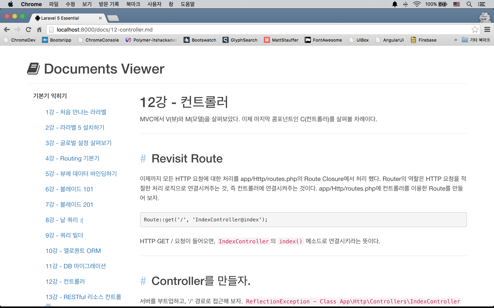
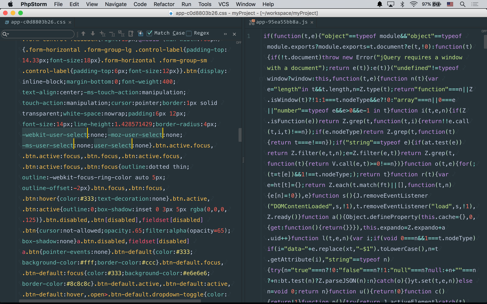

# 실전 프로젝트 1 - Markdown Viewer 

## 29강 - Elixir, 만병통치약?

**`필독`** 프론트엔드에 관심이 없다면 이 강좌를 읽을 필요 없다.

Elixir('엘릭서'라 읽음)은 만병통치약을 뜻하는 단어이다. 라라벨의 Elixir란 이름은 어디에서 유래되었는 지 모르겠다. Elixir는 여러 기능을 가지고 있지만, 함축하자면 프론트엔드 리소스, 그러니까 CSS 와 Javascript 같은 리소스의 빌드를 자동화하는 도구라고 생각할 수 있다. 여기서 말하는 빌드란 여러 Minification, CSS Vendor Prefixing, 여러 파일 병합, Sass/Less/Coffee/Babel 스크립트의 컴파일, ... 등을 의미한다. 프론트엔드 빌드 자동화를 수행하는 구현체는 Ruby on Rails 에서 Asset Pipeline 이란 이름으로 세상에 가장 먼저 소개되었고, 이후 Django Pipeline 등 여러 프레임웍에서 따라한 것으로 필자는 알고 있다. 라라벨도 그중 하나!! 

라라벨 5 버전이 출시되고 Elixir 가 공개되기 이전에 개발자들은 [Gulp](http://gulpjs.com/)나 [Grunt](http://gruntjs.com/)를 이용하여 빌드 자동화 스크립트를 작성해 왔다. 하지만 라라벨 5의 Elixir는 기존의 복잡함과 어려움을 극도로 단순화하여, 초보자도 쉽게 사용할 수 있는 API를 제시하고 있다. (그럼에도 불구하고 어렵고 복잡하다.)

### 필요한 프론트엔드 리소스 정의

우리 프로젝트에 필요한 프론트엔드 리소는 무엇인가? 앞선 강좌를 통해 우린 이미 Twitter Bootstrap을 가져다 쓴 바 있다. 이번 강좌에서는 CDN 버전을 그대로 사용하지 않고, 우리 서비스의 리소스로 추가할 것이다. 그외 아이콘을 쓰기 위한 FontAwesome, 앞으로 계속 진행될 학습을 위해, 이 프로젝트 전용 스타일시트와 자바스크립트 파일을 만들어서 Elixir로 빌드해 보도록 하자. 강좌를 진행하면서 이 목록에 더 많은 프론트엔드 리소스들이 추가될 것이다. 

- Twitter Bootstrap
- FontAwesome
- resources/assets/sass/app.scss
- resources/assets/js/app.js

이 강좌를 통해, 위에 나열된 2개의 외부 의존성과 내가 만든 2개의 리소스에 대한 빌드 자동화 방법을 배워볼 것이다.

### 필요한 글로벌 툴들 설치

먼저 [nodejs](https://nodejs.org)가 필요하다. 공식 사이트를 방문한 후, 인스톨러를 다운로드 받아 클릭-클릭으로 설치할 수 있다. 이 글을 쓰는 시점에 4.2.2 LTS 버전과 5.0 두 개의 버전이 존재하는데, 4.2.2 LTS를 받자. 인스톨러를 통해 node 런타임과 npm (node package manager)가 동시에 설치된다.

```bash
$ node --version # v4.2.2
$ npm --version # 2.14.7
```

Elixir는 Gulp 툴의 Wrapper이다. Gulp에 의존한다는 얘기~ 고 설치하자. 개발 머신 전체에서 `gulp`란 명령을 쓸 수 있도록 글로벌로(`-g`)로 설치한다.

```bash
$ sudo npm install -g gulp
$ gulp --version # [H:i:s] CLI version 3.9.0
```

3rd Party(남이 만든 것이란 의미. 내껀 1st Party라 한다) 스타일시트와 자바스크립트 리소스를 관리하기 위해 Bower 툴을 설치하자. 

```bash
$ sudo npm install -g bower
$ bower --version # 1.6.5
```

여기까지 작업은 다른 프로젝트에서도 계속 사용하게 될 글로벌 패키지들의 설치로, 최초 딱 한번만 수행하면 된다. 다음부터 설명하는 것은 매 프로젝트마다 해 주어야 하는 설치 작업이다.

### Elixir 의존 패키지 설치 및 최초 실행

Elixir가 의존하는 node 패키지들을 설치하자. 설치할 패키지들은 package.json 파일에 정의되어 있으며, 라라벨 프로젝트가 생성될 때 같이 생성되었다. 아래 작업은 라라벨에서 `composer install` 했던 것과 동일한 작업이라 생각하면 된다.

```bash
$ npm install
```

node_modules 폴더 아래에 뭔가 잔뜩 설치되었을 것이다. Elixir가 잘 동작하는지 확인해 보자. 아래 코맨드를 수행하기 전에 public/css 디렉토리가 있는지 확인해 보자. 없을 것이다. 코맨드 실행 후 다시 확인해 보자.
  
```bash
$ gulp
```

### Bower 패키지 설치

php/composer.json, nodejs/package.json 처럼 Bower 용 패키지들을 담을 레지스트리 파일인, bower.json 을 만들자. 또, .bowerrc 파일로 Bower 패키지들의 설치 위치도 변경하자 (디폴트는 프로젝트 루트의 bower_components). 또, .gitignore 파일에 Bower 패키지 저장소가 버전 컨트롤에서 제외되도록 정의해 놓자.

```bash
$ touch bower.json && echo '{"name":"myProject"}' > bower.json # bower.json 파일을 만들고, JSON 오브젝트를 써 놓는다.
$ touch .bowerrc && echo '{"directory":"resources/assets/vendor","analytics":false}' > .bowerrc
$ echo '/resources/assets/vendor' >> .gitignore # >> 은 기존 파일에 내용 append의 의미다.
```

Bower 패키지를 설치하자. `--save-dev` 는 bower.json 파일에 devDependencies 로 써 놓는다는 의미이다. 버전 컨트롤에서 제외시켰는데, bower.json에 의존성을 써 놓았기 때문에, 다른 개발자가 프로젝트의 버전 컨트롤 저장소를 clone/pull 했을 때 `$ bower install` 코맨드로 의존성을 설치할 수 있다. 이 강좌에서는 scss 문법을 이용할 것이라, `bootstrap-sass` 패키지를 설치했다. resources/assets/vendor 디렉토리에 설치한 패키지들이 있는지 확인해 보자. 

```bash
$ bower install bootstrap-sass --save-dev
$ bower install font-awesome --save-dev
```

### 휴~ 이제 빌드 스크립트를 쓰자.

`$ gulp` 명령에 반응하는 스크립트는 프로젝트 루트에 위치한 gulpfile.js 이다. 아래는 sass 컴파일하, 자바스크립트들을 머지한 후, 파일 이름에 버전을 매기고, fonts 파일을 정해진 위치에 배포하는 gulpfile.js 스크립트이다.

```javascript
var elixir = require('laravel-elixir');

elixir(function (mix) {
  mix
    .sass('app.scss')
    .scripts([
      '../vendor/jquery/dist/jquery.js',
      '../vendor/bootstrap-sass/assets/javascripts/bootstrap.js',
      'app.js'
    ], 'public/js/app.js')
    .version([
      'css/app.css',
      'js/app.js'
    ])
    .copy("resources/assets/vendor/font-awesome/fonts", "public/build/fonts");
});
```

Elixir의 Javascript API 들은 대부분 관례로 정해진 상대 경로를 기준으로 하므로, 문서를 잘 살펴보고 이용해야 한다.

API|Base Directory|Description
---|---|---
`less(src, output, options)`|resources/assets/less|less 문법으로 써진 스타일시트를 css로 컴파일
`sass(src, output, options)`|resources/assets/sass|sass, scss 문법으로 써진 스타일시트를 css로 컴파일
`styles(styles, output, baseDir)`|resources/assets/css|css 문법으로 써진 파일을 읽어서 머지하고 public/css로 배포
`coffee(src, output, options)`|resources/assets/coffee|coffee 문법으로 써진 자바스크립트를 js로 컴파일
`babel(scripts, output, baseDir, options)`|resources/assets/babel|ES6 또는 7 문법으로 써진 자바스크립트를 js로 컴파일
`scripts(scripts, output, baseDir)`|resources/assets/js|js 파일을 읽어서 머지하고 public/js로 배포
`copy(src, output)`|프로젝트 루트|`src` 파일/디렉토리를 `output`으로 복사
`version(src, buildPath)`|public|`src`로 넘겨 받은 css, js 파일을 버전을 부여하여 public/build/css, public/build/js 디렉토리로 배포

Bootstrap과 FontAwesome의 스타일시트들은 `styles()` API를 이용하지 않고, app.scss에서 import 하였다. 이 과정과 무관하므로 ass.scss에 작성된 내용들은 설명하지 않으므로, 소스코드를 살펴 보기 바란다.

```css
@import "../vendor/bootstrap-sass/assets/stylesheets/bootstrap";
@import "../vendor/font-awesome/scss/font-awesome";
...
```

### Version & Cache Busting

브라우저 입장에서 보면 app.css 파일은 정적(static) 파일이다. 즉, 캐싱 기능이 있는 브라우저에서, 웹 서버에 요청을 해서 304 Not Modified 응답을 받으면, 브라우저는 캐시에 가지고 있던 파일을 사용한다. 웹 서버는 바보라 정적 파일의 변경을 눈치채지 못한다. 그래서 개발측에서 수정한 파일의 이름이 같으면, 캐시 정책이 만료되기 전에는, 웹 서버는 app.css 파일에 대한 브라우저의 요청에 계속 304로만 답하게 된다. 변경된 프론트엔드용 정적 리소스가 바로 반영될 수 있도록 하는 테크닉이 Cache Busting의 핵심이다. 과거에는 app.css?t=1447665283 와 같이 랜덤 스트링을 붙여 브라우저가 매번 새로운 파일을 받아가도록 하기도 했었다. 

라라벨 Elixir에서는 `version()` API를 이용해서 Cache Busting을 자동화 해 준다. 빌드된 파일들은 public/build 디렉토리에 저장되고, 뷰에서 `elixir()` Helper를 이용해서 사용할 수 있다. `$ gulp` 명령을 실행할 때 마다, public/build 아래의 .js, .css 파일명이 변경되는 것을 확인할 수 있을 것이다. production 서버에서 다시 빌드할 것이므로, 버전 컨트롤에서 제외하자.

```bash
$ echo /public/css >> .gitignore
$ echo /public/js >> .gitignore
$ echo /public/build >> .gitignore
```

Cache Busting을 사용할 수 있도록 resources/views/master.blade.php 를 수정해 보자. `{{ elixir('css/app.css') }}`, `{{ elixir('js/app.js') }}`를 주목해 보자. `elixir()` Helper는 public/build/rev.manifest.json 의 내용을 읽어서 가장 최신으로 빌드된 리소스의 파일명을 쓸 수 있도록 하는 기능을 한다.

```html
<!doctype html>
<html lang="en">
<head>
    <meta charset="UTF-8">
    <meta http-equiv="X-UA-Compatible" content="IE=edge">
    <meta name="viewport" content="width=device-width, initial-scale=1, user-scalable=no">
    <title>Laravel 5 Essential</title>

    <link rel="stylesheet" href="{{ elixir('css/app.css') }}">
    @yield('style')
</head>
<body>
    <div class="container">
        @yield('content')

        @include('footer')
    </div>

    <script src=" {{ elixir('js/app.js') }}"></script>
    @yield('script')

</body>
</html>
```

### 췍!

카드를 까보자. resources/assets/sass/app.scss, resources/views/docs/index.md를 더 수정했다. 거듭말하지만, 프론트엔트 코스가 아니므로 자세한 설명은 하지 않으니, 코드를 참조하기 바란다. 



**`참고`** 28강에서 우리가 캐시 기능을 추가했던 것을 기억하는가? 스타일시트나 뷰를 변경한 후, `$ php artisan cache:clear`를 해서 기존 캐시를 지워주어야 변경된 내용을 확인할 수 있다. 

**`참고`** Elixir 에는 liveReload 기능을 내장하고 있다. 파일이 변경되면 브라우저에 바로 반영해 주는 기능이다. `browserSync()` 기능을 사용하려면, [공식문서](http://laravel.com/docs/5.1/elixir#browser-sync)를 확인해 보자.

### production 빌드

css vendor prefix, css minify, js uglify 까지 하면, production 환경에 적합한 프론트엔드 리소스를 빌드할 수 있다.

```bash
$ gulp --production
```



---

- [목록으로 돌아가기](../readme.md)
- [28강 - Cache](28-cache.md)
- [30강 - Debug & Final Touch](30-final-touch.md)
