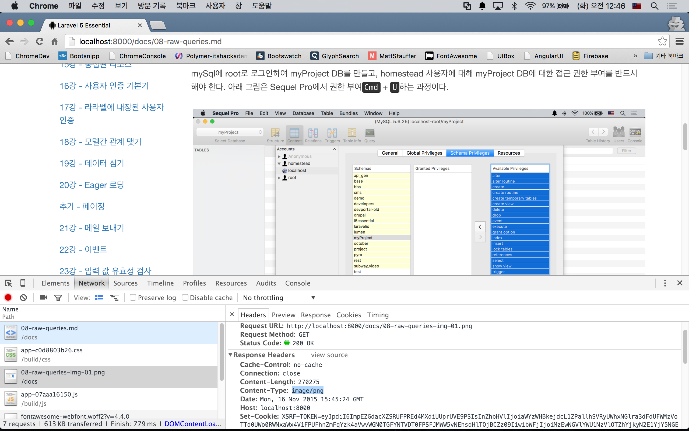
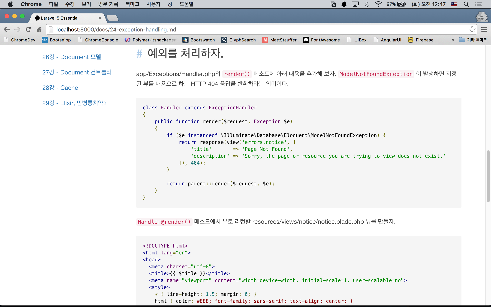

# 실전 프로젝트 1 - Markdown Viewer 

## 30강 - Debug & Final Touch

29강까지 작성한 우리 프로젝트에는 2가지 문제가 있다.

1.   이미지가 정상적으로 표시되지 않는다.
2.   Syntax Highlight가 없다.

### 이미지 표시하기

우리 이미지는 public 디렉토리 밖에, 그러니까 public 과 같은 레벨인 docs에 위치하고 있다. 즉 웹 서버가 접근할 수 없는 위치에 있다는 것이다. 이럴 경우에는 Route 에서 이미지 파일에 대한 요청을 받아서, 컨트롤러에서 Document Root(==public) 바깥 쪽에 위치한 이미지를 찾아 정확한 Content-type 으로 응답해 주어야 한다.

app/Http/routes.php 에 이미지 요청을 컨트롤러와 연결시키는 Route를 작성하자. 기존 문서 요청과 Route가 거의 동일하여, 이를 분리시키기 위하여 라라벨 Route의 글로벌 패턴이란 기능을 사용하였다. `Route::pattern()`의 첫번째 인자는 Route Parameter 이름, 두번째 인자는 정규표현식이다. 이 예제의 정규표현식은 01-welcome-image-01.png 에서는 매칭이 발생하고, 01-welcome.md 에서는 매칭이 발생하기 않는다. 해서, `Route::get('docs/{image}')`에서는 이미지 파일만 응답하고, `Route::get('docs/{file?}')` 에서는 나머지 docs로 시작하는 모든 경우에 대해 응답하게 된다.

```php
Route::pattern('image', '(?P<parent>[0-9]{2}-[\pL-\pN\._-]+)-(?P<suffix>img-[0-9]{2}.png)');

Route::get('docs/{image}', [
    'as'   => 'documents.image',
    'uses' => 'DocumentsController@image'
]);

Route::get('docs/{file?}', [
    'as'   => 'documents.show',
    'uses' => 'DocumentsController@show'
]);
```

**`참고`** 정규표현식의 작성 및 테스트를 위해서는 [Regex101](https://regex101.com/) 사이트를 이용할 것을 추천한다. 필자가 본 정규표현식 툴 중 최고이다.

이미지 응답을 만들기 위해서 intervention/image 패키지를 이용할 것이다. composer 로 설치하고, [매뉴얼](http://image.intervention.io/getting_started/installation#laravel)에 따라 config/app.php 파일에 서비스프로바이더, Facade도 추가하자.

```bash
$ composer require "intervention/image:2.3.*"
```

```php
//config/app.php
return [
    ...,
    'providers' => [
        ...,
        Intervention\Image\ImageServiceProvider::class,
    ],
    
    'aliases' => [
        ...,
        'Image' => Intervention\Image\Facades\Image::class,
    ]
];
```

이제 Image Facade를 이용할 수 있으니, DocumentsController 를 수정하자.

```php
class DocumentsController extends Controller
{
    ...
    
    public function image($file) {
        // 없는 파일을 요청할 때에 대비한 방어처리는 각자 해 보라~
        $image = \Image::make(base_path('docs' . DIRECTORY_SEPARATOR . $file));

        return $image->response('png');
    }
}
```



### Syntax Highlight 적용하기

Bower 콤포넌트를 설치하자!

```bash
$ bower install google-code-prettify --save-dev
```

gulpfile.js에 방금 다운로드 받은 패키지를 추가하자.

```javascript
elixir(function (mix) {
  mix
    .sass('...')
    .scripts([
      '...',
      '../vendor/google-code-prettify/src/run_prettify.js',
      'app.js'
    ], 'public/js/app.js')
    ....
  });
}
```

마크다운 컴파일러는 코드블럭을 `<pre>` 태그로 컴파일 한다. 따라서, `<pre>` 태그에 방금 설치 google-code-prettify의 스타일시들이 반응하도록 클래스를 추가해 줄 것이다. 마크다운 문서에 직접 추가할 수 없으니, resources/assets/js/app.js에 jQuery를 이용해 동적으로 추가해 보자.

```javascript
$("pre").addClass("prettyprint");
```

gulp 커맨드로 다시 빌드하고, 캐시도 지운 후 Syntax Highlight가 작 적용되었는지 확인해 보자.

```bash
$ gulp --production
$ php artisan cache:clear
```



---

- [목록으로 돌아가기](../readme.md)
- [29강 - Elixir](29-elixir.md)
