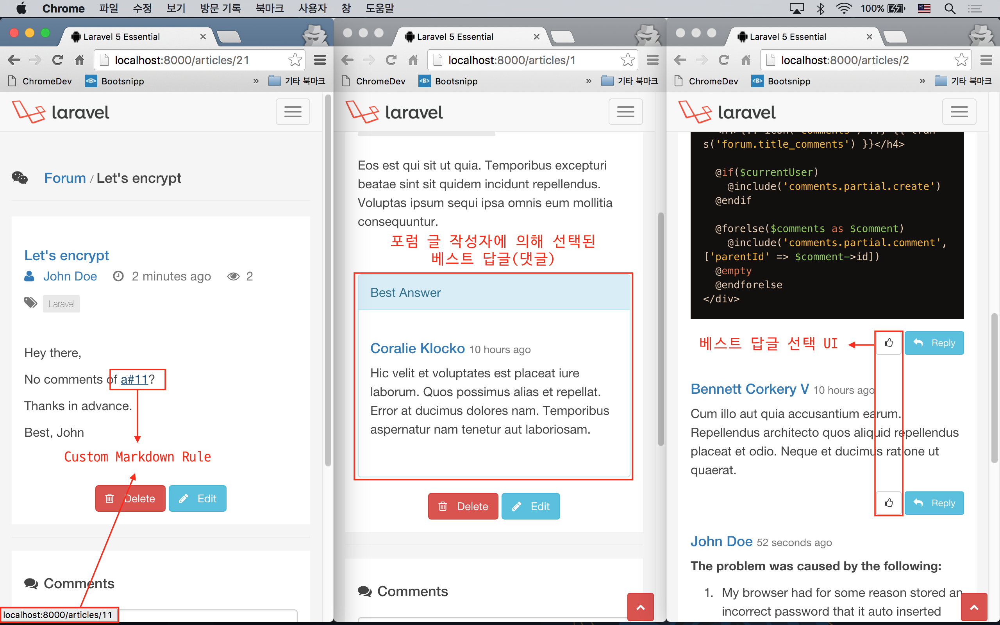

# 실전 프로젝트 2 - Forum

## 42강 - 서버 사이드 개선

아직 추가해야 할 기능들이 많지만, 이번 강으로 실전 프로젝트 2편은 마무리하기로 한다. 먼저 무엇을 개선할 지 리스트업하자.

1. 포럼에서 필터, 풀텍스트 검색, 정렬 기능을 제공한다.
2. 응답 성능 향상을 위해, 서버 사이드 캐싱을 활성화한다. `event:generate` 코맨드 이용한다.
3. 포럼에 댓글, 또는 댓글에 대댓글이 달릴 경우, 원본 글 작성자에게 이메일 알림을 발송한다. 이벤트를 수동으로 만들 것이다.
4. 서비스 디렉토리를 만들고, 기존 Markdown 컴파일러를 상속하여, 커스텀 컴파일 규칙을 만든다.
5. 앞 강에서 누락된 베스트 답글을 선택하고 표시하는 기능을 추가할 것이다.

### 필터, 풀 텍스트 검색, 정렬 기능

3가지 기능 모두가 `ArticlesController::index()` 와 관련이 있어 한번에 설명하기로 한다. 주목할 점은 필터를 적용하면 필터가 적용된 포럼 글만 표시된다. 풀 텍스트 검색을 적용하면 검색어에 해당하는 포럼 글만 표시된다. 반면, 정렬은 페이지에 표시할 포럼 콜렉션 자체를 변경하지는 않으며, 필터나 검색에 의해 선택된 포럼 콜렉션의 오름차순, 내림차순 정렬, 즉 Decoration만 하는 역할을 한다는 점을 기억하자. 

2가지 필터. 필터 추가는 독자들이 얼마든지 할 수 있을 것이다. URL 쿼리의 필드명은 'f' 로 하자. (e.g. f=nocomment)

- `nocomment`: 댓글이 없는 포럼 글
- `notsolved`: 베스트 답글이 없는 포럼 글

2가지 정렬 기준. URL 쿼리에서 's' 는 정렬할 기준 필드, 'd' 는 정렬방향으로 사용자에게 받는 걸로 하자. (e.g. s=created_at&d=asc)

- `created_at` 필드에 의한 정렬. Age 라 칭하자.
- `view_count` 필드에 의한 정렬. View 라 칭하자.

**`참고`** 간단해서 설명은 생략했지만, 포럼 상세보기 (`ArticlesController::show()`) 가 페이지 노출되었을 때 'view_count' 를 올리는 로직을 본 강좌에서 추가하였다.
 
#### UI 구현

기존의 'layouts.partial.search' 에 작성했던 검색 폼을 'articles.partial.search' 로 이동하였다. 기존 대비 폼에 action 속성이 추가되었고, 폼 전송을 하면 GET /articles?s=키워드 요청이 발생하며, 이는 `ArticlesController::index()` 에서 처리된다. 검색 키워드를 담고 폼을 통해 전송되는 필드 이름이 'q' 라는 것을 기억하자.  

```html
<!-- resources/views/articles/partial/search.blade.php -->

<form action="{{ route('articles.index') }}" method="get" role="search" id="search__forum">
  <input type="text" name="q" value="{{ Request::input('q') }}" class="form-control" placeholder="Search"/>
</form>
```

필터 목록을 표시할 UI를 추가하였다.

```html
<!-- resources/views/tags/partial/index.blade.php -->

<!-- Tags list here ... -->

<p class="lead">
  {!! icon('filter') !!} Filters
</p>
<ul class="list-unstyled">
  @foreach(['nocomment' => 'No Comment', 'notsolved' => 'Not Solved'] as $filter => $name)
    <li class="{{ (Request::input('f') == $filter) ? 'active' : '' }}">
      <a href="{{ route('articles.index', ['f' => $filter]) }}">
        {{ $name }}
      </a>
    </li>
  @endforeach
</ul>
```

포럼 목록 보기에서 정렬 UI 를 추가하였다.

```html
<!-- resources/views/articles/index.blade.php -->

<div class="btn-group pull-right sort__forum">
  <button type="button" class="btn btn-default dropdown-toggle" data-toggle="dropdown">
    {!! icon('sort') !!} Sort by <span class="caret"></span>
  </button>
  <ul class="dropdown-menu" role="menu">
    @foreach(['created_at' => 'Age', 'view_count' => 'View'] as $column => $name)
      <li class="{{ Request::input('s') == $column ? 'active' : '' }}">{!! link_for_sort($column, $name) !!}</li>
    @endforeach
  </ul>
</div>
```

위 뷰에서 정렬 링크를 생성하기 위해 `link_for_sort()` 라는 함수를 추가했는데 본문보다 코드에 설명하는 것이 더 효율적이라 생각되어, 코드 중간중간에 주석을 달았다. 

```php
// app/helpers.php

function link_for_sort($column, $text, $params = [])
{
    // 현재 요청의 'd' 쿼리 파라미터가 asc 이면, $reverse 에 desc
    $direction = Request::input('d');
    $reverse = ($direction == 'asc') ? 'desc' : 'asc';

    // 정렬을 위한 쿼리 파라미터(s) 의 값이 있으면,
    // 오름차순 또는 내림차순 아이콘을 함수의 인자로 넘겨 받은 $text 에 붙인다. 
    if (Request::input('s') == $column) {
        $text = sprintf(
            "%s %s",
            $direction == 'asc' ? icon('asc') : icon('desc'),
            $text
        );
    }

    // 현재 요청의 쿼리 스트링에서 'page', 's', 'd' 등을 제외한 나머지 쿼리 스트링과
    // 이 함수의 인자로 넘겨 받은 값들로 생성한 's', 'd' 등의 쿼리 스트링을 합쳐서
    // Anchor 태그의 href 속성 값에서 사용할 $queryString 생성한다.
    $queryString = http_build_query(array_merge(
        Input::except(['page', 's', 'd']),
        ['s' => $column, 'd' => $reverse],
        $params
    ));

    // 현재 요청 URL 을 Request::url() 로 얻어 오고,
    // 앞에서 만든 $queryString 문자열을 합쳐서 완전한 HTML <a> 태그를 생성한다. 
    return sprintf(
        '<a href="%s?%s">%s</a>',
        urldecode(Request::url()),
        $queryString,
        $text
    );
} 
```

위 함수에서 선택된 정렬 링크를 한번 더 선택하면, 오름차순, 내림차순 간에 토글된다. 물론, 아이콘도 같이 변경된다.

#### 마이그레이션

[MySql 공식 문서](https://dev.mysql.com/doc/refman/5.6/en/fulltext-boolean.html)를 이용하여 MySql 네이티브 풀텍스트 검색을 구현하기로 한다. 이를 위해 기존 마이그레이션을 약간 수정해야 한다.

```php
// database/migrations/create_articles_table.php

class CreateArticlesTable extends Migration
{
    public function up()
    {
        Schema::create('articles', function (Blueprint $table) { // ... });

        DB::statement('ALTER TABLE articles ADD FULLTEXT search(title, content)');
    }
    
    // ...
}
```

마이그레이션을 실행한다.

```bash
$ php artisan migrate:refresh --seed
```

#### 컨트롤러 구현

`index()` 메소드 안에 필터, 검색, 정렬 로직을 넣으면 길어져서 `filter()` 란 메소드로 빼내었다. 이번에도 코드에서 주석으로 설명한다.

**`참고`** 라라벨 커뮤니티에서는 비즈니스 로직과 데이터 소스를 디커플링시키고, 코드의 재활용성을 높이기 위해서 [Repository Pattern](https://msdn.microsoft.com/en-us/library/ff649690.aspx?f=255&MSPPError=-2147217396) 을 많이 사용한다. `filter()` 메소드와 같은 내용들은 Repository 로 옮겨져서 다른 클래서에서도 사용할 수 있도록 하면 좋을 것이다.

```php
// app/Http/Controllers/ArticlesController.php

class ArticlesController extends Controller
{
    public function index(FilterArticlesRequest $request, $id = null)
    {
        $query = $id
            ? Tag::findOrFail($id)->articles()
            : new Article;

        $query = $query->with('comments', 'author', 'tags', 'solution', 'attachments');
        $articles = $this->filter($request, $query)->paginate(10);

        return view('articles.index', compact('articles'));
    }

    protected function filter($request, $query)
    {
        if ($filter = $request->input('f')) {
            // 'f' 쿼리 스트링 필드가 있으면, 그 값에 따라 쿼리를 분기한다.
            switch ($filter) {
                case 'nocomment':
                    $query->noComment();
                    break;
                case 'notsolved':
                    $query->notSolved();
                    break;
            }
        }

        if ($keyword = $request->input('q')) {
            // 이번에도 'q' 필드가 있으면 풀텍스트 검색 쿼리를 추가한다.
            $raw = 'MATCH(title,content) AGAINST(? IN BOOLEAN MODE)';
            $query->whereRaw($raw, [$keyword]);
        }

        // 's' 필드가 있으면 사용하고, 없으면 created_at 을 기본값으로 사용한다.
        $sort = $request->input('s', 'created_at');
        // 'd' 필드가 있으면 사용하고, 없으면 desc 를 기본값으로 사용한다.
        $direction = $request->input('d', 'desc');

        return $query->orderBy($sort, $direction);
    }
    
    // Other codes ...
}
```

컨트롤러 구현 중에 좀 더 가독성 높은 쿼리를 위해, Article 모델에 아래 2개의 쿼리스코프를 추가하였다.

```php
// app/Article.php

class Article extends Model
{
    public function scopeNoComment($query)
    {
        return $query->has('comments', '<', 1);
    }

    public function scopeNotSolved($query)
    {
        return $query->whereNull('solution_id');
    }
}
```

`ArticlesController::index()` 에서 `FilterArticlesRequest` 란 Form Request 를 받는다. 이는 브라우저의 주소표시줄을 통해 사용자의 눈에도 보이는 HTTP GET 쿼리 스트링을 통해서, 'f', 's', 'd' 등의 필드 값이 전달되기 때문에, 서비스에서 허용하지 않는 문자열이 들어오는 것을 막기 위한 조치이다.

```php
// app/Http/Requests/FilterArticlesRequest.php

class FilterArticlesRequest extends Request
{
    public function rules()
    {
        return [
            'f' => 'in:nocomment,notsolved',   // filter
            's' => 'in:created_at,view_count', // Sort: Age(created_at), View(view_count)
            'd' => 'in:asc,desc',              // Direction: Ascending or Descending
            'q' => 'alpha_dash',               // Search query
        ];
    }
}
```

컨트롤러 코드에서 풀텍스트 검색을 위해 `whereRaw()` 란 날 SQL을 쓸 수 있는 메소드를 이용하였고, 특수한 MySql 쿼리를 이용하였다. 쿼리는 앞서 언급한 [MySql 공식 문서](https://dev.mysql.com/doc/refman/5.6/en/fulltext-boolean.html)를 참고하였다.

**`참고`** 여기서는 MySql 네이티브 풀텍스트 검색을 이용했지만, 데이터베이스 엔진의 의존성을 버리고 빠른 성능을 달성하기 위해서는 [Elastic Search](https://www.elastic.co/downloads/elasticsearch) 등을 검토해 보기 바란다.


### 캐시

#### 동작 원리

아래와 같은 원리로 동작할 것이다. () 안에 포함된 내용은 'file', 'database' 캐시에는 적용되지 않는다.

- `ArticlesController::index()` 에서 Article 모델의 콜렉션을 캐시에 ('xxx' 라는 태그로) 저장한다.
- 신규 Article 모델의 생성, 기존 모델의 수정 또는 삭제시 이벤트를 던져 ('xxx' 태그를 가진) 캐시를 삭제한다.

#### 도우미 패키지 설치

라라벨의 캐시 기능을 좀 더 편리하게 사용하기 위해서 [watson/rememberable](https://github.com/dwightwatson/rememberable) 패키지를 가져와서 사용할 것이다. 라라벨 4 버전에 있다가 5 버전에서 빠진 기능이다.

```bash
$ composer require watson/rememberable
```

이 패키지는 `Watson\Rememberable\Rememberable` 이란 Trait를 제공하는데, Model 에서 use 키워드로 활성화시켜 주면, `remember(\DateTime|int $minutes)` 란 메소드에 접근할 수 있다. 모든 모델에서 앞서 언급한 Trait 를 써주는 것은 피곤하기도 하거니와, 코드 구조화 측면에서 추상 모델 클래스 (abstract Model) 를 하나 만들고, 우리 프로젝트의 모델들은 이 추상 모델을 상속 받도록 하자. 이 추상 모델은 Eloquent 를 상속 받을 것이다.
 
```php
// app/Mode.php

<?php

namespace App;

use Illuminate\Database\Eloquent\Model as Eloquent;
use Watson\Rememberable\Rememberable;

abstract class Model extends Eloquent
{
    use Rememberable;
}
```

원래 'Article.php' 에 있던 `use Illuminate\Database\Eloquent\Model` 선언이 'Model.php' 로 이동한 것을 확인하자. 

```php
// app/Article.php

<?php

namespace App;

class Article extends Model { // ... }
```

#### 컨트롤러에서 캐시 기능 활성화

`remember()` 메소드는 분 단위로 지정된 캐시의 수명을 인자로 받게 되어 있다. 5분이라고 지정했다. 

`with()` 메소드 바로 뒤에 `remember()` 메소드를 체인했는데, 이는 Eager Loading 된 관계를 포함하여 모든 Article 콜렉션을 캐시에 저장한다는 의미이다. 

[캐시 태그](http://laravel.com/docs/cache#cache-tags) 는 캐시 키에 대한 별칭이라고 볼 수 있다. 가령, 'dogs' 란 캐시 키를 지정하고, 'animals' 란 캐시 태그를 지정한 후, 'animals' 태그에 속하는 모든 캐시를 한방에 지울 수 있다. 주의할 점은 `remember()` 메소드와 결합되었을 때는 `tags()` 메소드 대신 `cacheTags(string|array $cacheTags)` 를 사용하여야 한다는 점이다.

[캐시 태그](http://laravel.com/docs/cache#cache-tags) 를 쓸 때 또 하나 주의할 점은, 'file', 'database' 캐시 드라이버에서는 태그를 쓸 수 없다는 점이다. 아래 코드에서 `taggable()` Helper 가 태그 사용 가능성을 체크해 준다.

```php
// app/Http/Controllers/ArticlesController.php

class ArticlesController extends Controller
{
    public function index(FilterArticlesRequest $request, $id = null)
    {
        $query = $id
            ? Tag::findOrFail($id)->articles()
            : new Article;

        $query = taggable()
            ? $query->with('comments', 'author', 'tags', 'attachments')->remember(5)->cacheTags('articles')
            : $query->with('comments', 'author', 'tags', 'solution', 'attachments')->remember(5);

        // ...
    }
}
```

앞서 언급한 `taggable()` Helper 는 'config/cache.php' 를 읽어 와서, default 드라이버가 'file' 또는 'database' 인지를 체크한다.

```php
// app/helpers.php

function taggable()
{
    return !in_array(config('cache.default'), ['file', 'database']);
}
```

#### 캐시 삭제 이벤트

모델에 변경 사항이 있을 때 이벤트를 던져, 지정된 태그의 캐시만 비울 것이다. 앞서 설명했듯이, 캐시 태그 기능은 'file', 'database' 캐시 드라이버에서 지원되지 않으므로, 캐시 전체를 비우는 식으로 구현할 것이다.

모델에 변경이 발생하는 `store()`, `update()`, `destroy()` 메소드에서 각각 이벤트를 던져야 한다. `ModelChanged` 라고 이름 지었고, 이벤트 데이터로 지워야 할 태그의 리스트를 전달하였다.

```php
// app/Http/Controllers/ArticlesController.php

class ArticlesController extends Controller
{
    public function store(ArticlesRequest $request)
    {
        // ...
        event(new ModelChanged(['articles', 'tags']));
    }
    
    // ...
}
```

[22강 - 이벤트](22-events.md) 에서 배운 내용과는 다른 방법을 이용할 것이다. 

이벤트 이름과, 리스너 이름을 먼저 정한다. 이벤트 이름은 앞서 컨트롤러에서 `ModelChanged` 로 정했고, 리스너는 `CacheHandler` 로 정했다.

```php
// app/Prividers/EventServiceProvider.php

class EventServiceProvider extends ServiceProvider
{
    protected $listen = [
        \App\Events\ModelChanged::class => [
            \App\Listeners\CacheHandler::class
        ],
    ];
    
    // ...
}
```

artisal CLI 로 이벤트 클래스와 리스너 클래스를 만든다. 'app/Events/ModelChanged.php' 와 'app/Listeners/CacheHandler.php' 파일이 만들어 진 것을 확인하자.

```bash
$ php artisan event:generate
```

이벤트 클래스는 단순한 DTO (== [Data Transfer Object](https://en.wikipedia.org/wiki/Data_transfer_object)) 로 클래스간 데이터를 주고 받기 위한 매개체이다. 해서, DTO의 클래스 변수들은 모두 public 으로 주어야 한다는 것을 주의하자.

```php
// app/Events/ModelChanged.php

<?php

namespace App\Events;

use Illuminate\Queue\SerializesModels;

class ModelChanged extends Event
{
    use SerializesModels;

    public $cacheTags;

    public function __construct($cacheTags)
    {
        $this->cacheTags = $cacheTags;
    }
}
```

리스너도 별 것 없다. `EventServiceProvider` 의 `$listen` 속성에서 이벤트에 연결된 리스너의 `handle()` 메소드를 기본적으로 호출하게 되어있고, 이 메소드에는 이벤트 객체를 인자로 넘겨 주게 되어 있다. 

`ModelChanged` 객체를 넘겨 받았으므로, 위헤서 정의한 `$cacheTags` 변수에 쉽게 접근할 수 있다. `taggable()` Helper 로 태그 기능이 없으면, 캐시 전체를 삭제하고 Early Return 을 하도록 하자.

```php
// app/Listeners/CacheHandler.php

<?php

namespace App\Listeners;

use App\Events\ModelChanged;

class CacheHandler
{
    public function handle(ModelChanged $event)
    {
        if (! taggable()) {
            // Remove all cache store
            return \Cache::flush();
        }

        // Remove only cache that has the given tag(s)
        return \Cache::tags($event->cacheTags)->flush();
    }
}
```

> **`참고`** memcached 사용 관련... 
> 필자의 경우, memcache 사용을 위하여 'memcached(system library)', 'php-memcached(php module)' 을 모두 설치해 주어야 했다.
> memcached 를 사용하려면 .env.php 에서 CACHE_DRIVER=memcached 로 수정하고, 아래 설치 및 실행 명령을 참고하자.

```bash
# Linux
$ sudo apt-get install memcached php5-memcached
# Mac OS
$ brew install memcached homebrew/php/php5x-memcached
# Run as daemon mode
$ memcached -u memcached -d -m 30 -l 127.0.0.1 -p 11211
```

**`완전 잡담`** 가령, `Article::with('...')->where('...')->get()` 쿼리를 할 때, `with()` 가 붙는 순간 `Illuminate\Database\Eloquent\Builder` 인스턴스로 변하고, `get()` 으로 최종 결과값을 가져오면 `Illuminate\Database\Eloquent\Collection` 인스턴스가 된다.  

### 이메일 알림

별로 어렵지 않은데, 앞 전의 이벤트와 약간 다른 방식으로 이벤트와 핸들러를 등록할 것이다.

```php
// app/Providers/EventServiceProvider.php

class EventServiceProvider extends ServiceProvider
{
    // ...
    
    public function boot(DispatcherContract $events)
    {
        parent::boot($events);
        $events->listen('comments.*', \App\Listeners\CommentsHandler::class);
    }
}    
```

[22강 - 이벤트](22-events.md) 에서 배운 내용과 유사하다. 다만, `listen()` 메소드를 쓴 위치만, 글로벌 routes.php 에서 위 파일로 옮겨졌을 뿐이다. 'comments.*' 는 예상한대로, 'comments.' 로 시작하는 모든 이벤트를 `\App\Listeners\CommentsHandler::handle()` 로 연결시키겠다는 의미이다.

아래는 이벤트 핸들러 구현인데, 이메일을 보내는 일반적인 구현이다. 특이할만한 점은 `$comment->commentable()` 메소드를 이용하여 Comment 에 연결된 Article 객체를 가져와서 `author->email` 을 접근했다는 부분과, Comment 자신의 부모 Comment 의 `author->email` 도 같이 가져와서, 수신자에서 중복을 제거하고 메일을 발송하고 있다는 점이다.

'emails.new-comment' 뷰는 설명을 생략한다.

```php
// app/Listeners/CommentsHandler.php

<?php

namespace App\Listeners;

use App\Comment;

class CommentsHandler
{
    public function handle(Comment $comment)
    {
        $to[] = $comment->commentable->author->email;

        if ($comment->parent) {
            $to[] = $comment->parent->author->email;
        }

        $to = array_unique($to);
        $subject = 'New comment';

        return \Mail::send('emails.new-comment', compact('comment'), function($m) use($to, $subject) {
            $m->to($to)->subject($subject);
        });
    }
}
```

### Markdown 컴파일러 확장

[25강 - 컴포저](25-composer.md) 에서 가져온 `ParsedownExtra` 클래스를 이용하여, 사용자가 마크다운으로 작성한 포럼 글을 다시 보여줄 때 잘 사용하고 있었다. 

그런데, 갑자기 새로운 요구사항이 생겼다고 가정하자. 'a#포럼글id' 또는 'article#포럼글id' 식으로 마크다운 본문을 쓰면, 자동으로 해당 id로 이동하는 링크를 제공해야 한다고 하자.

먼저, `ParsedownExtra` 상속받아 이 프로젝트만의 `Markdown` 클래스를 만들고, 여기에 해당 로직을 녹여 넣도록 하자. `preg_*()` 함수는 PHP 내장함수로 사용법에 대한 설명은 공식 문서를 참고하기 바란다. 다만, `public function text($text)` 의 마지막 줄 `return parent::text($text);` 에서 넘겨 받은 raw 문자열에서 필요한 컴파일 작업을 먼저 수행하여 얻은 결과물을 부모 클래스로 넘겨 데코레이션한 부분은 눈여겨 볼만하다. 

```php
// app/Services/Markdown.php

<?php

namespace App\Services;

use ParsedownExtra;

class Markdown extends ParsedownExtra {

    const PATTERN_ARTICLE = '/(article|a)\#(?P<id>\d+)/i';

    public function text($text) {
        if (preg_match(self::PATTERN_ARTICLE, $text, $matches) > 0) {
            $text = preg_replace_callback(self::PATTERN_ARTICLE, function ($matches) {
                return sprintf(
                    "<a href='%s'>%s</a>",
                    route('articles.show', $matches['id']),
                    $matches[0]
                );
            }, $text);
        }

        return parent::text($text);
    }
}
```

### 베스트 답글 선택 구현
 
#### UI 구성

포럼 상세 보기 본문에 베스트 답글(== 댓글)이 있으면, 표시하도록 하였다.

또, 댓글 뷰를 `@include` 할 때, `$solved`, `$articleOwner` 란 새로운 변수도 넘겨 주도록 하였다.

```html
<!-- resources/views/articles/show.blade.php -->

<div class="col-md-9">
  <article id="article__article" data-id="{{ $article->id }}">
    <!-- ... -->
    @if ($article->solution)
      @include('comments.partial.best', ['comment' => $article->solution])
    @endif
  <!-- ... -->
  
  <article>
    @include('comments.index', [
      'solved' => $article->solution,
      'articleOwner' => $currentUser && $article->isAuthor()
    ])
  </article>
</div>
```

'comments.partial.best' 뷰는 특별한 내용이 없으므로 생략한다.
 
포럼 글에 대해서 베스트 댓글이 없으면, 포럼 글 작성자가 베스트를 선택할 수 있도록 UI를 제공해야 한다. 'articles.show' 뷰에서 넘겨 받은, `$solved`, `$articleOwner` 변수를 활용하고 있는 것을 확인할 수 있다.

아래에서 `@parent` 란 블레이드 문법에 주목하자. 이는 부모 뷰에 동일한 이름의 `@section` 정의가 있으면, 둘을 합쳐서 `@yield` 할 수 있게 해 준다. 가령, 'comments.partial.commnet' 뷰에 `@section('script')` 가 있고, 부모 뷰인 'comments.index' 에도 `@section('script')` 가 있다면, `@parent` 키워드를 포함하지 않으면, 일반적인 클래스 상속과 동일하게 자식뷰의 섹션이 부모뷰를 오버라이드해 버린다.

```html
<!-- resources/views/comments/partial/comment.blade.php -->

@if ($currentUser)
<p class="text-right" style="margin-top: 1rem;">
  @if (! $solved && $articleOwner)
    <button type="button" class="btn btn-default btn-sm btn__pick" title="Pick as the Best Answer">
      {!! icon('pick', false) !!}
    </button>
  @endif
  <!-- Reply button here ... -->
</p>
@endif

@section('script')
  @parent
  <script>
    // Other javascript codes ...
    $("button.btn__pick").on("click", function(e) {
      var articleId = $("#article__article").data("id"),
          commentId = $(this).closest(".media__item").data("id");

      if (confirm("Are you sure to select this comment as the 'Best'?")) {
        $.ajax({
          type: "POST",
          url: "/articles/" + articleId + "/pick",
          data: {
            _method: "PUT",
            solution_id: commentId
          }
        }).success(function() {
          flash('success', 'Updated ! The page will reload in 3 secs.', 2500);
          reload(3000);
        });
      }
    });
  </script>
@stop
```



### 그 외 추가된 장식들

- [22강 - 이벤트](22-events.md) 에서 썼던 users.last_login 필드를 살려서, 사용자가 로그인할 때마다 시각을 업데이트하였다. (database/migrations/create_users_table.php, app/Http/Controllers/SessionsController.php, app/Providers/EventServiceProvider.php, app/Listeners/UserEventsHandler.php)
- 포럼 상세 보기 페이지가 로드될 때마다 articles.view_count 값을 올려 조회수를 표시하는 기능을 추가하였다. (database/migrations/create_articles_table.php, app/Providers/EventServiceProvider.php, app/Listeners/ViewCountHandler.php, resources/views/articles/partial/article.blade.php)

---

- [목록으로 돌아가기](../readme.md)
- [41강 - UI 개선](41-ui-makeup.md)