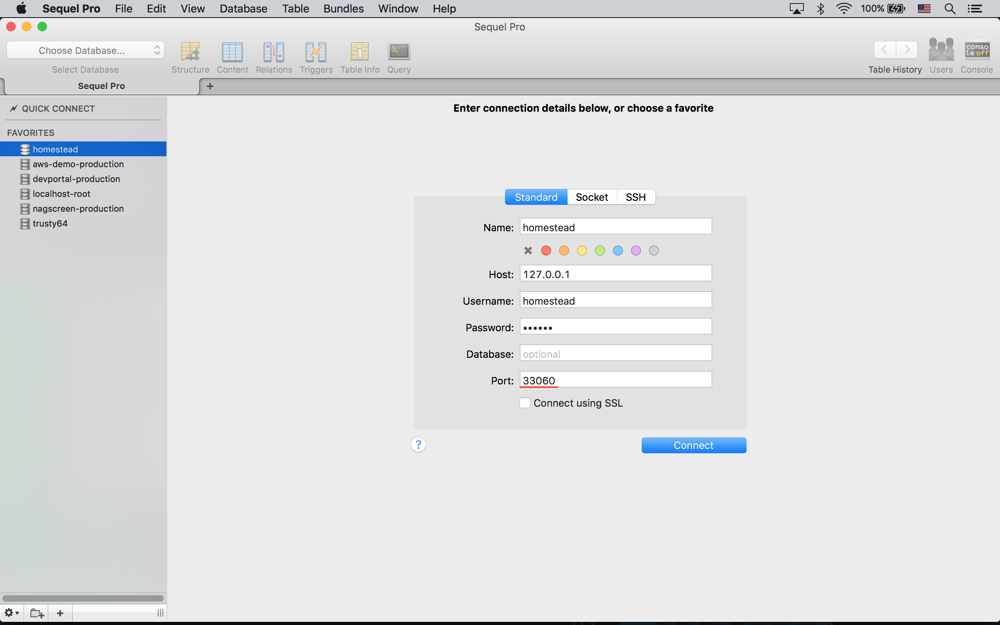

# Homestead 설치 (on Mac)

## 사전 요구 사항

[VirtualBox](https://www.virtualbox.org/wiki/Downloads) 와 [Vagrant](http://www.vagrantup.com/downloads.html) 설치가 필요하다. 인스톨러 화면에서 "Next" 만 계속 눌러서 쉽게 설치할 수 있다.
 
## Vagrant Box 설치

라라벨 커뮤니티에서 미리 준비해서 [Vagrant Box Registry](https://atlas.hashicorp.com/boxes/search) 에 배포해 놓은 `laravel/homestead` Vagrant Box (==Virtual Machine Image) 를 다운로드 하는 과정이다. 이 강좌를 쓰는 시점에 `laravel/homestead` Vagrant Box 의 최신 버전은 PHP7 이 기본 포함되어 있는 0.4.0 이다. 여기서는 PHP5 버전을 쓸 것이므로, `--box-version 0.3.3` 옵션을 추가해 주었다.

```bash
$ vagrant box add laravel/homestead --box-version 0.3.3

# 설치에 실패했다면, 기존 다운로드 찌거기를 지우고 다시 다운로드 받기 위해 --clean 옵션 스위치를 붙여야 한다.
# 기존에 설치한 laravel/homestead Box 을 덮어쓰고 강제로 다시 설치하려면 --force 옵션 스위치를 붙인다.
```

설치 과정에 아래 처럼 Virtual Machine Provider 를 선택하는 화면이 나온다. `2) vmware` 는 [Vagrant 용 Plugin](http://www.vagrantup.com/vmware) 을 별도로 사서 설치해야 한다는 점을 알고 있자. 이 강좌를 쓰는 현재 Vmware Vagrant Plugin 의 가격은 $79 이다. 무료로 쓸 수 있는 `1) virtualbox` 를 선택했다. OS 에 따라 수 GB 용량을 다운로드 받아야 하므로 꽤 오랜 시간이 걸린다.

```bash
This box can work with multiple providers! The providers that it
can work with are listed below. Please review the list and choose
the provider you will be working with.

1) virtualbox
2) vmware_desktop

Enter your choice: 1
```

## Homestead CLI 설치

[Homestead CLI](https://github.com/laravel/homestead) 는 `vagrant` CLI 의 Wrapper 이다. `vagrant` 대신 `homestead` 코맨드를 이용할 수 있다.  

```bash
$ composer global require "laravel/homestead:2.*"
```

`homestead` CLI 는 '~/.composer' 디렉토리에 설치된다. 경로 지정없이 `homestead` 명령을 사용하려면, 아래 처럼 경로를 추가해 주어야 한다.

```bash
# 사용하는 Shell 에 따라 Profile 파일 이름은 다를 수 있다. 
# 필자는 Zshell 을 쓰므로, .zshrc 이다. e.g. .profile, .bashrc
$ nano ~/.zshrc

# composer global 로 설치한 패키지들의 실행파일을 경로에 넣어 준다.
# 이 과정이 없다면 $ ~/.composer/vendor/bin/homestead 와 같이 전체 경로를 써주어야 한다.
export PATH="$PATH:$HOME/.composer/vendor/bin"

# 수정했다면 ctrl + X, "Y" 를 눌러 변경 내용을 저장하고, 엔터를 한번 더 눌러 기존 파일을 덮어 쓴다. 

# 그리고, 수정 내용을 현재 콘솔에 적용해 준다. 콘솔을 껐다가 다시 실행해도 된다.
$ source ~/.zshrc
```

최신 버전이 `3.*` 이지만, 필자는 굳이 구 버전인 `2.*` 를 설치했다. 새 버전은 `laravel/homestead` Vagrant Box v0.4.0 과 궁합이 맞도록 구현 되어 있을 뿐만아니라, 아래에 나온 편리한 코맨드들도 모두 제거되었기 때문이다.

```bash
$ homestead
  Laravel Homestead version 2.1.8
  
  Usage:
    command [options] [arguments]
  
  Options:
    # ...
  
  Available commands:
    destroy     Destroy the Homestead machine
    edit        Edit a Homestead file
    halt        Halt the Homestead machine
    help        Displays help for a command
    init        Create a stub Homestead.yaml file
    list        Lists commands
    make        Install Homestead into the current project
    provision   Re-provisions the Homestead machine
    resume      Resume the suspended Homestead machine
    run         Run commands through the Homestead machine via SSH
    ssh         Login to the Homestead machine via SSH
    ssh-config  Outputs OpenSSH valid configuration to connect to Homestead
    status      Get the status of the Homestead machine
    suspend     Suspend the Homestead machine
    up          Start the Homestead machine
    update      Update the Homestead machine image
```

`make` 란 명령은 꽤 최근에 추가된 것인데, 각 프로젝트마다 별도의 Homestead 설정을 만들 수 있는 명령이다. Docker 의 Container 개념과 유사하다고 볼 수 있다. 복수의 프로젝트를 개발 중이고, 프로젝트간에 서버 환경이 굉장히 많이 다르다면, 사용하면 좋을 것 같다.

## Homestead 설정

`laravel/homestead` Vagrant VM 을 올바르게 셋팅하기 위한 설정 파일은 '~/.homestead' 디렉토리에 위치해야 한다. 아래 명령으로 이 설정 파일을 초기화하자.

```bash
$ homestead init
```

Homestead 설정을 우리 프로젝트에 맞게 수정하자.

```bash
$ homestead edit

# 로컬에 Sublime Text 가 설치되어 있지 않다면..
# ~/.homestead/Homestead.yaml 을 편집기로 직접 열면 된다.
```

```bash
# ~/.homestead/Homestead.yaml

ip: "192.168.10.10" # homestead VM 이 사용할 ip 주소
memory: 2048
cpus: 1
provider: virtualbox # Virtual Machine Provider

# SSH 로그인에 사용할 public key. 이 키 값은 homestead VM 의 
# /home/vagrant/.ssh/authorized_keys 에 자동으로 추가된다.
authorize: ~/.ssh/id_rsa.pub 

keys:
    - ~/.ssh/id_rsa # SSH 로그인에 사용할 private key

# 로컬과 VM 간에 공유할 폴더를 설정한다.
# 이 강좌용 라라벨은 ~/workspace/myProject 에 위치한다고 가정한다.
folders:
    - map: ~/workspace # 로컬 디렉토리 경로
      to: /home/vagrant/Code # VM 의 디렉토리 경로

# 도메인 이름 (hostname) 과 VM 에 설치된 웹 서버의 Document Root 를 설정한다.
sites:
    - map: myproject.dev # 도메인 이름
      to: /home/vagrant/Code/myProject/public # 웹 서버의 Document Root
    # 사이트를 추가하려면.. 아래 처럼 추가 사이트를 정의한 다음
    # VM 콘솔에서 $ homestead provision 명령을 실행한다.
    - map: example.dev
      to: /home/vagrant/Code/example/public

# 서버 프로비저닝 과정에서 아래에 정의한 DB 를 만들어 준다.
databases:
    - myProject
```

## Host 파일 설정

Homestead 설정에서 myproject.dev 란 도메인을 이용했다. 이런 도메인은 존재하지 않는다. 운영체제의 Host 파일을 수정할 것이다. 운영체제에 포함된 'hosts' 파일은 DNS 로 myproject.dev 에 대한 ip 주소 Resolution 요청이 나가기 전에 요청을 낚아 채서, 'hosts' 파일 안에서 찾는다. 사용자가 요청한 도메인에 해당하는 레코드가 있으면 지정된 ip 주소로 이동할 것이다.

```bash
$ sudo nano /etc/hosts
```

```bash
# /etc/hosts

192.168.10.10    myproject.dev
```

## Homestead 실행

실행해 보자. 처음 실행할 때는 시간이 좀 걸리는데, 이유는 앞에서 Homestead.yaml 에 설정한, ip 주소, public key 복사, 공유 폴더 설정 등을 하기 때문이다.

```bash
$ homestead up

# homestead VM 을 중지시킬 때는 $ homestead halt
# 완전히 끌 때는 $ homestead suspend
```

VM 에 로그인하고 Homestead.yaml 설정이 잘 먹었나 확인해 보자.

```bash
$ homestead ssh
# Welcome to Ubuntu 14.04.3 LTS (GNU/Linux 3.19.0-25-generic x86_64)

vagrant@homestead:~$ ls ~/Code
# ... myProject ...

vagrant@homestead:~$ ifconfig | grep 192.168.10.10
# inet addr:192.168.10.10  Bcast:192.168.10.255  Mask:255.255.255.0

vagrant@homestead:~$ cat ~/.ssh/authorized_keys
# ssh-rsa AAAAB3NzaC1...D3XDfv juwonkim@me.com
```

**`참고`** ssh 를 이용해 직접 접속하려면 `$ ssh vagrant@myproject.dev -D 2222`. 

## 데이터베이스 접속

Host `127.0.0.1`, Port `33060`, Username `homestead`, Password `secret` 로 접속한다. PostgresSQL 의 경우 Port `54320` 으로 접속한다.



## 웹 서버 접속

Homestead 에는 Nginx 가 기본으로 탑재되어 있고, Homestead.yaml 의 sites 섹션에서 설정한대로 이미 서비스가 돌고 있는 상태이다.

브라우저에서 'http://myproject.dev' 로 접속해 보자. 테스트용으로 쓸 수 있는 self-signed 인증서가 설치되어 있기 때문에 'https://myproject.dev' 도 사용할 수 있다.

<!--@start-->
---

- [목록으로 돌아가기](../readme.md)
<!--@end-->
