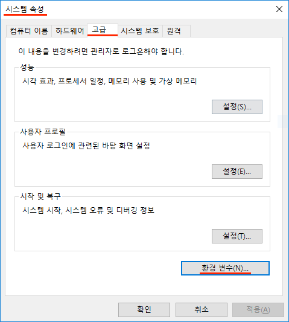
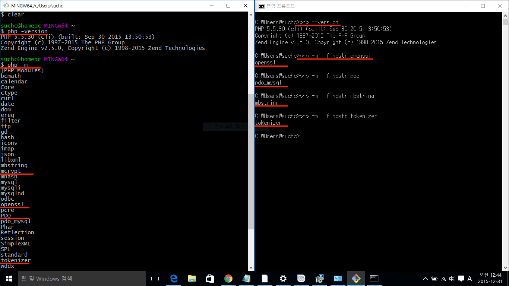
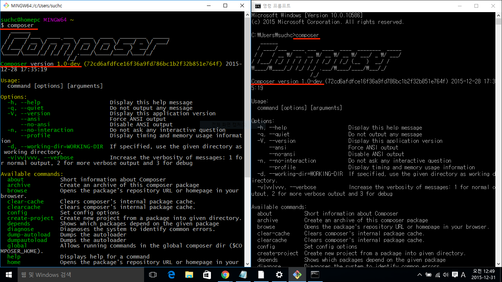
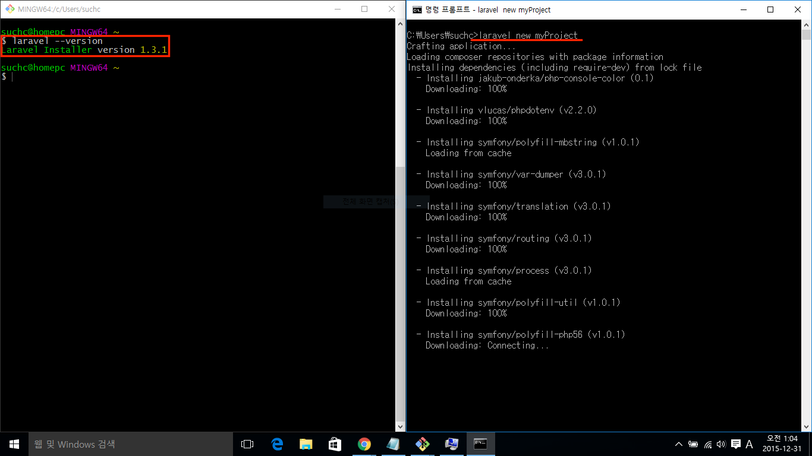

# 2강 - 라라벨 5 설치하기 (on Windows)

Windows 사용자라면 Mac 으로 전환할 것을 권장한다. 필자는 10년도 훨씬 전에 Windows Server 2000 트랙에서 [MCSE](https://www.microsoft.com/en-us/learning/mcse-certification.aspx) 였었다. 무려 6 주에 걸쳐 매주 한 과목씩 총 6 과목을 시험을 봐야 했었다. 예전엔 Windows 밖엔 쓸 줄 몰랐단 얘기다. 

어쨌든 시간이 지나면서 여러 OS 를 경험하고 난 후 필자가 느낀 바는 Windows 는 개인용 PC 운영체제로 나쁘지 않다는 점이다. 서버 운영체제로 쓸 때도 나쁘지 않다. 헌데 **개발자 용으로 쓸 때 Windows 는 Mac 대비 생산성 측면에서 아주아주아주 별로다**. 특히, 콘솔. 아래 그림은 캘리포니아의 어느 개발자 컨퍼런스 모습인데.. 아마 Windows 가 대세인 한국에서 다양한 개발 생산성 도구들을 개발했다면 아래 그림은 완전 역전되었을 지도 모르겠다. 


## 개발 환경 셋업

시작하기 전에.. 사용자 계정이 한글이거나, 영문이더라도 사용자 계정에 공백이 있다면 반드시 새로운 사용자 계정을 만들고 아래 과정을 수행하시기 바란다.

> 홍길동 (x), user name (x), username (o)

### [이 코스에서 사용] 로컬 개발 환경

Windows 사용자에게도 2가지 옵션이 있다. 로컬 PC를 개발 머신으로 쓰거나, 다음 절에 설명하는 Homestead 를 쓰는 방법이다. 

이 코스에서는 **로컬 PC를 개발환경으로 쓰는 것을 가정하고 설명**한다. 로컬 PC에 PHP, Mysql 이 설치되어 있지 않다면 [Bitnami Wamp](https://bitnami.com/stack/wamp) 를 이용해 설치하자. 

Bitnami 를 이용해 설치한 PHP 실행기가 OS 환경변수에 등록되어 있지 않으므로 등록해 주어야 한다. 제어판 -> 시스템 -> 고급 -> 시스템 변수 또는 환경 변수에서 Path 부분을 찾은 다음, PHP 실행기의 경로를 등록한다. 필자의 경우 `C:\Bitnami\wampstack-5.5.30-0\php` 을 등록하였다. 열려 있던 코맨드 프롬프트 창이 있다면, 재 실행 해 주어야 방금 변경한 환경설정의 적용된다는 것을 꼭 기억하자.




그리고, 코맨드 프롬프트 대체 프로그램인 [Git Bash](https://git-for-windows.github.io/) 를 설치하자. 

## **[OPTIONAL]** 공짜로 쓰는 개발 서버 "Homestead"

개발팀 구성원들이 동일한 개발 환경을 가지기 위해서, 또는 Production 과 유사한 환경에서 개발하기 위해서 Homestead 사용을 권장한다. Homestead 는 위에서 언급한 필요 확장 모듈이 기본 설치되어 있다.

설정법은 꽤나 까다로우니 [Homestead 설치 (on Windows)](02-install-homestead-windows.md) 를 참고하자.

## 라라벨이 동작하기 위한 PHP 버전 및 필요 모듈 조건 확인

라라벨을 설치하려는 개발환경 또는 서버가 아래 필요사항을 충족하는 지 확인한다.
- php 5.5.9 이상
- php Extensions
    - OpenSSL
    - PDO
    - Mbstring
    - Tokenizer

```bash
# Git Bash
$ php --version # PHP 5.5.30
$ php -m # Git Bash 에서는 파이프 (`|`) 연산자가 먹지 않아 `grep` 명령을 쓸 수 없다.

# Windows Command Prompt
\> php --version # PHP 5.5.30
\> php -m | findstr openssl
\> php -m | findstr pdo
\> php -m | findstr mbstring
\> php -m | findstr tokenizer
```

Bitnami Wamp 를 설치했다면 모두 설치되어 있을 것이다. 이미 PHP, Mysql 이 설치되어 있었던 경우에, 필요한 모듈 중 하나라도 빠진게 있다면 구글링해서 설치하자~



## 이제 라라벨을 설치해 보자.

라라벨 인스톨러를 사용할 것을 권장한다. 왜냐하면 Composer 를 이용해 설치하는 것 보다 훨~씬 빠르니까...

먼저, Composer 가 필요하다. 왜냐하면, 라라벨 인스톨러가 Composer 를 통해 배포되기 때문이다. [윈도우즈용 Composer 인스톨러](https://getcomposer.org/Composer-Setup.exe)를 다운로드 받아 설치하자. 설치 중에 PHP 경로를 물어본다면, 앞 절에서 설정한 경로로 찾아 들어가서 PHP 실행기를 선택해 준다. 

```bash
\> composer --version # Composer version 1.xx
```



이제 Composer 를 이용해서 라라벨 인스톨러를 설치한다.

```bash
\> composer global require "laravel/installer"
```

`laravel` 코맨드를 어디서든 접근할 수 있게 Path 환경변수를 설정하자. 필자의 경우 `C:\Users\{username}\AppData\{Local|Roaming}\Composer\vendor\bin` 을 등록하였다. 환경 변수가 변경되었으면, 열려 있던 콘솔 창을 재 실행해 주어야 한다.

```bash
\> laravel --version # Laravel Installer version 1.2.1
```

휴~, 이제 설치를 위한 준비가 완료되었다. 라라벨 인스톨러로 라라벨 5를 설치하자.

```bash
\> laravel new myProject
\> cd myProject
\> php artisan --version # Laravel Framework version 5.x
```



서버를 부트업하고, 라라벨을 시작해 보자!

```bash
# 로컬 서버를 부트한다.
\> php artisan serve # 종료하기 ctrl+c
# Laravel development server started on http://localhost:8000/
```

브라우저에서 `http://localhost:8000` 페이지를 방문해서 'Laravel 5' 란 글씨가 써진 화면이 보인다면, 성공적으로 설치한 것이다.


**`참고`** `artisan` 은 라라벨의 코맨드 라인 툴이다. `\> php artisan` 을 실행한 후, 설명을 쭈욱~ 한번 살펴보자. 개발 중에 코드 에디터와 콘솔을 오가면서, `artisan` 코맨드를 많이 사용하게 될 것이다.

프로젝트의 디렉토리 구조와 라라벨의 동작 시퀀스 다이어그램은 Mac 용 설치 문서 "[2강 - 라라벨 5 설치하기](02-hello-laravel.md)"를 참조하자.

<!--@start-->
---

- [목록으로 돌아가기](../readme.md)
- [1강 - 처음 만나는 라라벨](01-welcome.md)
- [3강 - 글로벌 설정 살펴보기](03-configuration.md)
<!--@end-->