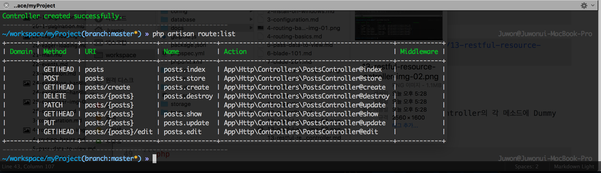

# 13강 - RESTful 리소스 컨트롤러

REST는 이 코스 범위를 넘어가는 내용이니, 시간 날 때 구글링을 통해서 공부하자. 모든 HTTP 요청 Url 엔드포인트에 대해서 `IndexController@method` 와 같이 연결하면 Route 정의만으로도 수백, 수천 줄이 될 수 있다. REST 원칙에 따라 리소스 이름으로된 Url 엔드포인트를 정의하고, `@method` 없이 컨트롤러에 연결시키는 것이 리소스 컨트롤러라고 이해하고 넘어가자.

## RESTful Resource Route

아래는 Post 모델에 대한 Url 엔드포인트를 'posts'라 했을 때, REST 원칙에 따라 라라벨이 자동으로 생성해 주는 Url 엔드포인트와 PostsController의 메소드간의 연결을 표로 표현한 것이다.

Verb|Endpoint|Method Override|Controller Method|Description
---|---|---|---|---
GET|/posts/| |`index()`|Post 모델 Collection 보기
GET|/posts/{id}| |`show()`|id를 가지는 Post Instance 보기 
GET|/posts/create| |`create()`|새로운 Post Instance 생성을 위한 폼
POST|/posts| |`store()`|새로운 Post Instance 생성
GET|/posts/{id}/edit| |`edit()`|id를 가진 Post Instance 업데이트 폼
POST|/posts/{id}|`_method=PUT` `(x-http-method-override: PUT)`|`update()`|id를 가진 Post Instance 업데이트
POST|/posts/{id}|`_method=DELETE` `(x-http-method-override: DELETE)`|`delete()`|id를 가진 Post Instance 삭제

app/Http/routes.php에 posts 경로에 대한 resource 라우트를 정의하자. 그간 배웠던 `get()` 메소드가 아닌, `resource()`란 메소드를 쓰는 것에 유의하자.

```php
Route::resource('posts', 'PostsController');
```

artisan CLI 로 Route 목록을 확인해 보자.

```bash
$ php artisan route:list
# ReflectionException - Class App\Http\Controllers\PostsController does not exist
```

## RESTful Resource Controller 만들기

artisan CLI 로 PostsController를 만들자. 이번엔 --plain 옵션이 빠진다.

```bash
$ php artisan make:controller PostsController

# Route 목록을 다시 확인해 보자.
$ php artisan route:list
```



## 테스트

app/Http/Controller/PostsController.php 가 만들어졌는지 확인하자. PostsController의 각 메소드에 Dummy 반환값을 넣고 RESTful 라우트와 컨트롤러가 잘 동작하는지 확인해 보자.

```php
class PostsController extends Controller
{
    public function index()
    {
        return '[' . __METHOD__ . '] ' . 'respond the index page';
    }

    public function create()
    {
        return '[' . __METHOD__ . '] ' . 'respond a create form';
    }

    public function store(Request $request)
    {
        return '[' . __METHOD__ . '] ' . 'validate the form data from the create form and create a new instance';
    }

    public function show($id)
    {
        return '[' . __METHOD__ . '] ' . 'respond an instance having id of ' . $id;
    }

    public function edit($id)
    {
        return '[' . __METHOD__ . '] ' . 'respond an edit form for id of ' . $id;
    }

    public function update(Request $request, $id)
    {
        return '[' . __METHOD__ . '] ' . 'validate the form data from the edit form and update the resource having id of ' . $id;
    }

    public function destroy($id)
    {
        return '[' . __METHOD__ . '] ' . 'delete resource ' . $id;
    }
}
```

테스트를 위해 [PostMan 크롬 확장 프로그램](https://chrome.google.com/webstore/detail/postman/fhbjgbiflinjbdggehcddcbncdddomop)을 사용할 것을 권장한다. 이 문서의 표 대로 하나씩 대입해 보자. PostMan에서 GET을 선택하고 http://localhost:8000/posts, http://localhost:8000/posts/1, http://localhost:8000/posts/1/edit.


그럼, HTTP 요청 메소드를 POST로 바꾸고, http://localhost:8000/posts를 해보자.

## TokenMismatchException

라라벨은 CSRF(Cross Site Request Forgery) 공격을 방지하기 위해 기존 데이터를 변경하는 행위, 즉, 신규 생성, 업데이트, 삭제 등의 행위에 대해서는 CSRF 토큰을 폼요청에서 제공해야 한다. 가령 `PostsController@create` 메소드에서 응답한 모델 생성 폼에서 숨은 필드로 `_token` 값을 제공해야 한다. 폼 요청을 받은 `PostsController@store` 메소드는 토큰의 유효성을 확인하고, 같은 세션일 경우, 즉, `create()`를 요청한 클라이언트와 `store()`를 요청한 클라이언트가 동일할 경우에만 `store()` 액션을 수행한다. 지금 우리가 PostMan을 통해서 테스트하는 행위 자체가 CSRF 공격이라 볼 수 있다.
  
우선 이번 테스트를 위해 CSRF 보호기능을 잠시 끄도록 하자. app/Http/Middleware/VerifyCsrfToken.php를 수정하자.

```php
class VerifyCsrfToken extends BaseVerifier
{
    protected $except = [
        'posts', 
        'posts/*'
    ];
}
```

POST http://localhost:8000/posts가 정상 동작하는 것을 확인한 후, 이번에는 POST http://localhost:8000/posts/1 으로 요청해 보자.

## MethodNotAllowedHttpException

브라우저들은 PUT, DELETE 등의 HTTP 동사(==메소드)를 지원하지 않는다. 즉, 브라우저에서는 PUT, DELETE등의 요청을 할 수 없다는 얘기다. 그럼에도 불구하고, REST 원칙을 지키기 위해서 라라벨 뿐 아니라 대부분의 웹 프레임웍들이 메소드 오버라이딩을 사용한다. POST로 폼 전송을 하되 숨은 필드로 `_method=PUT` 등과 같이 "내 비록 POST로 요청하지만 이건 PUT 요청이오~" 라고 서버 프레임웍에게 힌트를 주는 방법이다.

http://localhost:8000/posts/1 로 PUT, DELETE 요청을 하기 위해서는 폼데이터로 `_method=PUT`, `_method=DELETE` 를 추가해 주어야 한다. PostMan에 Body라 써진 탭을 열고, form-data 에 Key:"_method", Value:"PUT"을 각각 입력한 후 다시 테스트해 보자.

**`참고`** 숨은 필드를 이용하지 않고 `x-http-method-override: DELETE` 와 같이 HTTP Header를 이용해서 메소드 오버라이딩을 할 수도 있다.

모든 테스트가 끝났으면, `VerifyCsrfToken` 클래스에서 예외 처리 했던 것을 원복 시키자.

```php
class VerifyCsrfToken extends BaseVerifier
{
    protected $except = [];
}
```
<!--@start-->
---

- [목록으로 돌아가기](../readme.md)
- [12강 - 컨트롤러](12-controller.md)
- [14강 - 이름 있는 Route](14-named-routes.md)
<!--@end-->