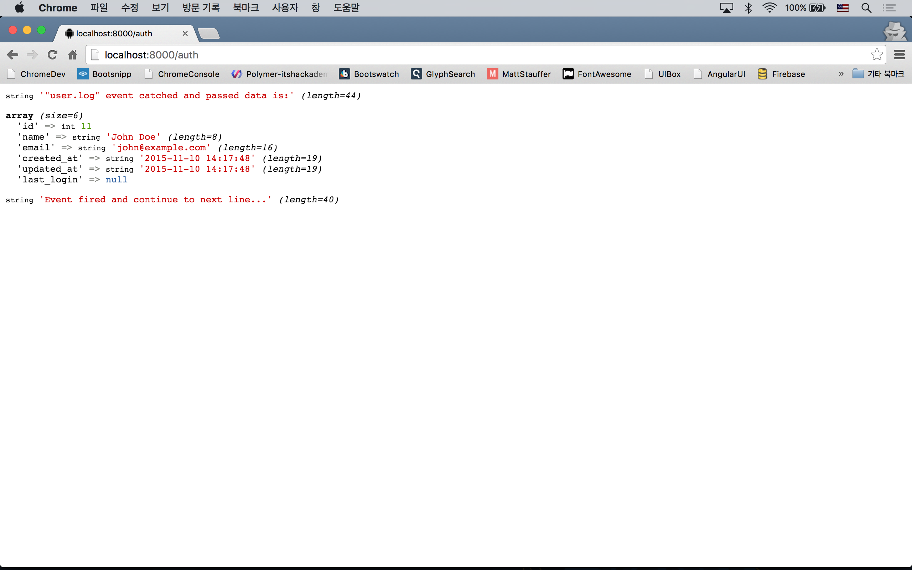

# 22강 - 이벤트

라라벨 이벤트 시스템은 Observer 또는 PubSub 패턴을 구현할 수 있게 해 준다. 필자가 알고 있는 이벤트 방식 구조체의 잇점 몇가지는 아래와 같다.

- 사용자에게 빠른 응답을 제공할 수 있다. (Non blocking I/O)
- 리스너를 여러개 구현하면, 이벤트 하나로 여러가지 작업을 동시에 수행할 수 있다.

## 시나리오

어떤 목적인지 모르겠지만, 사용자가 로그인 하면 users 테이블에 last_login 필드에 로그인 시간을 업데이트한다고 가정하자.

**`참고`** 이벤트는 주로 IO 가 수반되는 경우에 많이 사용된다. smtp 로 이메일을 보낸다든가, HTTP 클라이언트로 외부 서비스로 부터 데이터를 가져온다든가, 파일 시스템으로부터 큰 파일을 읽을 때 등이 대표적인 예이다.
 
## 마이그레이션

users 테이블에 last_login 필드를 추가하자.

```bash
$ php artisan make:migration add_last_login_to_users_table
```

마이그레이션 코드를 작성하자.

```php
class AddLastLoginToUsersTable extends Migration
{
    public function up()
    {
        Schema::table('users', function(Blueprint $table) {
            $table->timestamp('last_login')->nullable();
        });
    }

    public function down()
    {
        Schema::table('users', function(Blueprint $table) {
            $table->dropColumn('last_login');
        });
    }
}
```

마이그레이션을 실행하자.

```bash
$ php artisan migrate
```

User 모델을 수정하자. `$dates` 속성에 'last_login' 필드를 추가함으로써, 'updated_at', 'created_at' 처럼 `Carbon\Carbon` 이 제공하는 다양한 메소드에 접근할 수 있다.

```php
class User extends Model implements ...
{
    protected $dates = ['last_login'];
}
```

## 구조체를 만들어 보자.

이번에도 app/Http/routes.php 를 사용할 것이다. 제 "16강 사용자 인증 기본기"에서 사용했던 내용을 좀 훔쳐오자. 
 
```php
Route::get('auth', function () {
    $credentials = [
        'email'    => 'john@example.com',
        'password' => 'password'
    ];

    if (! Auth::attempt($credentials)) {
        return 'Incorrect username and password combination';
    }

    Event::fire('user.login', [Auth::user()]);

    var_dump('Event fired and continue to next line...');

    return;
});

Event::listen('user.login', function($user) {
    var_dump('"user.log" event catched and passed data is:');
    var_dump($user->toArray());
});
```

tinker 로 로그인에 사용할 사용자를 만들자.

```bash
$ php artisan tinker
>>> App\User::create([
... 'email' => 'john@example.com',
... 'name' => 'John Doe',
... 'password' => bcrypt('password')
... ]);
=> App\User {#684
     email: "john@example.com",
     name: "John Doe",
     updated_at: "2015-11-10 14:17:48",
     created_at: "2015-11-10 14:17:48",
     id: 11,
   }
```

서버를 부트업하고 브라우저에서 'auth' Route 로 접근해 보자. `Event::fire(string|object $event, mixed $payload)` 에서 이벤트를 던지고, `Event::listen(string|array $events, mixed $listener)`이 이벤트를 받아서 처리하는 식의 구조체이다. `Event::fire()` 대신 `event()` Helper Function을 이용할 수도 있다.



## 이벤트를 처리하자.

구조체가 만들어 졌으니, 시나리오 대로 로그인 시각을 저장하자.

```php
Event::listen('user.login', function($user) {
    $user->last_login = (new DateTime)->format('Y-m-d H:i:s');

    return $user->save();
});
```

artisan CLI 로도 확인해 보자. 'last_login' 필드가 `Carbon\Carbon` 인스턴스로 잘 동작하는 것을 확인할 수 있다.

```bash
$ php artisan tinker
>>> $user = App\User::find(11);
=> App\User {#672
     id: 11,
     name: "John Doe",
     email: "john@example.com",
     created_at: "2015-11-10 14:17:48",
     updated_at: "2015-11-10 14:24:36",
     last_login: "2015-11-10 14:24:36",
   }
>>> $user->last_login;
=> Carbon\Carbon {#679
     +"date": "2015-11-10 14:24:36.000000",
     +"timezone_type": 3,
     +"timezone": "UTC",
   }
```

## 라라벨 공식 문서에서의 이벤트

처음 접하는 분들이 보기에 라라벨 공식 문서의 이벤트 설명은 정말 어렵다. 하지만, 기본적으로 위 예제와 같은 동작을 좀 더 관리하기 편리하도록 쪼개 놓은 것이라고 볼 수 있다.

공식 문서의 `event(new PodcastWasPurchased($podcast))` 에서 이벤트 이름과 이벤트 데이터를 객체로 넘긴 것이며, app/Proviers/EventServiceProvider.php 에서 이벤트 이름과 이벤트 핸들러를 연결시켜 준 것이다. 연결된 이벤트 핸들러는 결국은 우리 예제의 `Event::listen()` 에 두번 째 인자로 전달한 Closure를 별도 클래스로 떼 놓은 것이다.

<!--@start-->
---

- [목록으로 돌아가기](../readme.md)
- [21강 - 메일 보내기](21-mail.md)
- [23강 - 입력 값 유효성 검사](23-validation.md)
<!--@end-->
