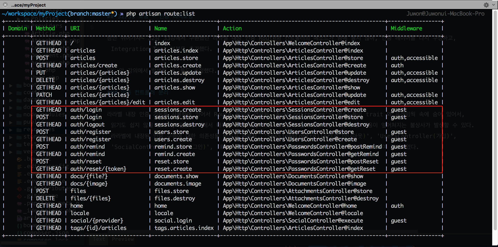
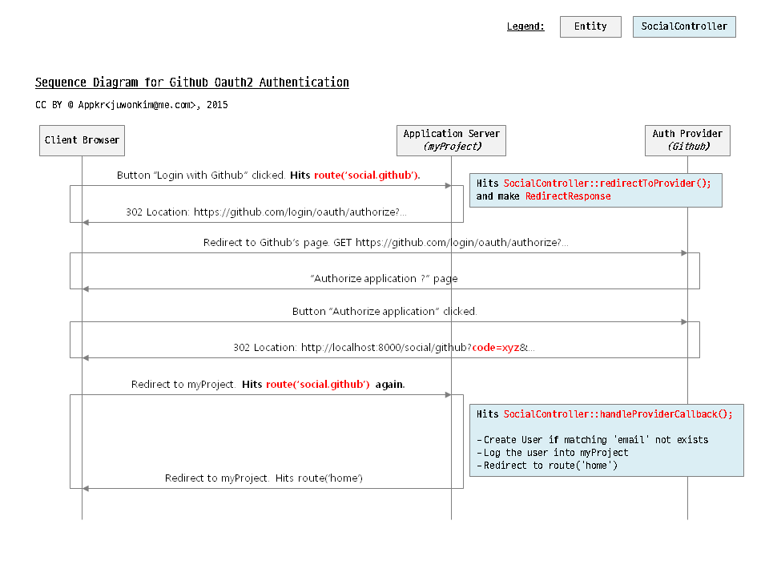

# 실전 프로젝트 2 - Forum

## 32/33 보충 - 인증 리팩토링

잠깐 쉬어가자~ 32강 33강에서 구현했던 라라벨 내장 인증 Route와 컨트롤러의 메소드가 맘에 들지 않아, 인증 레이어를 다시 구성하고, Integration Test 부분도 추가했다.  

또, 앞 강의에서 발생한 버그들도 수정했다.

### 인증 재구현

라라벨 내장 인증 기능을 사용함에 있어서 Route 정의에 연결된 'AuthController'의 메소드들이 trait 와 프레임웍 속에 숨어 있어서, 읽기도 쉽지 않을 뿐더러, 필요에 의해서 내부를 수정하면, 다음 프레임웍 업데이트 때, 나의 수정 내용이 엎어쳐지는 불상사가 발생할 수 있다. 라라벨에 내장된 인증 구현에 대한 의존성을 버리기 위해서, 

- `App\Http\Controllers\UsersController` (가입)
- `App\Http\Controllers\SessionsController` (로그인/아웃)
- `App\Http\Controllers\SocialController` (소셜 로그인)
- `App\Http\Controllers\PasswordsController` (비밀번호 재설정)

으로 각각 분리하여 작성하였다.

#### 문제점 인식

서비스마다 로그인에 대한 정책이 있기 마련인데, 필자는 우리 서비스(이하 'myProject')의 사용자들이 소셜 로그인도 할 수 있고, 네이티브 로그인도 할 수 있게 하고 싶다. 여기서는 사용자의 Github 이메일 계정과, myProject 에 회원 가입한 이메일 계정이 동일할 경우만을 가정한다. 

**`참고`** Github 이메일과 myProject의 사용자 이메일 주소가 서로 다르다면, 두 개의 서로 다른 계정으로 인식될 것이다. 즉, myProject 에 들어와서 사용자가 생성하는 Article, Comment 등의 모델은 그때 그때 로그인한 소셜 또는 네이티브 사용자에게 속할 것이다. 프로그램적으로 해결할 수 있는 문제가 아니므로, 정책적으로 해결하거나, 사용자가 수동으로 계정을 연결할 수 있는 방법과 장치를 제공해야 할 것이다.  

기존 소셜 로그인 코드를 잠시 살펴 보자. 아래 코드에서 `User::firstOrCreate()` 메소드에서 Github 로 부터 받은 정보를 이용하여 **'password'가 없는 사용자를 생성**하고 있다는 것을 기억하고 있자.

```php
// 기존 코드
// app/Http/Controllers/Auth/AuthController.php

public function handleProviderCallback()
{
    $user = \Socialite::driver('github')->user();
    $user = User::firstOrCreate([
        'name'  => $user->getName(),
        'email' => $user->getEmail(),
    ]);
    ...
}
```

아래와 같은 경우의 수가 발생할 수 있다.

1. myProject 에 회원 가입을 먼저하고, 소셜 로그인을 시도하는 경우
    1. 사용자 이름까지 같을 경우 -> 로그인 됨
    2. **사용자 이름이 다르면, 사용자 생성을 시도하게 됨 -> 동일 이메일을 가진 User 가 하나 더 생김**
2. 소셜 로그인을 하여, 빈 'password'를 가진 User 모델이 생성된 상태에서, 네이티브 인증을 시도하는 경우
    1. 'password' 가 없으므로 네이티브 로그인 불가능
    2. myProject 에 회원 가입을 시도하는 경우, **같은 이메일을 가진 User 가 이미 있으므로 가입 불가능**

다음과 같은 방법으로 해결해 보자.

1. myProject 에 회원 가입을 먼저하고, 소셜 로그인을 시도하는 경우
    1. `firstOrCreate()` 부분을 'email'로 먼저 쿼리하고, 없으면 User를 생성하는 로직으로 다시 작성하자.
2. 소셜 로그인을 하여, 빈 'password'를 가진 User 모델이 생성된 상태에서... 
    1. myProject 에 회원 가입을 시도하는 경우, 기존 소셜 로그인으로 'password' 없이 생성된 계정에 'password'를 업데이트한다.
    2. 비밀번호 재설정을 시도하는 경우, 소셜 로그인 사용자라고 안내한다.

우선, 기존 마이그레이션의 'password' 필드에 `nullable()` 속성을 추가하였다. 수정했으면 `$ php artisan migrate:refresh --seed`

```php
// database/migrations/create_users_table.php

public function up()
{
    // ...
    $table->string('password', 60)->nullable();
}
```

#### Route 정의



잘 보면, `Route::get('social/{provider}', 'SocialController@execute')` 부분에서 'social/github', 'social/facebook' 등으로 소셜 로그인 공급자를 더 붙일 수 있도록 Route 구조를 좀 변경할 것을 확인할 수 있다.

```php
// app/Http/routes.php

/* User Registration */
Route::get('auth/register', [
    'as'   => 'users.create',
    'uses' => 'UsersController@create'
]);
Route::post('auth/register', [
    'as'   => 'users.store',
    'uses' => 'UsersController@store'
]);

/* Social Login */
Route::get('social/{provider}', [
    'as'   => 'social.login',
    'uses' => 'SocialController@execute',
]);

/* Session */
Route::get('auth/login', [
    'as'   => 'sessions.create',
    'uses' => 'SessionsController@create'
]);
Route::post('auth/login', [
    'as'   => 'sessions.store',
    'uses' => 'SessionsController@store'
]);
Route::get('auth/logout', [
    'as'   => 'sessions.destroy',
    'uses' => 'SessionsController@destroy'
]);

/* Password Reminder */
Route::get('auth/remind', [
    'as'   => 'remind.create',
    'uses' => 'PasswordsController@getRemind',
]);
Route::post('auth/remind', [
    'as'   => 'remind.store',
    'uses' => 'PasswordsController@postRemind',
]);
Route::get('auth/reset/{token}', [
    'as'   => 'reset.create',
    'uses' => 'PasswordsController@getReset',
]);
Route::post('auth/reset', [
    'as'   => 'reset.store',
    'uses' => 'PasswordsController@postReset',
]);
```

**`중요`** Route 정의가 변경되었으므로, 회원 가입, (소셜) 로그인, 비밀번호 재설정 관련해서 기존에 뷰 코드에 박아 놓았던, `route()` Helper 를 이용한 링크들을 모두 수정해 주어야 한다.

**`참고`** 기존에 'resources/views/auth' 아래에 위치하던 뷰들도 'users', 'sessions', 'passwords' 아래로 옮기고, 이름도 적절히 변경하였다. 각 컨트롤러에서 `view()`를 반환할 때 바뀐 위치로 적용해 주어야 한다.

#### 'SocialController(소셜 로그인)' 구현

앞 절의 Route 정의에서 `Route::get('social/{provider}', 'SocialController@execute')`로 썼다. 소셜 인증 과정에는 Github 'Authorize application' 페이지로 이동하는 Route 하나, 앞 과정에서 사용자가 승인하면 Github 에서 myProject 로 콜백해 주는 Route 총 두 개가 필요했던 것을 `execute()` 하나로 줄였다. `execute()` 메소드에서 myProject의 Router로 들어오는 HTTP 요청 쿼리스트링의 'code' 필드의 유무에 따라 분기시킨 것이다. 전체적인 과정은 아래 그림을 참조하자.



`$user = (\App\User::whereEmail($user->getEmail())->first()) ?: \App\User::create([...]);` 부분에서 기존의 `firstOrCreate()` 메소드를 다시 썼다. 'email' 로만 쿼리해서 있으면 myProject 에 로그인해 주고, 해당 'email'을 가진 레코드가 없으면, 'email', 'name' 필드를 가진 사용자를 생성시키도록 수정하였다.

```php
// app/Http/Controllers/SocialController.php

class SocialController extends Controller
{
    public function execute(Request $request, $provider)
    {
        if (! $request->has('code')) {
            return $this->redirectToProvider($provider);
        }

        return $this->handleProviderCallback($provider);
    }

    protected function redirectToProvider($provider) { // ...}

    protected function handleProviderCallback($provider)
    {
        $user = $this->socialite->driver($provider)->user();

        $user = (\App\User::whereEmail($user->getEmail())->first())
            ?: \App\User::create([
                'name'  => $user->getName(),
                'email' => $user->getEmail(),
            ]);

        // ...
    }
}
```

Route 가 바뀌었으므로, [Github Developer Applications Console](https://github.com/settings/developers)를 방문하여 Authorization callback URL 을 'http://localhost:8000/social/github' 로 변경하여야 한다.

**`참고`** `handleProviderCallback()` 에서 보통은 Github 에서 받은 사용자 정보로 폼을 포함한 뷰를 한번 더 사용자에게 보여주며, 다른 이메일, 비밀번호, 사용자 이름 등을 더 받아 `App\User` 모델로 저장하는 것이 정석이다. 이렇게 구현하면, 위에서 언급한 복잡한 Sync 과정이 불필요하다.

#### UsersController(가입) 구현

기존 대비 특별히 달라진 부분들만 살펴보도록 하자.

`store()` 메소드에서는, 먼저 `App\User` 모델에 새로 정의한 `noPassword() (== whereNull('password'))` 란 [쿼리스코프](http://laravel.com/docs/eloquent#query-scopes)를 이용하여 회원 가입 요청에서 사용자가 제출한 'email' 값과 일치하고, 'password' 가 `null` 인 사용자를 찾는다. 이는 소셜로 로그인하면서 생성된 계정을 의미한다. 소셜로 생성된 계정이면 `syncAccountInfo()` 메소드로 처리 로직을 위임하고, 소셜 로그인 이력이 없는 회원 가입 요청이면 `createAccount()` 메소드로 위임했다.

`syncAccountInfo()` 메소드에서는, 사용자가 회원 가입 폼에 입력한 값들에 대한 유효성 검사를 수행하고, 통과하면 폼에서 넘겨 받은 'password' 값으로 기존에 `null` 이던 값을 대체하였다. Github 사용자 이름과, myProject 에서 사용하는 이름이 다를 수 있으므로, 'name' 필드도 넘겨 받은 값으로 업데이트하였다. 여기서 주목할 점은 `createAccount()` 메소드와 폼 데이터에 대한 유효성 검사 규칙이 약간 다르다는 것이다. 소셜 로그인으로 이미 사용자는 생성된 상태이므로, 'email' 필드 검사 규칙에서 'unique:users' 규칙이 빠졌다.

`createAccount()` 는 기존과 크게 달라진 점이 없다.

```php
// app/Http/Controllers/UsersController.php

class UsersController extends Controller
{
    public function store(Request $request)
    {
        if ($user = User::whereEmail($request->input('email'))->noPassword()->first()) {
            // Filter through the User model to find whether there is a social account
            // that has the same email address with the current request
            return $this->syncAccountInfo($request, $user);
        }

        return $this->createAccount($request);
    }

    protected function syncAccountInfo(Request $request, User $user)
    {
        $validator = \Validator::make($request->except('_token'), [
            'name'     => 'required|max:255',
            'email'    => 'required|email|max:255',
            'password' => 'required|confirmed|min:6',
        ]);

        if ($validator->fails()) {
            return back()->withInput()->withErrors($validator);
        }

        $user->update([
            'name' => $request->input('name'),
            'password' => bcrypt($request->input('password'))
        ]);

        \Auth::login($user);
        flash(trans('auth.welcome', ['name' => $user->name]));

        return redirect(route('home'));
    }

    protected function createAccount(Request $request) {// ...}
}
```

#### SessionsController(로그인/아웃) 구현

여기서는 기존 대비 크게 달라진 점이 없이, trait나 프레임웍 속에 숨어 있던 것을 도메인레이어로 옮겨 놓았을 뿐이므로, 설명을 생략한다.

#### PasswordsController(비밀번호 재설정) 구현

myProject 에 가입하지 않고, 소셜 로그인으로만 사용하던 사용자가 갑자기 비밀번호 재설정 시도를 할 경우를 대비한 방어조치만 추가했다. 나머지 부분들은 기존 대비 크게 다르지 않다.

```php
// app/Http/Controllers/PasswordsController.php

public function postRemind(Request $request)
{
    // ...
    if (User::whereEmail($request->input('email'))->noPassword()->first()) {
        flash()->errors(sprintf("%s %s", trans('auth.social_olny'), trans('auth.no_password')));
        return back();
    }
    //...
}
```

#### 인증 관련 통합 테스트 추가

설명은 생략하지만, 'tests/Http/Controllers' 디렉토리 하위에 포함된 코드들을 살펴보고, 테스트를 수행해 볼 것을 권장한다. 필자가 아직은 실력이 미천해서 외부로 HTTP 요청이 발생하는 'SocialController' 와 이메일을 보내야 하는 'PasswordsController' 부분은 테스트 코드를 쓰지 못했다 (PR 또는 가르침 환영합니다 ^^/)
 
```bash
$ phpunit
```

### 디버그 및 자잘한 개선


'config/services.php' 에 하드코드로 박아 놓았던 Github 소셜 로그인 관련 설정 값들을 '.env'로 옮겼다.

로그인 하지 않은 상태에서 `@if (auth()->user()->isAdmin() ...)` 이 들어간 뷰를 방문하면 null 포인터 에러가 나는 버그가 있었다. `@if ($currentUser and ($currentUser->isAdmin() ...))` 으로 변경하였다. 로그인을 하면 `auth()->user()` 는 로그인한 사용자에 해당하는 `App\User` 인스턴스를 반환하는데, 로그인 되어 있지 않으면 `null`을 반환한다. `null->isAdmin()` 은 당연히 성립할 수 없는 코드이다. 

아울러, 뷰 코드에 `Auth::check()` 로 된 부분들도 `App\Http\Controlelrs\Controller::__construct()` 에서 뷰에 공유한 `$currentUser` 변수로 대체하였다. 만들었으면 써야 하기에...

코드에디터(또는 IDE)에서 <kbd>Cmd</kbd> + Mouse Click 으로 , Facade 에 연결된 메소드로 이동을 쉽게 하기 위해서 ['barryvdh/laravel-ide-helper'](https://github.com/barryvdh/laravel-ide-helper) 패키지를 Dev Dependency 로 추가하였다. `$ composer require barryvdh/laravel-ide-helper --dev`. 설정법은 스스로 찾아서 적용하기 바라고, 설명하고 싶었던 것은 다른 것이다. 개발 과정 중에만 필요한 패키지를 설치하고, 해당 패키지가 제공하는 ServiceProvider를 'config/app.php' 에 등록할텐데, production 서버에 올릴 때 매번 불필요한 패키지 라인을 주석처리 하는 것은 귀찮은 일이다. 이때 `App\Providers\AppServiceProvider` 를 이용하면 편리하게 local 또는 dev 환경일 때만 로드되도록 할 수 있다. 참고로 아래 코드에서 `$this->app->environment()` 는 `\App::environment()` 또는 `app()->environment()` 로도 쓸 수 있다.

```php
// app/Providers/AppServiceProvider.php

public function register()
{
    if ($this->app->environment('local')) {
        $this->app->register(\Barryvdh\LaravelIdeHelper\IdeHelperServiceProvider::class);
    }
}
```
<!--@start-->
---

- [목록으로 돌아가기](../readme.md)
- [39강 - Attachment 기능 구현](39-attachments.md)
- [40강 - Comment 기능 구현](40-comments.md)
<!--@end-->