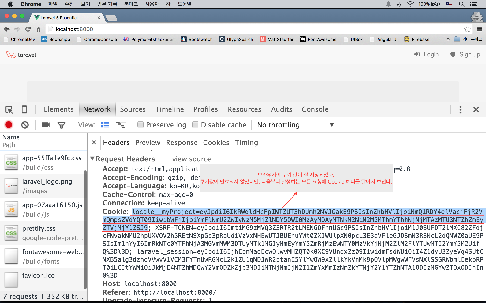
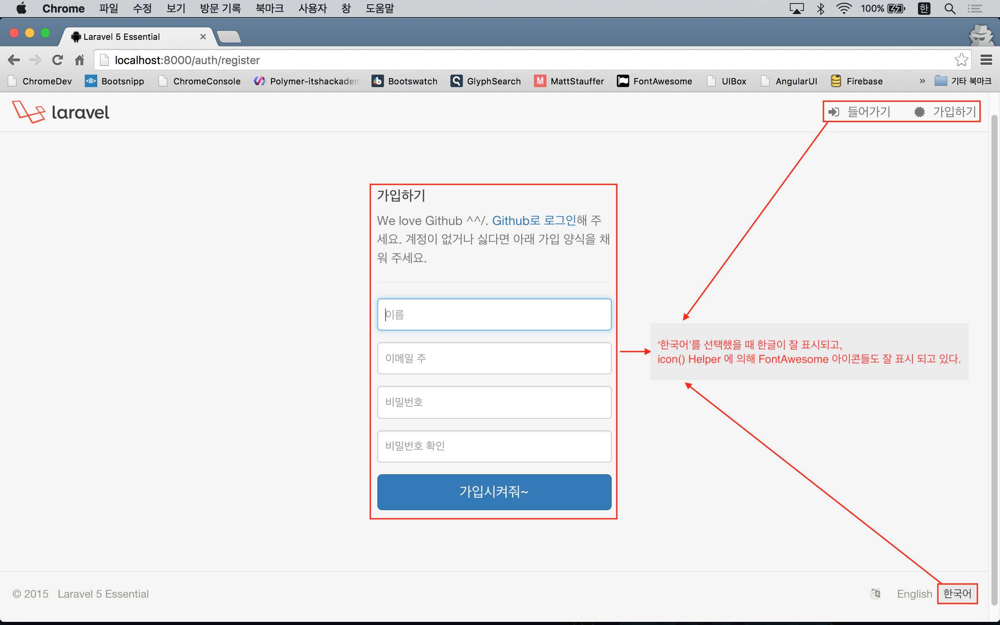

# 실전 프로젝트 2 - Forum

## 35강 - 다국어 지원

필자도 좀 오버했다는 생각이 들긴 한다. 그래도 기획에 들어 있는 내용이니 해 보자.

### 설계 의사 결정

생각을 해 보자. 뷰(UI)에 제시된 영어/한국어 선택지 중 사용자가 선호하는 언어를 선택한다. 
> Q : 사용자의 선호를 서비스에 어떻게 전달할 것인가? 
> A : 링크에 쿼리스트링으로 달아서 사용자 선택값을 전달하도록 하자. 

사용자의 선호를 기억해 두었다가 다음번에 방문했을 때는 링크 선택지를 다시 누르지 않고 기존에 선택한 언어로 서비스가 제공되어야 한다. 기억해둔다 == 저장한다. 
> Q : 어디에 저장할 것인가? 
> A : 필자는 쿠키로 선택했다. User 모델에 써 두는 것은 사용자가 로그인 하기 전에 알 수 없기 때문이다.

그런데, 잘 생각해 보면, 
> Q : 브라우저 요청에 따라 서버에서 뷰를 만들고 응답하기 전에 언어값이 반영되어야 한다. 
> A : 즉, 브라우저의 요청에 붙은 쿠키값을 읽어 라라벨이 부트업되는 시점부터 전체 프레임웍의 언어가 바뀌어 있어야 한다는 의미다. 

어렵다~

**`잡담`** 쿠키는 프론트엔드, 즉 브라우저에 저장된다. 가령, 폰트 사이즈에 대한 사용자 설정이라면 서버를 거칠 필요가 없이 자바스크립트에서 미리 저장된 쿠키 또는 localStorage 를 읽어서 동적으로 CSS 속성을 변경하면 된다. 그런데, 폰트 사이즈가 아니다. AngularJS와 같은 프론트엔드 프레임웍을 사용한다면, 서버에서 언어 딕셔너리 전체를 JSON으로 내려받고, 사용자가 브라우저에 저장한 값을 읽어 컨트롤러나 뷰모델에서 런타임에 동적으로 스트링들을 바꿀 수도 있다. 서버 로드를 줄이는 측면에서 좋지만, 프론트엔드쪽의 코드량이나 메모리 사용량이 늘어난다. 결국은 BE개발자와 FE개발자간의 폭탄 떠넘기기 문제이다.

### 공유된 뷰 데이터

전혀 관련없어 보이지만, 좀 있어 보면 왜 이걸 했는지 안다~. 컨트롤러에서 뷰를 반환할 때 뷰에서 쓸 데이터를 바인딩하는 것으로 입문코스에서 배웠다. 데이터 중에서는 뷰마다 달라지지 않을 뿐 더러, 모든 뷰에서 가지고 있으면 편리한 데이터들이 있다. 이 때 `View::share(string $key, mixed $value)` 메소드를 이용한다. 모든 컨트롤러가 상속하는 app/Http/Controllers/Controller.php 의 생성자에서 뷰에 쓰일 공통 데이터를 공유해 보자.

```php
abstract class Controller extends BaseController
{
    public function __construct() {
        $this->setSharedVariables();
    }

    protected function setSharedVariables() {
        view()->share('currentLocale', app()->getLocale());
        view()->share('currentUser', auth()->user());
        view()->share('currentRouteName', \Route::currentRouteName());
        view()->share('currentUrl', \Request::fullUrl());
    }
}
```

**`주의-주의-주의`** abstract Controller에서 생성자를 사용했으므로, 이를 상속 받는 컨트롤러들이 생성자를 사용하고 있다면, 반드시 `parent::__construct()` 를 호출해 주어야 하다는 점이다. DocumentsController, WelcomeController, AuthController, PasswordController 에 적용하자. 적용하지 않으면 `$current*` 변수가 없어서 에러가 난다.

```php
class DocumentsController extends Controller
{
    public function __construct(Document $document)
    {
        $this->document = $document;
        parent::__construct();
    }
    ...
}
```

### 뷰를 수정하자.

사용자가 언어를 토글할 수 있는 방법은 뷰이다. 앞선 강좌에서 resources/views/layouts/footer.blade.php 를 언어 선택을 위한 정적 메뉴를 만들었던 것을 기억할 것이다. 동적 메뉴로 고치자.

```html
<footer class="footer">
  <ul class="list-inline pull-right locale">
    <li><i class="fa fa-language"></i></li>
    @foreach (['en' => 'English', 'ko' => '한국어'] as $locale => $language)
      <li class="{{ ($locale == $currentLocale) ? 'active' : '' }}">
        <a href="{{ route('locale', ['locale' => $locale, 'return' => urlencode($currentUrl)]) }}">
          {{ $language }}
        </a>
      </li>
    @endforeach
  </ul>

  ...
</footer>
```

`@foreach`로 루프를 돌면서 링크를 뿌리고 있다. `$currentLocale`, `$currentUrl` 변수는 앞 절에서 공유된 뷰 데이터이다. 이 partial 뷰는 마스터 뷰에 포함되어 있고, 마스터 뷰를 이용하는 어떤 뷰라도 컴파일될 때, 이 변수들은 사용할 수 있다. English와 한국어 중 사용자가 선택한 언어에 'active' 클래스를 표시하기 위해 3항 연산자를 사용했고, 언어 변경 요청후 현재 Url로 다시 돌아 오기 위해 return 이란 쿼리스트링을 달았다. 

### Route & 컨트롤러 정의

사용자가 뷰에서 누른 언어 변경 요청 링크에 응답하는 Route를 만들고, 컨트롤러에 연결하자.

```php
Route::get('locale', [
    'as' => 'locale',
    'uses' => 'WelcomeController@locale'
]);
```

WelcomeController를 수정한다. `Cookie::forever(string $key, mixed $value)` 메소드를 이용해서 브라우저의 요청에서 넘겨 받은 쿼리스트링의 locale 값으로(== 'en' or 'ko') 쿠키 인스턴스를 만들었다. 만들어진 쿠키 인스턴스를 다음 응답에 실어서 보내기 위해서 `Cookie::queue()` 로 예약을 걸어 두었다. 그 다음 Redirect 응답을 만드는데, 쿼리스트링에 return 값이 있을 때와 없을 때를 3항 연산자로 분기시켰다.

```php
class WelcomeController extends Controller
{
    public function __construct()
    {
        $this->middleware('auth', ['only' => ['home']]);
        parent::__construct();
    }
    
    ...
    
    public function locale()
    {
        $cookie = cookie()->forever('locale__myProject', request('locale'));

        cookie()->queue($cookie);

        return ($return = request('return'))
            ? redirect(urldecode($return))->withCookie($cookie)
            : redirect(route('home'))->withCookie($cookie);
    }
}
```

여기서 서버를 띄우고 홈페이지로 접근해서 footer 영역에서 '한국어' 링크를 눌러보자.

**`참고`** 라라벨이 내 보내는 쿠키는 해킹 툴들로 값을 조작하는 것을 방지하지 위해 암호화 되어 있다. `Crypt::decrypt(string $payload)` 메소드로 풀어서 써야 한다. 



브라우저에 저장된 쿠키 값을 읽어서 tinker 로 해독해 보았다.

```bash
$ php artisan tinker
>>> Crypt::decrypt('eyJ...SJ9');
=> "ko"
```

그런데, 아무리 눌러도 '한국어' 링크가 active 상태로 바뀌지 않는다.

### AppServiceProvider

우리가 이제까지 작업한 것은 쿠키 값을 셋팅하는 행위였을 뿐이다. 런타임에 기본 언어를 바꾸라고 라라벨에게 어떤 명령도 하지 않았다. app/Providers/AppServiceProvider.php 를 수정하자. `Request::cookie(string $key)` 메소드로 앞서 브라우저와 주고 받은 쿠키 값을 읽어 와서 `App::setLocale(string $locale)` 메소드로 기본 언어를 바꾸라고 라라벨에게 명령했다.

```php
class AppServiceProvider extends ServiceProvider
{
    public function boot()
    {
        if ($locale = request()->cookie('locale__myProject')) {
            app()->setLocale(\Crypt::decrypt($locale));
        }
    }
    ...
}
```

다시 확인해 보자. 이제 잘 될 것이다.

**`참고`** ServiceProvider의 `boot()`와 `register()` 메소드들은 라라벨이 부트업될 때 실행된다. 둘 간의 차이점은 [공식문서](http://laravel.com/docs/master/providers#writing-service-providers)에 잘 설명되어 있다. 쉽게 `register()`에서는 외부에서 가져온 인스턴스 생성등 라라벨 프레임웍과 크게 무관한 작업을, `boot()`에서는 프레임웍의 기능이 어느 정도 살아 나서, 사용자 코드들을 수행하기 직전에 수행된다고 생각하면 된다. 즉, `register()` 에서는 Helper나 Event 등이 동작하지 않는 상태인 것이다. 

### 기본 언어 설정

기본 언어는 config/app.php 에 'locale' 키로 설정되어 있다. 앞에서 우리가 한 것은 런타임에 언어를 바꾸라고 변경한 것이다 'fallback_locale'은 곧 배울 `trans(string $key)` Helper 에서 $key 에 해당하는 언어별 스트링 정의가 없을 경우, 폴백되는 언어 설정의 의미한다. 

```php
return [
    'locale' => 'en',
    'fallback_locale' => 'en',
];
```

### 언어 파일 만들기

뷰에서 `trans(string $key)` 로 언어 파일을 사용할 수 있다. 언어 딕셔너리들은 resources/lang 아래에 정의되어 있다. 현재는 'en' 디렉토리만 존재하는데, 기본언어 또는 런타임에 설정한 언어가 'en' 이라면, 'en' 디렉토리 밑에서 `$key` 값을 찾게 된다. 즉, ko 란 디렉토리를 만들고, 딕셔너리를 정의해 놓으면 한국어 서비스를 할 수 있다는 의미이다.

그리고, 뷰에 하드코드로 박아놓은 스트링들은 `{{ trans('auth.failed') }}` 식으로 모두 바꾸도록 하자.

```bash
$ php artisan tinker
>>> trans('auth.failed');
=> "These credentials do not match our records."
>>> app()->setLocale('ko');
>>> trans('auth.failed');
=> "로그인 정보가 정확하지 않습니다."
```

필자는 resources/lang/en/auth.php에 딕셔너리 키들을 더 추가하고, documents.php와 forum.php 를 추가로 생성했다. 이 부분은 코드를 참고해서 각자 알아서 하셔야 한다. 

딕셔너리에서 변수를 사용하는 예 살펴보자. 딕셔너리에서 `'key' => '... :변수명 ...'` 으로 쓰고, 뷰에서 `trans('key', ['변수명' => '바인딩 할 값'])`식으로 사용한다는 것을 기억하자.

```php
// resources/lang/en/auth.php
return [
    'title_signup_help' => '... Please <a href=":url">login via Github</a> ...',
];
```

```html
<!-- resoucres/views/auth/register.blade.php -->
<p class="text-muted">
  {!!  trans('auth.title_signup_help', ['url' => route('session.create')]) !!}
</p>
```

## `icon()` Helper

다국어와 뷰를 작업하는 김에... 
`icon()` Helper는 뷰에서 호출했을 때, FontAwesome 아이콘을 뿌리기 위한 HTML 스트링을 반환해 주는 역할을 할 것이다. `route()` Helper랑 마찬가지로 Route 이름을 넣어줄거냐? 하드코드로 뷰나 컨트롤러에 Url을 박아 넣을 거냐?의 의사결정인 것이다. 프로젝트의 성격(규모)나 개인의 선호도에 달린 것이므로 어떻게 구현할지는 각자가 알아서 선택하도록 하자.

```php
// app/helpers.php
...
if (! function_exists('icon')) {
    function icon($class, $addition = 'icon', $inline = null) {
        $icon   = config('icons.' . $class);
        $inline = $inline ? 'style="' . $inline . '"' : null;

        return sprintf('<i class="%s %s" %s></i>', $icon, $addition, $inline);
    }
}
```

```php
// config/icons.php
return [
    'login'       => 'fa fa-sign-in',
    ...,
];
```

```html
<!-- resources/views/auth/login.blade.php -->
...
<li>
  <a href="{{ route('session.create') }}">{!! icon('login') !!} {{ trans('auth.title_login') }}</a>
</li>
...
```


<!--@start-->
---

- [목록으로 돌아가기](../readme.md)
- [34강 - 사용자 역할](34-role.md)
- [36강 - 마이그레이션과 모델](36-models.md)

<!--@end-->
