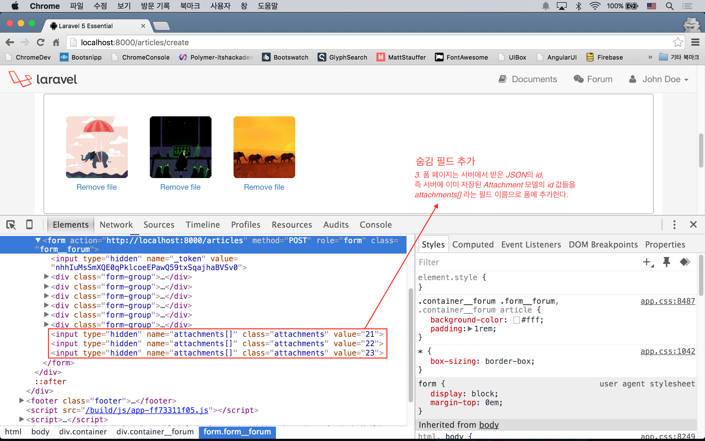
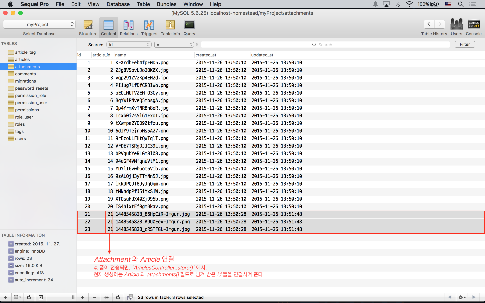

# 실전 프로젝트 2 - Forum

## 39강 - Attachment 기능 구현

Q. 구현을 시작하기 전에 "첨부 파일을 언제 올릴 것이냐?"에 대한 질문에 대한 답을 먼저 결정해야 한다. 포럼 글 (== Article)을 쓰는 시점에 허용할 것이냐, 아니면 포럼 글이 이미 작성되고 난 이후에 상세보기에서 허용할 것이냐? 
: A. **우리는 포럼 글을 작성하는 시점에 파일 첨부를 허용할 것이다.** 

Q. 또 하나의 질문은 'title', 'content', 'tags' 와 같은 포럼 Article 메타데이터와 파일을 한번에 전송할 것이냐? 아니면 파일 따로, 메타데이터 따로 전송할 것이냐? 이다. 
: A. **우리는 Async 방식으로 전송하는 것으로 한다**.

좀 더 괜찮은 UI를 위해 첨부파일이 이미지 파일일 경우, 작성 중인 본문에 마크다운 문법으로 이미지를 입력할 수 있도록 하기 위해서다 (주제를 벗어난 내용이므로, 설명은 하지 않지만, 코드에는 포함되어 있을 예정이다).
 
여기까지 디자인 결정에서, 문제점이 보이는가? 첨부 파일을 업로드하는 시점에는 해당 Article 이 존재하지 않기 때문에, 방금 서버에 생성한 파일을 어느 Article 과 연결시켜야 할 지 알 수 없는 상태가 된다. 다음과 같은 시퀀스로 해결을 시도해 보자.

1. 'articles.create' 폼에서 Ajax 로 첨부파일을 업로드 한다.
2. `AttachmentsController::store()` 메소드에서 처리하고, 처리된 파일의 id, 컨텐트 타입, 전체 Url을 JSON으로 내려준다.
3. 폼 페이지는 서버에서 받은 JSON의 id, 즉 서버에 이미 저장된 Attachment 모델의 id 값들을 attachments[] 라는 필드 이름으로 폼에 추가한다.
4. 폼이 전송되면, `ArticlesController::store()` 에서, 현재 생성하는 Article 과 attachments[] 필드로 넘겨 받은 id 들을 연결시켜 준다.

잠깐!!! 다시 생각해 보면, 포럼을 수정할 때도, 기존에 첨부한 파일에 추가해서 파일을 더 첨부할 수 있는데, 이때는 Article id를 이미 알고 있는 상태이다. 그래서, 수정할 때는 아래 두 단계로 끝날 수 있지 않을까 생각된다.

1. 1 'articles.edit' 폼에서 첨부파일 업로드 Ajax 데이터에 Article id를 달아서 보낸다.
2. 2 `AttachmentsController::store()` 메소드에서, 지금 생성할 Attachment 모델에, 첨부파일 업로드 Ajax 요청으로 넘겨 받은 Article 의 id을 연결시킨다.

### Dropzone.js

[Dropzone.js](http://www.dropzonejs.com/) 는 Drag & Drop 방식으로 파일을 끌어다 놓으면, 페이지 리로드 없이 서버에 Ajax 로 파일을 업로드를 요청을 하고, 서버의 응답을 동적으로 보여주는 JS 라이브러리이다. 

```bash
$ bower install dropzone --save-dev
```

bower 로 끌고온 Dropzone은 Sass 파일이 없어서, Gulp 태스크를 기존과 다르게 좀 수정했다. 수정 후 `$ gulp` 코맨드로 빌드한다. 기존 대비 `sass()` 빌드에서 두번째 인자로 빌드 결과물을 저장할 위치를 지정하고, `styles()` 빌드에서 방금 빌드한 sass 파일과 dropzone의 스타일시트를 머지하는 부분이 달라졌다. 

**`참고`** `sass()` 나 `styles()` 빌드는 기본적으로 'public/css' 에 결과물을 저장한다. `styles()` 든 `scripts()` 든 파일명을 `all.css`, `all.js` 로 저장하는데, 이를 오버라이드하기 위해서 각 빌드 메소드의 두번째 인자로 파일명을 명시적으로 지정해 주었다. 만약 파일명을 지정하지 않았다면, `version()` 메소드의 인자를 `['css/all.css', 'js/all.js']` 로 해 주면 되고, 'resources/views/layouts/master.blade.php' 에서 `{{ exilir("all.ext") }}` 로 연결시켜 주면 된다.

```javascript
elixir(function (mix) {
  mix
    .sass('app.scss', 'resources/assets/css')
    .styles([
      'app.css',
      '../vendor/dropzone/dist/dropzone.css'
    ], 'public/css/app.css')
    .scripts([
      // Other JS Libraries
      '../vendor/dropzone/dist/dropzone.js',
      'app.js'
    ], 'public/js/app.js')
    // ...
});
```

포럼 쓰기, 수정 폼에 Dropzone 파일 업로드 UI를 붙여 보자. 앞 강에서 생성했던 'tagselector.blade.php'는 포럼 외에 다른 곳에 쓸 일이 없을 것 같아, 'form.blade.php'에 머지하였다.

```html
<!-- resources/views/articles/partial/form.blade.php -->

...
<div class="form-group">
  <label for="my-dropzone">Files</label>
  <div id="my-dropzone" class="dropzone"></div>
</div>
...

@section('script')
  <script>
    Dropzone.autoDiscover = false;

    var myDropzone = new Dropzone("div#my-dropzone", {
      url: "/files",
    }
  </script>
@stop
```


여기까지 *'1. 'articles.create' 폼에서 Ajax 로 첨부파일을 업로드 한다.'* 였다. 브라우저의 개발자 도구의 네트워크 탭을 켜 놓고, Dropzone UI 에 파일을 놓아 보면, 실제로 'POST /files' Route 로 요청이 나가는 것이 보일 것이다. 물론, 아직 서버에서 받아 주지 않기 때문에 에러가 발생할 것이다.
 
### 첨부파일 저장 로직 구현

*'2. `AttachmentsController::store()` 메소드에서 처리하고, 처리된 파일의 id, 컨텐트 타입, 전체 Url을 JSON으로 내려준다.'* 부분을 구현할 것이다.

#### Route 작성

'public/attachments' 라는 디렉토리를 첨부파일 저장 위치로 만들었기 때문에, Route 엔드포인트를 'attachments' 로 할 수 없다. 해서 앞 절에서 'files'로 했다.

```php
// app/Http/routes.php

Route::resource('files', 'AttachmentsController', ['only' => ['store', 'destroy']]);
```

#### 컨트롤러 작성

RESTful 리소스 컨트롤러를 사용했는데, 세번째 인자로 'only' 키워드를 이용하여 `store()` 와 `destroy()` 메소드만 사용하는 것으로 정의했다. 특정 메소드만 제외하고 싶으면 `['except' => ['show']]` 처럼 'except' 키워드를 이용할 수 있다.

```bash
$ php artisan make:controller AttachmentsController
```

```php
// app/Http/Controllers/AttachmentsController.php

public function store(Request $request)
{
    if (! $request->hasFile('file')) {
        return response()->json('File not passed !', 422);
    }

    $file = $request->file('file');
    $name = time() . '_' . str_replace(' ', '_', $file->getClientOriginalName());
    $file->move(attachment_path(), $name);

    $attachment = \App\Attachment::create(['name' => $name]);

    return response()->json([
        'id'   => $attachment->id,
        'name' => $name,
        'type' => $file->getClientMimeType(),
        'url'  => sprintf("/attachments/%s", $name),
    ]);
}
```

`! $request->hasFile('file')` 부분에서 'file' 필드가 있는 지 확인한다. 없으면, `response()->json()` 메소드로 파일이 없다는 메시지를 JSON 으로 응답한다.

`$request->file('file')` 로 `Symfony\Component\HttpFoundation\File\UploadedFile` 인스턴스를 얻어 온다. 이 인스턴스에서 `move()`, `getClientOriginalName()`, `getClientMimeType()`, `getClientOriginalExtension()` 등의 메소드를 사용할 수 있다. 파일 이름 중복을 피하기 위해 `time()` php 내장 함수를 파일명 앞에서 붙여 주었다. `move()` 메소드로 'public/attachments' 디렉토리에 파일을 저장하였다.

Attachment 모델을 만들고, JSON 응답에 'id', 'name', 'type', 'url' 등의 필드 값을 포함하였다.
 
그런데, 여기까지 작업하고 폼에서 파일을 업로드해 보면 에러가 날 것이다. 이유는 attachments 테이블의 article_id는 articles 테이블에 외래키 관계가 걸려있기 때문이다. 다시 말하면, attachments 테이블에 레코드를 생성할 때, articles 테이블에 존재하는 id 값이 이 테이블의 article_id 로 연결되어야 하는데, 현재는 article_id 를 알 수 없기 때문에 발생하는 것이다. 마이그레이션을 수정하고 다시 실행해 보자.

```php
// database/migrations/create_attachments_table.php

// 아래 라인을 주석 처리하자.
// $table->foreign('article_id')->references('id')->on('articles')->onDelete('cascade');
```

```bash
$ php artisan migrate:refresh --seed
```

다시 테스트 해 보자. public/attachments 에 파일이 잘 업로드 되었고, attachments 테이블에 article_id 가 없는 새로운 레코드가 추가되었는지 확인해야 한다.


**`참고`** 여기서 의문!!! "파일만 업로드해 놓고 포럼 작성 또는 수정을 포기하면 어떻게 하나요?" 이런 의문이 들었어야 한다. JS 쪽에서 많은 부분을 구현할 수록, 즉 브라우저에 자유도를 많이 줄 수록 (반면 사용자 UX는 좋아질수록), 이런 문제는 많아진다. 서버에서 crontab을 이용해서 article_id가 없는 Attachment 모델을 주기적으로 청소할 것이다. 라라벨에는 cron 을 쉽게 작성할 수 있는 기능이 포함되어 있고, 이 코스에서 곧 만나게 될 것이다. 

### 다시 폼으로

*'3. 폼 페이지는 서버에서 받은 JSON의 id, 즉 서버에 이미 저장된 Attachment 모델의 id 값들을 attachments[] 라는 필드 이름으로 폼에 추가한다.'* 부분을 구현할 차례다. [Dropzone.js 의 이벤트 부분](http://www.dropzonejs.com/#events)을 참고하여 JS 코드를 작성해 보자.
 
```javascript
// resources/views/articles/partial/form.blade.php

var myDropzone = new Dropzone("div#my-dropzone", {...});

myDropzone.on("success", function(file, data) {
  $("<input>", {
    type: "hidden",
    name: "attachments[]",
    class: "attachments",
    value: data.id
  }).appendTo(form);
});
```

Dropzone.js의 'success' 이벤트는 앞서 지정한 'POST /files' Route 로의 요청에서 200 OK 응답을 받았음을 의미한다. `on()` 메소드의 두번째 인자인 콜백에서, `<input type="hidden" name="attachments[]" value="">` 와 같은 숨김 입력 필드를 동적으로 만들고 (== DOM 조작), `<form>` 태그의 자식 태그로 추가한다. 가령, 첨부파일을 3개 업로드해서 모두 성공했고, 응답된 Attachment id 가 21, 22, 23 이라면, JS에 의해 이 페이지에 동적을 추가되는 필드는 아래와 같다.
   
```html
<form ...>
  <input type="hidden" name="attachments[]" value="21">
  <input type="hidden" name="attachments[]" value="22">
  <input type="hidden" name="attachments[]" value="23">
</form>
```

이 상태에서 폼 전송을 하면, 당연히 'attachments[]' 필드들도 같이 서버로 전송될 것이다.



**`참고`** 여기서 또 의문!!! 가령, 사용자가 크롬 개발자 도구에서 'attachments[]' 의 필드값을 23에서 10으로 변경하거나, 숨김 필드를 고의적으로 수십 개만들어서 요청하면, 보안상 문제 있는 것 아닌가요? 맞다. 앞의 예처럼 사용자가 조작한 Attachment의 id가 이미 존재하는 id라면, 첨부파일이 엉뚱한 Article 에 연결될 수 있다. 원래 서버의 모델 id 를 연속된 값으로 사용하는 것은 Anti-Pattern이고, 사용자가 예측할 수 없는 난수를 사용하는 것이 정석인데, 이 강좌에서 이 내용까지 포함하는 것은 오버라 생각된다. 다음 절에서 엘로퀀트의 `whereIn()` 를 이용하므로, 없는 id 로 조작하는 것에 대해서는 안전하다는 것까지만 알고 넘어가자.

### 컨트롤러 마무리

*'4. 폼이 전송되면, `ArticlesController::store()` 에서, 현재 생성하는 Article 과 attachments[] 필드로 넘겨 받은 id 들을 연결시켜 준다.'* 부분을 구현하기 위해 `ArticlesController::store()` 메소드를 재방문한다. 첨부파일은 Dropzone.js의 Ajax 요청에 의해 `AttachmentsController@store` 에서 'article_id'가 없는 상태로 이미 생성되었다는 것을 기억하자. 

```php
// app/Http/Controllers/ArticlesController.php

public function store(ArticlesRequest $request)
{
    // ...
    
    if ($request->has('attachments')) {
        $attachments = \App\Attachment::whereIn('id', $request->input('attachments'))->get();
        $attachments->each(function($attachment) use($article) {
            $attachment->article()->associate($article);
            $attachment->save();
        });
    }

    // ...
}
```

`$request->input('attachments')` 는 앞 절에서 JS의 의해 동적으로 생성한 폼 데이터들의 값이고, 배열 형태를 가진다. 이 예제에서 `whereIn(string $column, array $values)` 메소드는 `whereIn('id', [21, 22, 23])` 과 같이 해석되어, Attachment 모델에서 id 가 21, 22, 23 번으로 이루어진 Collection을 `$attachments` 변수에 담는다. `$attachments` Collection 에 대해 루프를 돌면서, Attachment 모델 생성과정에서 입력하지 못한, 'article_id' 필드를 업데이트한다. `$attachment->article()->associate($article)` 는 `$attachment->article_id = $article->id` 와 같은 의미로 이해하면 된다.



### 포럼 수정에서 첨부파일 업로드 구현

#### 수정 폼 구현

이제 수정 폼 (e.g. 'GET /articles/1/edit') 을 브라우저에서 열어보자. 아주 정상적으로 잘 표시될 것이다. 그런데, 포럼 작성 폼과 달리 수정 폼에서는 Article id 를 이미 가지고 있다. `AttachmentsController::store()` 로 전송되는 폼 데이터에 Article id 가 포함되어야 한다. *1. 1 'articles.edit' 폼에서 Ajax 데이터에 Article id를 달아서 첨부파일을 업로드한다.* 부분이다.
 
```javascript
// resources/views/articles/partial/form.blade.php

var myDropzone = new Dropzone("div#my-dropzone", {
  url: "/files",
  params: {
    _token: "{{ csrf_token() }}",
    articleId: "{{ $article->id }}"
  }
});
```

#### 컨트롤러 수정

*2. 2 `AttachmentsController::store()` 메소드에서 생성된 Attachment 모델을 넘겨 받은 Article id 에 연결시킨다.* 부분을 구현할 것이다.

```php
// app/Http/Controllers/AttachmentsController.php 

public function store(Request $request)
{
    // ...
    $file->move(attachment_path(), $name);

    $articleId = $request->input('articleId');

    $attachment = $articleId
        ? \App\Article::findOrFail($articleId)->attachments()->create(['name' => $name])
        : \App\Attachment::create(['name' => $name]);

    // return response() ...
}
```

동일한 폼으로 동일한 컨트롤러가 반응하기 위해서 `$request->input('articleId')` 가 true 이면 `Article::attachments()` 관계를 이용하여 Attachment 모델을 생성하고, false 이면 Attachment 모델을 바로 생성하고 `ArticlesController::store()` 에서 `Attachment::$article_id` 를 업데이트할 여지를 남겨 두었다.

테스트해 보자. 포럼 생성에서 첨부파일 업로드, 포럼 수정에서 첨부파일 업로드, 모두 잘 동작하는 것을 확인할 수 있을 것이다.

### Final Touch

#### 첨부 파일 목록 표시 및 삭제 구현

포럼 상세 보기에서 첨부된 파일을 볼 수 있었으면 좋겠다. 'attachments.partial.list' 에 첨부파일 리스트를 출력하는 뷰를 생성하고, 'articles.show' 뷰에 `@include` 하였다.

```html
<!-- resources/views/articles/show.blade.php -->

<div class="col-md-9">
  <article>
    @include('articles.partial.article', ['article' => $article])

    @include('attachments.partial.list', ['attachments' => $article->attachments])
    
    <!-- ... -->
  </article>
</div>
```

작업하는 김에 관리자나 포럼 글의 소유자이면 첨부파일을 삭제할 수 있는 기능도 추가하였다.

```html
<!-- resources/views/attachments/partial.list.blade.php -->

@if ($attachments->count())
  <ul class="tags__forum">
    @foreach ($attachments as $attachment)
      <li class="label label-default">
        {!! icon('download') !!}
        <a href="/attachments/{{ $attachment->name }}">{{ $attachment->name }}</a>
        @if (auth()->user()->isAdmin() or $article->isAuthor())
          <form action="{{ route('files.destroy', $attachment->id) }}" method="post" style="display: inline;">
            {!! csrf_field() !!}
            {!! method_field('DELETE') !!}
            <button type="submit">x</button>
          </form>
        @endif
      </li>
    @endforeach
  </ul>
@endif
```

Ajax 로 첨부파일을 삭제할 경우를 대비해, `if (\Request::ajax())` 부분이 들어갔다.

```php
// app/Http/Controllers/AttachmentsController.php

public function destroy($id)
{
    $attachment = \App\Attachment::findOrFail($id);

    $path = attachment_path($attachment->name);
    if (\File::exists($path)) {
        \File::delete($path);
    }

    $attachment->delete();

    if (\Request::ajax()) {
        return response()->json(['status' => 'ok']);
    }

    flash()->success(trans('forum.deleted'));

    return back();
}
```


#### Article 삭제

놓치기 쉬운데, Article 모델이 삭제되면 연결된 Attachment 모델 및 첨부파일들도 삭제되어야 한다.

```php
// app/Http/Controllers/ArticlesController.php

public function destroy($id)
{
    $article = Article::with('attachments')->findOrFail($id);

    foreach($article->attachments as $attachment) {
        \File::delete(attachment_path($attachment->name));
        $attachment->delete();
    }

    $article->delete();

    flash()->success(trans('forum.deleted'));

    return redirect(route('articles.index'));
}
```

#### 부가 기능 참고

첨부파일이 이미지일 경우, 첨부된 이미지를 `<textarea name='content'></textarea>` 영역의 최종 커서 위치에 이미지 마크다운으로 추가하는 기능과, 첨부파일을 업로드했지만 작성 또는 수정 폼을 전송하기 전에 이미 서버에 생성된 첨부파일을 Ajax 요청으로 삭제할 수 있는 기능을 추가적으로 구현했다. JS 내용이라 설명은 생략한다.

```html
<!-- resources/views/articles/partial/form.blade.php -->

@section('script')
  <script>
    // ...

    var insertImage = function(objId, imgUrl) {
      var caretPos = document.getElementById(objId).selectionStart;
      var textAreaTxt = $("#" + objId).val();
      var txtToAdd = "";
      $("#" + objId).val(
        textAreaTxt.substring(0, caretPos) +
        txtToAdd +
        textAreaTxt.substring(caretPos)
      );
    };

    myDropzone.on("success", function(file, data) {
      file._id = data.id;
      file._name = data.name;

      $("<input>", {
        type: "hidden",
        name: "attachments[]",
        class: "attachments",
        value: data.id
      }).appendTo(form);

      if (/^image/.test(data.type)) {
        insertImage('content', data.url);
      }
    });

    myDropzone.on("removedfile", function(file) {
      $.ajax({
        type: "POST",
        url: "/files/" + file._id,
        data: {
          _method: "DELETE",
          _token: $('meta[name="csrf-token"]').attr('content')
        }
      }).success(function(data) {
        console.log(data);
      })
    });
  </script>
@stop
```
<!--@start-->
---

- [목록으로 돌아가기](../readme.md)
- [38강 - Tag 기능 구현](38-tags.md)
- [32/33 보충 - 인증 리팩토링](32n33-auth-refactoring.md)
- [40강 - Comment 기능 구현](40-comments.md)

<!--@end-->