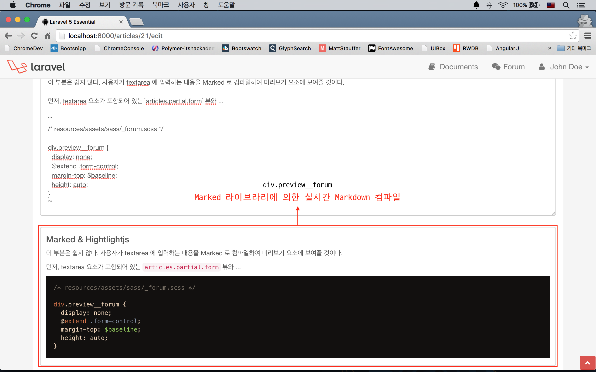
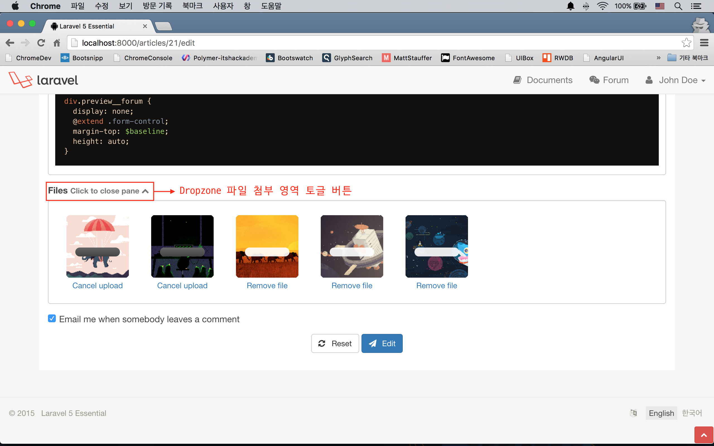
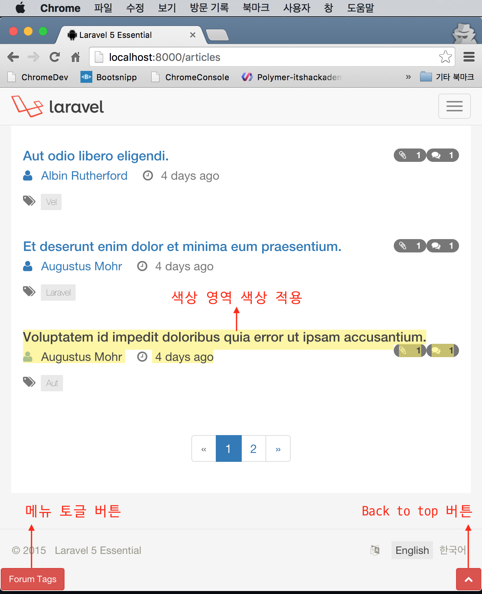

# 실전 프로젝트 2 - Forum

## 41강 - UI 개선

이번 강에서 전반적인 UI 개선 작업을 하고, 다음 강에서는 이벤트, 알림, 캐싱 등 서버 사이드 쪽 개선 작업을 하도록 하자. 먼저 무엇을 개선할지 정의하자.

1. 포럼 본문 또는 댓글을 쓸 때
  1. 사용자가 입력하는 내용을 실시간으로 마크다운 컴파일하여 보여준다.
  2. textarea 요소에서 코드를 쓸 경우를 대비해, <kbd>Tab</kbd> 키 입력을 지원하자. (원래는 <kbd>Tab</kbd> 키를 치면 다음 요소로 이동해 버린다.)
  3. 사용자가 입력한 내용이 길어지는 것을 대비해, textarea 요소의 크기를 입력 내용의 양에 따라 자동으로 조절하자.
2. 마크다운 문법을 잘 모르는 사용자를 배려하여, 사용법을 페이지에서 보여주자.
3. 파일 첨부 UI를 토글할 수 있도록 하자.

### UI 콤포넌트 설치

위의 기획에 따라, 필자의 경험과 인터넷 검색을 통해 적절한 프론트엔드 라이브러리를 아래와 같이 선택하였다.

- [Fastclick](https://github.com/ftlabs/fastclick) : 모바일 디바이스에서 터치 반응을 개선한다.
- [Tabby](https://github.com/alanhogan/Tabby) : textarea 에서 <kbd>Tab</kbd> 키 입력을 지원한다. 
- [Autosize](https://github.com/jackmoore/autosize) : 텍스트 길이에 따라 textarea 요소의 높이를 자동으로 조정한다.
- [Marked](https://github.com/chjj/marked) : 클라이언트 사이드에서의 마크다운 컴파일 기능을 지원한다. 
- [Highlightjs](https://github.com/components/highlightjs) : 코드에서 Syntax Highlight 기능을 지원한다. 기존 Google Code Prettify 를 대체한다.
- [Earthsong](http://daylerees.github.io/) : Syntax Highlight 에서 Earthsong 테마를 입힌다. Highlightjs 내장 테마를 대체한다.

**`참고`** Earthsong 테마는 [Dayle Rees](http://daylerees.com/) 가 개발했다. 그는 라라벨 코어 멤버로 활동할 뿐 아니라, [PHP PANDA](https://leanpub.com/php-pandas) 등 여러 권의 PHP 서적을 낸 바 있다. 그가 만든 [Color Scheme](https://github.com/daylerees/colour-schemes) 은 모르는 개발자가 없을 정도로 유명하다. Color Scheme에서 제공하는 다양한 에디터 테마를 보려면 [Color Scheme Gallery](http://daylerees.github.io/)를 확인해 보자.

```bash
# highlightjs를 쓸 것이므로 google-code-prettify 는 제거한다.
$ bower uninstall google-code-prettify --save-dev
$ bower install fastclick tabby autosize marked highlightjs --save-dev
# Bower 콤포넌트가 아니므로, github 에서 raw URL를 따서 CURL 로 다운로드하였다.
$ curl https://raw.githubusercontent.com/daylerees/colour-schemes/master/highlightjs/contrast/earthsong-contrast.css -o ./resources/assets/vendor/earthsong.css
```

빌드스크립트를 수정하자. 수정 후 빌드 코맨드는 이젠 척척 알아서.. `$ gulp` (or `$ gulp --production`)

```javascript
// gulpfile.js

elixir(function (mix) {
  mix
    .styles([
      // ...
      '../vendor/earthsong.css',
      'app.css'
    ], 'public/css/app.css')
    .scripts([
      // ...
      '../vendor/fastclick/lib/fastclick.js',
      '../vendor/tabby/jquery.textarea.js',
      '../vendor/autosize/dist/autosize.js',
      '../vendor/highlightjs/highlight.pack.js',
      '../vendor/marked/lib/marked.js',
      'app.js'
    ], 'public/js/app.js')
    // ...
});
```

### 포럼 본문 및 댓글 쓰기 개선

#### Fastclick

쉬운 것 먼저 하자. Fastclick 기능 추가는 `attach()` 메소드 호출 하나로 끝난다.

```javascript
// resources/assets/js/app.js

var csrfToken = $('meta[name="csrf-token"]').attr('content'),
    routeName = $('meta[name="route"]').attr('content'),
    textAreas = $('textarea');

/* Global Settings */

/* Activate Fastclick */
window.addEventListener('load', function() {
  FastClick.attach(document.body);
}, false);

/* Set Ajax request header.
 Document can be found at http://laravel.com/docs/routing#csrf-x-csrf-token */
$.ajaxSetup({
  headers: {
    'X-CSRF-TOKEN': csrfToken
  }
});
```

작업하는 김에 코드들도 약간 정리했다. `csrfToken` 부분은 앞 절에서 설명했을 것이다.

`textareas` 란 글로벌 변수를 주목하자. 이 스크립트는 모든 페이지 로딩시 같이 로딩된다. 즉, 페이지 로딩시 마다, textarea 요소가 있는 페이지에서는 `textareas` 변수가 셋팅이 된다.

Fastclick 적용 결과는 눈에 딱히 보이지는 않는다. 모바일 브라우저에서 접근해서 확인해야 하는데, 필자도 별로 체감은 되지 않는 것 같다.

#### Highlightjs

역시 쉽다. 'articles.show' 뷰 등에서는 기존에 작성한 포럼 본문이 표시되고, 코드 블럭을 포함하고 있을 수 있다. 'articles.show' 페이지가 로드되자 마자, 코드 블럭이 있으면 Highlightjs 가 작동한다. 주의할 점은 페이지 로드 이후에 자바스크립트에 의해서 동적으로 DOM에 추가된 코드블럭에는 Highlightjs 가 적용되지 않는다는 점이다.  

```javascript
// resources/assets/js/app.js

/* Activate syntax highlight. 
   This will affect code blocks right after the page renders */
hljs.initHighlightingOnLoad();
```


#### Tabby & Autosize

역시 쉽다. 위에서 `textareas` 란 변수를 지정한 것을 기억할 것이다. Tabby 와 Autosize 기능은 `textareas.length` 값이 있을 때만 동작시키는 것으로 했다. 

```javascript
// resources/assets/js/app.js

if (textAreas.length) {
  /* Activate Tabby on every textarea element */
  textAreas.tabby({tabString: '    '});
  
  /* Auto expand textarea size */
  autosize(textAreas);
}
```


#### Marked & Hightlightjs

이 부분은 쉽지 않다. 사용자가 textarea 에 입력하는 내용을 Marked 로 컴파일하여 미리보기 요소에 보여줄 것이다.

먼저, textarea 요소가 포함되어 있는 'articles.partial.form' 뷰와 'comments.partial.create', 'comments.partial.edit' 뷰에 미리보기를 표시할 HTML 요소를 추가하자. 

```html
<!-- resources/views/articles/partial/form.blade.php -->

<div class="form-group">
  <label for="content">{{ trans('forum.content') }}</label>
  <textarea name="content" class="form-control forum__content" rows="10">{{ old('content', $article->content) }}</textarea>
  {!! $errors->first('content', '<span class="form-error">:message</span>') !!}
  <div class="preview__forum">{{ markdown(old('content', 'Preview will be shown here...')) }}</div>
</div>
```

```css
/* resources/assets/sass/_forum.scss */

div.preview__forum {
  display: none;
  @extend .form-control;
  margin-top: $baseline;
  height: auto;
}
```

'div.preview__forum' 이란 요소를 추가하고, 처음 로드될 때 상태를 `display:none;` 로 지정하였다. 

유효성 검사 에러가 발생할 경우를 대비해, `{{ markdown(old('content', '...')) }}` 라고 쓴 것도 놓치지 말자. 포럼/댓글 작성/수정 폼 전송시에는 컴파일되지 않은 Raw 상태로 `*Controller::store()` 메소드에 전달되고, 유효성 검사에서 튕길 경우, `withInput()` 에 의해서 사용자가 작성한 폼 값들을 세션에 구워서 폼을 전송했던 뷰로 되돌려 보낸다. 이 때 서버는 뷰를 응답하기 전에, `markdown()` Helper 를 이용해서 미리 HTML 로 컴파일 된 내용을 'div.preview__forum' 요소에 넣어 놓는 부분이다. 당연히 textarea 요소에는 컴파일되지 않은 Raw 상태를 그대로 뿌리게 된다.

이제 자바스크립트 부분을 보도록 하자.

```javascript
// resources/assets/js/app.js

if (textAreas.length) {
  // Other library activation codes ...
  
  textAreas.on("focus", function (e) {
    // Show preview pane when a textarea is in focus
    $(this).siblings("div.preview__forum").first().show();
  });

  textAreas.on("keyup", function(e) {
    // Register 'keyup' event handler
    var self = $(this),
        content = self.val(),
        previewEl = self.siblings("div.preview__forum").first();

    // Compile textarea content
    var compiled = marked(content, {
      renderer: new marked.Renderer(),
      gfm: true,
      tables: true,
      breaks: true,
      pedantic: false,
      sanitize: true,
      smartLists: true,
      smartypants: false
    });

    // Fill preview container with compiled content
    previewEl.html(compiled);
    // Add syntax highlight on the preview content
    previewEl.find('pre code').each(function(i, block) {
      hljs.highlightBlock(block)
    });
  }).trigger("keyup");
}
```

먼저 textarea 에 커서가 들어가면 (== 'focus' 이벤트), jQuery의 `show()` 메소드를 이용하여 'div.preview__forum' 요소를 `display: block;` 상태로 변경시켰다.

그 다음은 textarea 에 'keyup' 이벤트가 발생했을 때 이다. textarea 에 입력한 내용을 읽어오고, 미리보기를 표시할 요소를 잡아 `content`, `previewEl` 변수가 각각 담았다.

`marked()` 메소드를 이용해서 `content` 를 컴파일하여 `compiled` 변수에 담은 후, `previewEl` 의 내용을 `compiled` 로 채워 넣었다.

앞서 설명했듯이, Highlightjs 가 페이지 로드 이후에 동적으로 DOM 에 추가된 코드블럭에 대해서는 동작을 못하기 때문에, 이 부분을 처리하는 코드도 추가하였다.



### 마크다운 사용법 Modal

Bootstrap 에는 Modal 요소를 포함하고 있다. 이를 활용하자.

먼저, Modal에 본문으로 표시될, 마크다운 사용법을 담고 있는 뷰를 만들고, 적절한 위치에 `@include` 시키자.

```html
<!-- resources/views/articles/partial/form.blade.php -->

<div class="form-group">
  <a href="#" class="help-block pull-right hidden-xs" id="md-caller">
    <small>{!! icon('preview') !!} Markdown Cheatsheet</small>
  </a>
  <label for="content">{{ trans('forum.content') }}</label>
  <!-- ... -->
</div>

<!-- ... -->

@include('layouts.partial.markdown')

@section('script')
  <script>
    // Other codes ...
    
    /* Modal window for Markdown Cheatsheet */
    $("#md-caller").on("click", function(e) {
      e.preventDefault();
      $("#md-modal").modal();
      return false;
    });
  </script>
@stop
```

```html
<!-- resources/views/layouts/partial/markdown.blade.php -->

<div class="modal fade" id="md-modal" tabindex="-1" role="dialog" aria-labelledby="myModalLabel" aria-hidden="true">
  <div class="modal-dialog modal-lg">
    <div class="modal-content">
      <div class="modal-header">
        <button type="button" class="close" data-dismiss="modal">
        <span aria-hidden="true">&times;</span>
        <span class="sr-only">Close</span></button>
        <h4 class="modal-title">Markdown Cheatsheet</h4>
      </div>

      <div class="modal-body table-responsive">
        <table class="table">
        <!-- Content of markdown cheatsheet ... -->
        </table>
      </div>

      <div class="modal-footer">
        <button type="button" class="btn btn-default" data-dismiss="modal">Close</button>
      </div>
    </div>
  </div>
</div>
```

'a#md-caller' 가 클릭되었을 때, `modal()` 메소드를 호출하는 것으로 처리하였다.


### 파일 첨부 UI 토글

미리보기까지 들어가면서, 폼이 너무 길어지게 되어 줄일 필요성이 대두되었다. 나머지 폼들은 모두 채워야 하지만, 파일 첨부는 선택적으로 해도 되는 요소이므로, 사용자가 필요할 때만 열어서 파일을 올려 놓을 수 있도록 하자.

```html
<!-- resources/views/articles/partial/form.blade.php -->

<div class="form-group">
  <label for="my-dropzone">
    Files
    <small class="text-muted">
      Click to attach files <i class="fa fa-chevron-down"></i>
    </small>
    <small class="text-muted" style="display: none;">
      Click to close pane <i class="fa fa-chevron-up"></i>
    </small>
  </label>
  <div id="my-dropzone" class="dropzone"></div>
</div>

<!-- ... -->

@section('script')
  <script>
    var dropzone  = $("div.dropzone"),
      dzControl = $("label[for=my-dropzone]>small");

    dzControl.on("click", function(e) {
      dropzone.fadeToggle(0);
      dzControl.fadeToggle(0);
    });
    
    // Other codes ...
  </script>
@stop
```



### 그 외 추가된 장식들

- Back to top 버튼이 추가되었다. 페이지 스크롤이 발생했을 때 버튼이 표시되며, 누르면 페이지의 맨 위로 이동하는 그거다. (resources/views/layouts/partial/footer.blade.php, resources/assets/js/app.js)
- 모바일에서 Forum, Documents 를 열었을 때 좌측에 표시되던 태그, 문서목록을 숨기도록 하였다. 그리고 뷰 하단에 작은 버튼을 두어 누르면, 목록이 열리도록 하였다. (resources/assets/sass/\_mediaqueries.scss, resources/assets/js/app.js)
- 페이지에서 블럭을 잡았을 때, 선택 영역의 색상을 수정했다. (resources/assets/sass/\_commons.scss)


<!--@start-->
---

- [목록으로 돌아가기](../readme.md)
- [40강 - Comment 기능 구현](40-comments.md)
- [42강 - 서버 사이드 개선](42-be-makeup.md)
<!--@end-->