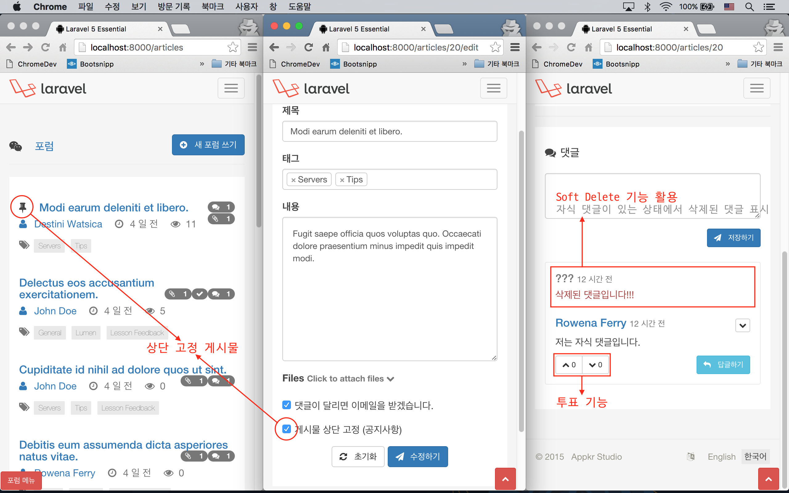
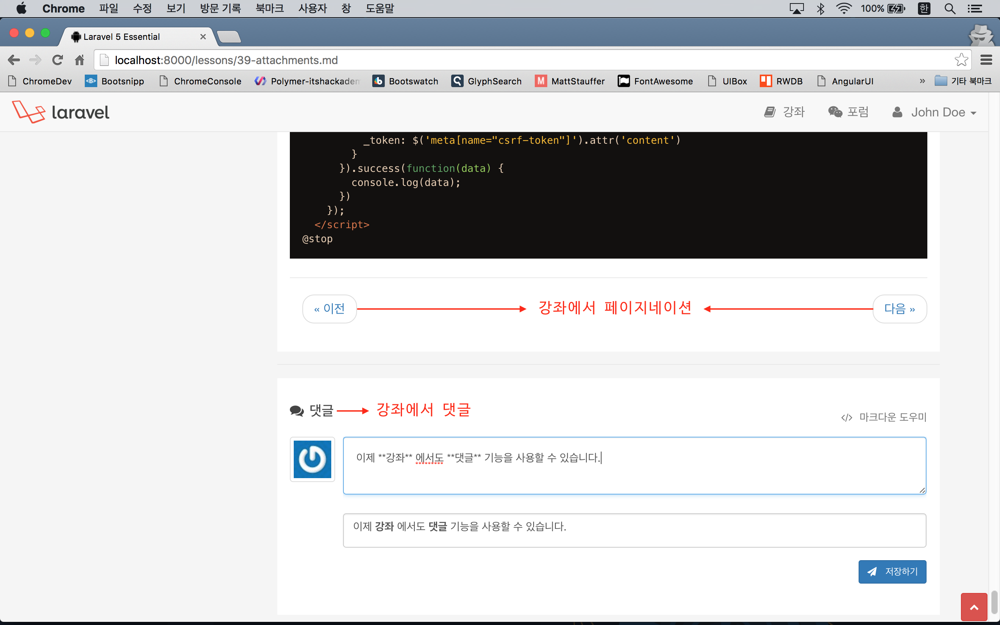
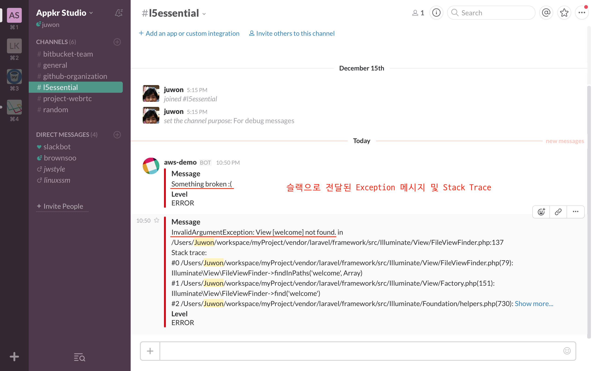

# 실전 프로젝트 2 - Forum

## 43강 - 변경 사항 알림

2~3주 정도 다른 일로 쉬는 동안 강좌는 쓰지 못했지만, 코드 변경을 계속 해 왔다. 다음 실전 강좌로 넘어가기 전에, 모든 변경 내용을 설명하지는 못하겠지만, 큰 변경 내용은 정리해서 공유하고자 한다.

1. Article Refactoring 
    - 포럼에서 "상단 고정 게시물" 기능을 구현했다. 
    - `Article`, `Comment` 모델에 [Soft Delete](http://laravel.com/docs/eloquent#soft-deleting) 기능을 추가하였다.
    - 댓글에 투표 기능을 추가했다.
2. Lesson Refactoring
    - 'documents (문서)' 디렉토리, Route 엔드포인트, 뷰 등등을 'lessons (강좌)' 으로 변경했다. 아울러 모델 이름도 `Document` 에서 `Lesson` 으로 변경했다.
    - 포럼 뿐 아니라 강좌에서도 댓글을 쓸 수 있도록 수정하였다. 이 과정에서 `Lesson` 모델 관련 [Repository Pattern](https://github.com/domnikl/DesignPatternsPHP/tree/master/More/Repository) 을 적용하는 등 몇 가지 관련 코드들의 수정이 있었다.
    - 강좌에서도 "이전", "다음" 페이지네이션 기능을 추가하였다.
    - 'lessons (강좌)' 디렉토리에 담긴 마크다운 파일의 내용이 바뀌었을 경우, `Lesson` 모델과 컨텐츠 동기화를 해 주는 커스텀 Artisan 코맨드를 추가했다. 
3. 라이브 데모 사이트 개설
    - 이 강좌의 라이브 데모 사이트를 위해, 랜딩 페이지를 만들고, [Amazon Web Service](http://aws.amazon.com/) 에 코드를 배포하였다. 
    - 이 과정에서 [Envoy SSH Task Runner](http://laravel.com/docs/envoy) 를 사용하였다.
    - 라이브 데모 사이트에서 발생하는 Exception 을 [\# slack](https://slack.com/) 메시지로 받기 위한 기능을 추가했다. 

**`참고`** 상세한 변경사항은 [Laravel 5 Essential](https://github.com/appkr/l5essential/commit) 의 Commit History 에서 확인하시기 바란다.

### 1. Article Refactoring

#### 상단 고정 게시물 기능 구현
`Article` 모델에 `$pin` 속성이 지정되어 있으면, 포럼 목록을 표시할 때 가장 위에 표시하는 식으로 포럼 "상단 고정 게시물" 기능을 구현했다.

```php
// DATE_create_articles_table.php

class CreateArticlesTable extends Migration
{
    public function up()
    {
        Schema::create('articles', function (Blueprint $table) {
            // ...
            $table->boolean('pin')->default(0);
        }
    }
}
```

아래 코드에서 `orderBy('pin', 'desc')`가 추가된 것을 확인하자.

```php
// app/Http/Controllers/ArticlesController.php

class ArticlesController extends Controller
{
    protected function filter($request, $query)
    {
        //...
        return $query->orderBy('pin', 'desc')->orderBy($sort, $direction);
    }
```

그리고, `$pin` 속성은 관리자만 지정하거나 해제할 수 있도록 하였다.

```html
<!-- resources/views/articles/partial/form.blade.php -->

<!-- Other view codes... -->
@if ($currentUser and $currentUser->isAdmin())
  <div class="form-group">
    <div class="checkbox">
      <label>
        <input type="checkbox" name="pin" {{ $article->pin ? 'checked="checked"': ''}}>
        {{ trans('forum.pin') }}
      </label>
    </div>
  </div>
@endif
```

#### Soft Delete 적용 및 댓글에 응용

[Soft Delete](http://laravel.com/docs/eloquent#soft-deleting) 란 사용자가 삭제 요청을 하면, DB 에서 레코드를 완전히 삭제하는 것이 아니라, `deleted_at` 이란 필드에 삭제된 날짜를 넣어 놓는 식으로 동작한다. 마이그레이션에서 `deleted_at` 필드를 추가하고, Soft Delete 를 적용할 모델에서 라라벨에 제공하는 Trait 만 추가하면 된다.

```php
// DATE_create_articles_table.php

class CreateArticlesTable extends Migration
{
    public function up()
    {
        Schema::create('articles', function (Blueprint $table) {
            // ...
            $table->softDeletes();
        }
    }
}
```

아래에서 `$dates` 는 날짜 형식을 `Carbon\Carbon` 인스턴스로 바꾸어서 보여주기 위한 Accessor 이다. 기본기 [22강 - 이벤트](22-events.md) 강좌에서 `$last_login` 속성을 추가할 때도 사용한 적이 있다. 

```php
// app/Article.php

use Illuminate\Database\Eloquent\SoftDeletes;

class Article extends Model
{
    use SoftDeletes;
    
    protected $dates = ['deleted_at'];
    
    // ...
}
```

Soft Delete 가 적용되었더라도 엘로퀀트나 쿼리빌더에서는 이전과 동일하게 쿼리하면, 라라벨이 내부적으로 `deleted_at == null` 인 레코드들만 가져오게 되어 있다. 다만 삭제된 레코드까지도 가져오고 싶다면 `withTrashed()` 메소드를 체인하면 된다. 아래는 자식 댓글이 있음에도 불구하고, 작성자가 자신의 댓글을 삭제했을 때, "삭제된 댓글" 이라고 표시하기 위한 구현인데, `withTrashed()` 로 삭제된 댓글까지도 모두 가져오고 있음을 확인할 수 있다.

```php
// app/Http/Controllers/ArticlesController.php

class ArticlesController extends Controller
{
    public function show($id)
    {
        $article = Article::with('comments', 'tags', 'attachments', 'solution')->findOrFail($id);
        $commentsCollection = $article->comments()->with('replies')
            ->withTrashed()->whereNull('parent_id')->latest()->get();
        // ...
    }
```

아래는 `Comment` 모델의 삭제 구현이다. 자식 댓글이 없으면 `forceDelete()` 메소드로 DB 에서 완전히 삭제해 버리고, 그렇지 않으면 `delete()` 메소드로 Soft Delete 한다.

```php
// app/Http/Controllers/CommentsController.php

class CommentsController extends Controller
{
    public function destroy(Request $request, $id)
    {
        $comment = Comment::with('replies')->find($id);

        if ($comment->replies->count() > 0) {
            $comment->delete();
        } else {
            $comment->forceDelete();
        }

        // ...
    }
}
```

이제 뷰를 살펴보자. `$comment->trashed()` 는 Soft Delete 된 댓글일 경우 `true` 를 반환한다.

```html
<!-- resources/views/comments/index.blade.php -->

@forelse($comments as $comment)
@include('comments.partial.comment', [
  // ...
  'hasChild'  => count($comment->replies),
  'isTrashed' => $comment->trashed()
])
@empty
@endforelse
```

```html
<!-- resources/views/comments/partial/comment.blade.php -->

@if ($isTrashed and ! $hasChild)
  <!-- 자식 댓글이 없는 상태에서 삭제된 댓글 -->
@elseif ($isTrashed and $hasChild)
  <!-- 자식 댓글이 있는데 삭제되었을 때 -->
  <p class="text-danger">삭제된 댓글입니다.</p>
@else
  <!-- 삭제되지 않은 댓글일 때 -->
@endif
```

#### 댓글에 투표 기능 추가

[Disqus](https://disqus.com/), [Stack Overflow](http://stackoverflow.com/) 의 댓글들은 투표시스템 (== 포인팅 시스템) 을 가지고 있고, 그 점수에 따라 댓글의 품질을 평가하고 있다. 여기서도 유사한 기능을 구현했다. 주의할 점은 특정 댓글에 이미 Up 또는 Down 투표를 한 사용자는 같은 댓글에 대해서는 다시 투표를 할 수 없어야 한다는 점이다.
 
먼저 투표을 받기 위한 마이그레이션과 모델을 만들자. `user_id` 필드는 이미 투표한 사용자인지를 판단하기 위해서 사용한다. `up`, `down` 필드는 특정 `comment_id` 에 대한 투표 값 통계를 내기 위한 목적으로 각각 분리해서 필드를 생성했다.

```php
// DATE_create_votes_table.php

class CreateVotesTable extends Migration
{
    public function up()
    {
        Schema::create('votes', function (Blueprint $table) {
            $table->increments('id');
            $table->integer('user_id')->unsigned();
            $table->integer('comment_id')->unsigned();
            $table->tinyInteger('up')->nullable();
            $table->tinyInteger('down')->nullable();
            $table->timestamp('voted_at');

            $table->foreign('user_id')->references('id')->on('users')->onDelete('cascade');
            $table->foreign('comment_id')->references('id')->on('comments')->onDelete('cascade');
        });
    }
}
```

아래는 `Vote` 모델이다. `User`, `Comment` 모델에서의 Reverse Relationship 은 설명을 생략한다.

```php
// app/Vote.php

class Vote extends Model
{
    public $timestamps = false;

    protected $fillable = [
        'user_id',
        'comment_id',
        'up',
        'down',
        'voted_at',
    ];

    protected $dates = [
        'voted_at',
    ];

    public function comment()
    {
        return $this->belongsTo(Comment::class);
    }

    public function user()
    {
        return $this->belongsTo(User::class);
    }
}
```

이제 투표를 하기 위한 UI 를 만들자. 아래 코드에서 `<?php $voted = $comment->votes->contains('user_id', $currentUser->id); ?>` 부분을 주목해볼만 하다. 페이지가 로드될 때, 현재 로그인한 사용자가 이미 투표를 했는지 확인하는 부분인데, `\Illuminate\Database\Eloquent\Collection::contains(mixed $key, mixed $value = null)` API 를 이용하고 있다. 이미 투표했을 경우. `@if ($voted) {{ 'disabled="disabled"' }} @endif` 에서 버튼을 비활성화시켰다.

투표 값, 'up' 또는 'down' 전송은 Ajax 를 이용하고 있고, 서버에서 성공 응답을 받으면, 투표한 댓글의 투표 버튼을 비활성화 시키고 있다. 

```html
<!-- resources/views/comments/partial/comment.blade.php -->

@if ($currentUser)
  <div class="btn-group" role="group">
    <?php $voted = $comment->votes->contains('user_id', $currentUser->id); ?>
    <button type="button" class="btn btn-default btn-sm btn__vote" data-vote="up" title="Vote up" @if ($voted) {{ 'disabled="disabled"' }} @endif>
      {!! icon('up', false) !!} <span>{{ $comment->up_count }}</span>
    </button>
    <button type="button" class="btn btn-default btn-sm btn__vote" data-vote="down" title="Vote down" @if ($voted) {{ 'disabled="disabled"' }} @endif>
      {!! icon('down', false) !!} <span>{{ $comment->down_count }}</span>
    </button>
  </div>
  <!-- Other view codes... -->
@endif

@section('script')
  @parent
  <script>
    $("button.btn__vote").on("click", function(e) {
      var self = $(this),
          commentId = $(this).closest(".media__item").data("id");

      $.ajax({
        type: "POST",
        url: "/comments/" + commentId + "/vote",
        data: {
          vote: self.data("vote")
        }
      }).success(function(data) {
        self.find("span").html(data.value);
        self.attr("disabled", "disabled");
        self.siblings().attr("disabled", "disabled");
      }).error(function() {
        flash("danger", "{{ trans('common.msg_whoops') }}", 2500);
      });
    });
  </script>
@stop
```

이제 뷰에서 Ajax 로 전송한 투표를 받고 처리할 수 있는 Route 와 컨트롤러 로직을 만들어야 한다.

```php
// app/Http/routes.php

Route::post('comments/{id}/vote', 'CommentsController@vote');
```

아래는 컨트롤러이다. 주석에 설명을 달았다.

```php
// app/Http/Controllers/CommentsController.php

class CommentsController extends Controller
{
    public function vote(Request $request, $id)
    {
        $this->validate($request, [
            'vote' => 'required|in:up,down',
        ]);

        if(Vote::whereCommentId($id)->whereUserId($request->user()->id)->exists()) {
            // 사용자가 브라우저의 Inspector 등을 이용해서 disabled 된 투표 버튼을 다시 활성화시켜
            // 중복 투표를 하는 것을 방지하기 위한 조치이다.
            return response()->json(['errors' => 'Already voted!'], 409);
        }

        $comment = Comment::findOrFail($id);
        $up = $request->input('vote') == 'up' ? true : false;

        $comment->votes()->create([
            'user_id'  => $request->user()->id,
            'up'       => $up ? 1 : null,
            'down'     => $up ? null : 1,
            'voted_at' => \Carbon\Carbon::now()->toDateTimeString(),
        ]);

        return response()->json([
            // up, down 어떤 투표인지와 투표 후 총 투표 수를 반환하고,
            // 뷰의 자바스크립트에서 총 투표 수를 업데이트한다.
            'voted' => $request->input('vote'),
            'value' => $comment->votes()->sum($request->input('vote'))
        ]);
    }
}
```

아래 `Comment` 모델에서 `$with` 속성은 모든 쿼리에서 포함할 Eager Loading 관계이다. 즉, `Comment::find(1)` 로만 쿼리해도 `Comment::with('author', 'votes')->find(1)` 과 같은 결과를 보여준다는 의미이다.

```php
// app/Comment.php

class Comment extends Model
{
    protected $with = [ 'author', 'votes', ];

    protected $appends = [ 'up_count', 'down_count' ];

    public function getUpCountAttribute()
    {
        return (int) static::votes()->sum('up');
    }

    public function getDownCountAttribute()
    {
        return (int) static::votes()->sum('down');
    }
    
    // ...
}
```

투표를 포함한 댓글 목록을 브라우저 쪽으로 던져 주는 부분은 `ArticlesController::show()` 메소드인데 설명은 생략한다. 대신, 사용자로 부터 얻은 댓글에 대한 통계를 어떻게 얻는지를 설명하기로 한다.
 
`Comment` 모델에서 `up_count` 와 `down_count` 란 필드를 동적으로 생성하고 모델의 속성으로 Append 하였다. 이 속성들은 `getUpCountAttribute()`, `getDownCountAttribute()` 란 메소드에서 그 값이 채워지는데, `Comment::votes()->sum(up)` 처럼 엘로퀀트 컬렉션에서 제공하는 통계 메소드인 `sum()` 을 이용하고 있다. 앞 전에 `Vote` 모델을 채울 때, `up` 과 `down` 속성에 `null|1` 을 채운 것이 여기서 모두 합해 지는 것이다.

```bash
$ php artisan tinker
>>> $comment = App\Comment::find(22);
=> App\Comment {#835
     content: "저는 자식 댓글입니다.",
     #...,
     author: App\User {#840
       name: "Rowena Ferry",
       #...,
     },
     votes: Illuminate\Database\Eloquent\Collection {#838
       all: [
         App\Vote {#843
           up: 1,
           #...,
         },
         App\Vote {#844
           up: 1,
           #...,
         },
       ],
     },
   }
>>> $comment->up_count;
=> 2
>>> $comment->down_count;
=> 0
```



### 2. Lesson Refactoring

#### Repository 구현

강좌에서도 댓글을 쓸 수 있도록 하기 위해서, [28강 - Cache](28-cache.md) 에서 살펴본 바와 유사하게, 사용자의 마크다운 파일 요청이 있으면, 파일시스템에 있던 파일을 읽어서 바로 주는 것이 아니라 DB 에 넣었다. 즉, 파일의 내용을 DB 에 넣어서, 모델을 만들었다는 얘기다. 단, 매번 파일시스템 -> DB Insert 식으로 동작하는 것이 아니라, 캐시처럼 DB 를 먼저 탐색해서 없으면 파일시스템에서 읽어서 DB Insert 하는 식으로 구현했다.

먼저 파일로 부터 읽어 들인 마크다운 파일의 내용을 담을 DB 마이그레이션을 만들어야 한다.

```php
// DATE_create_lessons_table.php

class CreateLessonsTable extends Migration
{
    public function up()
    {
        Schema::create('lessons', function (Blueprint $table) {
            $table->increments('id');
            $table->integer('author_id')->unsigned();
            $table->string('name');
            $table->text('content');
            $table->timestamps();
            $table->foreign('author_id')->references('id')->on('users');
        });
    }
}
```

여러가지 구조를 고민하다가, 강좌 외에도 마크다운 형식의 파일을 서비스할 일이 더 있을 것을 고려해서 Repository 를 만들기로 했다. 아래 코드에서 `find()` 메소드를 보면, 사용자가 요청한 파일 이름으로 먼저 DB 쿼리를 하고, 쿼리 결과가 `null` 이면 파일 시스템에서 읽어서 `Lesson` 모델을 생성하고 있는 것을 확인할 수 있다.

```php
// app/Repositories/MarkdownRepository.php

use Exception;
use File;
use Illuminate\Database\Eloquent\Model;

abstract class MarkdownRepository implements RepositoryInterface
{
    protected $model;
    
    protected $path;

    public function __construct()
    {
        $this->initialize();
    }

    public abstract function model();

    protected function initialize()
    {
        $model = app()->make($this->model());

        if (! $model instanceof Model) {
            throw new Exception(
                'model() method must return a string name of an Eloquent Model.'
            );
        }

        if (! property_exists($this->model(), 'path')) {
            throw new Exception(
                "{$this->model()} should have a property named 'path'"
            );
        }

        $path  = base_path($model::$path);

        if (! File::isDirectory($path)) {
            throw new Exception(
                "Something went wrong with the path property of {$this->model()} model."
            );
        }

        $this->model = $model;
        $this->path  = $path;
    }

    public function find($id, $columns = ['*'])
    {
        return $this->model->whereName($id)->first()
            ?: $this->model->create([
                // Bad!! Avoid hard code, b.c, admin may change.
                'author_id' => 1, 
                'name'      => $id,
                'content'   => File::get($this->getPath($id)),
            ]);
    }

    public function image($file) { // ... }

    public function etag($file) { // ... }

    protected function getPath($file)
    {
        $path = $this->path . DIRECTORY_SEPARATOR . $file;

        if (!File::exists($path)) {
            abort(404, 'File not exist');
        }

        return $path;
    }
}
```

이 추상 클래스를 상속하는 클래스는 `public abstract function` 으로 지정한 `model()` 메소드를 반드시 구현해야 한다. 그리고, 해당 Repository 와 연결된 모델에서는 `$path` 속성을 제공해야 한다. 이 클래스를 상속하게 되는 `LessonRepository` 와 `Lesson` 모델을 차례로 볼 것이다.
 
```php
// app/Repositories/LessonRepository.php

class LessonRepository extends MarkdownRepository
{
    public function model()
    {
        return \App\Lesson::class;
    }
}
```

```php
// app/Lesson.php

class Lesson extends Model
{
    public static $path = 'lessons';
    
    // ...
}
```

`MarkdownRepository` 추상 클래스에서 `initialize()` 메소드의 구동을 살펴보자.

- 먼저 `app()->make(string $abstract)` Helper 를 이용해서, `Lesson` 모델을 생성한다. `LessonRepository::model()` 메소드에서 `\App\Lesson` 이란 스트링을 반환하게 되어 있으므로, 당연히 전술한 코드는 `app()->make('\App\Lesson')` 와 같이 된다.
- 좀 전에 만든 클래스가 엘로퀀트 모델이 맞는지를 체크하여 아닐 경우 `\Exception` 을 던진다
- [`property_exists(mixed $class, string $property)`](http://php.net/manual/kr/function.property-exists.php) PHP 내장 함수로, `Lesson` 모델에 `$path` 속성이 지정되어 있지 않을 경우, `\Exception` 을 던진다.
- 또, `Lesson` 모델에서 `$path` 속성으로 지정한 디렉토리가 존재하지 않을 경우 `\Exception` 을 던진다.
- 모든 체크 과정이 완료되면, 이 추상 클래스가 동작하기 위해 필요한 `$model`, `$path` 속성이 모두 준비된다.

이제 `LessonsController` 에서 만들어진 `LessonRepository` 를 사용하면 된다. 

```php
// app/Controllers/LessonsController

class LessonsController extends Controller
{
    protected $repo;

    public function __construct(LessonRepository $repo)
    {
        // LessonRepository 를 Injection 하고 $repo 속성에 할당한다.
        $this->repo = $repo;
    }

    public function show($file = '01-welcome.md')
    {
        $lesson = $this->repo->find($file);

        $commentsCollection = $lesson->comments()->with('replies')
            ->withTrashed()->whereNull('parent_id')->latest()->get();

        return view('lessons.show', [
            'index'           => $this->repo->index(),
            'lesson'          => $lesson,
            'comments'        => $commentsCollection,
            'commentableType' => $this->repo->model(),
            'commentableId'   => $lesson->id,
        ]);
    }
    
    // ...
}
```

강좌에서도 댓글을 사용하기 위해 `$comments` 변수를 뷰로 넘기는 것이 보일 것이다.

#### Pagination

포럼 목록보기에서 `\Illuminate\Database\Eloquent\Collection` 을 이용해서 페이지네이션을 보여주었다면, 강좌에서는 단일 강좌 상세보기를 보여주고 있으므로 "다음" 또는 "이전" 강좌로 이동하는 페이지네이션이 적절할 것으로 생각된다. 

`MarkdownRepository` 에 페이지네이션에 필요한 기능을 구현하였다. `$toc` 는 전체 강좌 목록을 가진 배열이다. `$current` 는 현재 선택된 강좌의 배열 값 (== 파일이름) 이다. `$toc` 는 `initialize()` 과정에서 셋팅이되며, `$current` 는 `find()` 메소드에서 셋팅이 된다. 

`$toc` 를 셋팅하는 과정에 [`glob()`](http://php.net/manual/kr/function.glob.php), [`array_diff()`](http://php.net/manual/kr/function.array-diff.php), [`array_map()`](http://php.net/manual/kr/function.array-map.php), [`pathinfo()`](http://php.net/manual/kr/function.pathinfo.php) 등의 PHP 내장 함수를 사용하는데, 공식 문서들을 참고하자.

`prev(string $current)`, `next(string $current)` 메소드는 모두 `$current` 를 인자로 받는데, 이는 현재 화면에 표시된 강좌의 마크다운 파일이름이다. 이 메소드들에서는 [`array_search()`](http://php.net/manual/kr/function.array-search.php) PHP 내장 함수를 이용해서, 인자로 넘겨 받은 `$current` 에 해당하는 배열 인덱스를 `$toc` 에서 찾은 후, +1 또는 -1 해서 원하는 인덱스에 해당하는 파일이름을 반환하게 구현되어 있다. [`array_key_exists()`](http://php.net/manual/kr/function.array-key-exists.php) 도 찾아보기 바란다.

```php
// app/Repositories/MarkdownRepository.php

abstract class MarkdownRepository implements RepositoryInterface
{
    protected $toc;

    protected $current;
    
    public function __construct() {// ...}
    
    protected function initialize()
    {
        if (! $this->toc) {
            $all    = glob(base_path($model::$path . DIRECTORY_SEPARATOR . '*.md'));
            $except = glob(base_path($model::$path . DIRECTORY_SEPARATOR . '*INDEX.md'));
            // $files 는 INDEX.md 를 제외한 나머지 *.md 파일들을 담고 있는 배열이다.
            $files  = array_diff($all, $except);

            $this->toc = array_map(function($file) {
                // $files 배열을 순회하면서, $this->toc 에 담는다.
                return pathinfo($file, PATHINFO_BASENAME);
            }, $files);
        }
    }
    
    public function find($id, $columns = ['*'])
    {
        // $id 는 '01-welcome.md' 와 같은 파일 이름을 담고 있다.
        $this->current = $id;
        
        // ...
    }

    public function prev($current) {
        // $current 가 '01-welcome.md' 라면,
        // array_search 의 결과는 이 파일의 index 인 0 이 된다.
        // $prev 에는 -1 이 할당된다.
        $prev = array_search($current, $this->toc) - 1;

        // $this->toc[-1] 은 존재하지 않으므로 false 가 리턴될 것이다.
        return array_key_exists($prev, $this->toc) ? $this->toc[$prev] : false;
    }

    public function next($current) {
        // $current 가 '01-welcome.md' 라면,
        // array_search 의 결과는 이 파일의 index 인 0 이 된다.
        // $next 에는 2 가 할당된다.
        $next = array_search($current, $this->toc) + 1;

        // $this->toc[2] 에 해당하는 값은 '02-hello-laravel.md' 이다.
        return array_key_exists($next, $this->toc) ? $this->toc[$next] : false;
    }
    
    // ...
}

```

이제 쉽다. 컨트롤러에서 뷰에다 "이전", "다음" 에 해당하는 파일이름을 넘겨주기만 하면 되니까..

```php
// app/Http/Controllers/LessonsController.php

class LessonsController extends Controller
{
    public function show($file = '01-welcome.md')
    {
        // ...
        
        return view('lessons.show', [
            // ...
            'prev'            => $this->repo->prev($file),
            'next'            => $this->repo->next($file),
        ]);
    }
}
```

뷰를 보자.

```html
// resources/views/lessons/show.blade.php

<article>
  @include('lessons.partial.pager')
  <!-- ... -->
</article>
```

컨트롤러에서 넘겨 받은 `$prev`, `$next` 값이 `false` 일 경우, 즉 처음 페이지 또는 마지막 페이지일 경우, `class="disabled"` 속성을 지정하고 있다. 반면 값이 있을 경우에는, `route('lessons.show', '파일이름')` 으로 "이전" 또는 "다음" 으로 이동하는 링크를 만드는 것을 볼 수 있다.

```
// resources/views/lessons/partial/pager.blade.php

<nav>
  <ul class="pager">
    <li class="previous {{ $prev === false ? 'disabled' : ''}}">
      <a href="{{ $prev !== false ? route('lessons.show', $prev) : '#'}}">
        {{ trans('pagination.previous') }}
      </a>
    </li>
    <li class="next {{ $next === false ? 'disabled' : ''}}">
      <a href="{{ $next !== false ? route('lessons.show', $next) : '#' }}">
        {{ trans('pagination.next') }}
      </a>
    </li>
  </ul>
</nav>
```

기존 강좌에서 넣어 두었던 마크다운을 이용한 이전 강좌, 다음 강좌 링크와 이번에 구현한 페이지네이션간의 중복을 피하기 위해, 기존 강좌의 마크다운 파일에 &lt;!--@start--&gt; &lt;!--@end--&gt; 와 같은 커스텀 마크다운 컴파일 규칙을 정의하고, 그것을 이해하고 처리하기 위해 'app/Services/Markdown.php' 도 약간 수정했다.



#### Custom Artisan Command

사용자의 요청이 없으면 강좌의 내용은 DB 에 Insert 되지 않는다. 그렇지만, 이미 DB 에 들어간 강좌의 마크다운 파일을, 다음 릴리즈 때 수정해서 올려야 한다면 어떻게 할까? 당연히 기존에 DB 에 들어가 있는 강좌 엔트리를 모두 업데이트해 줘야 한다. 사실 'lessons' 테이블을 truncate 하면 모든게 리셋되고, 새로 파일에서 읽어 DB Insert 를 하겠지만, 이렇게 하면 문제가 생긴다. 무슨 문제이고 하니, 댓글의 'commentable_id' 값이 이미 DB 에 들어간 강좌의 'id' 와 연결되어 있다는 점이다. 강좌의 변경 내용을 효율적으로 반영하기 위해 [커스텀 Artisan 코맨드](http://laravel.com/docs/5.2/artisan) 를 만들자.

```bash
$ php artisan make:console UpdateLessonsTable
```

기본적으로 알고 있어야 할 것은 이 정도다. `$this->argument()` 로 콘솔에서 사용자가 입력한 인자를 얻을 수 있다. `$this->option()` 으로 콘솔에서 사용자가 입력한 옵션 값을 얻을 수 있다. `$this->info()`, `$this->error()`, `$this->warning()`, `$this->line()`, `$this->table()` 등으로 사용자에게 코맨드 실행결과를 알려 줄 수 있다. 사실 가장 중요한 것은 코맨드의 인자와 옵션을 지정하는 `$signature` 속성이다. 더 상세한 내용은 공식문서를 살펴볼 것을 권장한다. 

```php
// app/Console/Commands/UpdateLessonsTable.php

class UpdateLessonsTable extends Command
{
    protected $signature = 'my:update-lessons';

    protected $description = 'Update the content of the lessons table.';

    public function handle()
    {
        $lessons = \App\Lesson::all();

        foreach($lessons as $lesson) {
            $path = base_path(\App\Lesson::$path . DIRECTORY_SEPARATOR . $lesson->name);
            $lesson->content = \File::get($path);
            $lesson->save();
            $lesson->touch();

            $this->info(sprintf('Success updating %d: %s', $lesson->id, $lesson->name));
        }

        return $this->warn('Finished.');
    }
}
```

Artisan 명령을 작성했으면 반드시 'app/Console/Kernel.php' 에 등록해 주어야 한다.

```php
// app/Console/Kernel.php

class Kernel extends ConsoleKernel
{
    protected $commands = [
        \App\Console\Commands\UpdateLessonsTable::class,
    ];
    
    // ...
}
```

실행해 보면 아래 그림과 같은 결과를 얻을 수 있다.


**`참고`** 라라벨은 서버의 Crontab 정의를 직접 손대지 않고도, PHP 코드 레벨에서 작업 스케쥴을 정의할 수 있게 도와 준다. 공식 문서의 [Task Scheduling](https://laravel.com/docs/5.2/scheduling) 부분을 살펴볼 것을 권장한다. 아래는 이 서비스에 적용되어 있는 월 단위 라라벨 로그를 삭제하는 스케쥴이다. 매일 3시에 DB 를 백업하는 코맨드도 넣어 두었다.

```php
// app/Console/Commands/ClearLog.php

class ClearLog extends Command
{
    protected $signature = 'my:clear-log';

    protected $description = 'Clear Laravel log.';

    public function handle()
    {
        $path = storage_path('logs/laravel.log');
        system('cat /dev/null > ' . $path);

        $now = \Carbon\Carbon::now()->toDateTimeString();
        $result = "{$this->getName()} command done at {$now}";
        \Log::info($result);

        return $this->info($result);
    }
}
```

```php
// app/Console/Kernel.php

class Kernel extends ConsoleKernel
{
    // ...
    
    protected function schedule(Schedule $schedule)
    {
        $schedule->command('inspire')->hourly();
        $schedule->command('my:clear-log')->monthly();
        $schedule->command(
                sprintf('my:backup-db %s %s', env('DB_USERNAME'), env('DB_PASSWORD'))
            )->dailyAt('03:00');
    }
}
```

### 3. 라이브 데모 사이트 개설

#### 라이브 데모 사이트

AWS 에 오픈했다.


#### Envoy SSH Task Runner

[Envoy](http://laravel.com/docs/envoy) 는 라라벨에서 제공하는 Remote Task Runner 이다. 원격 서버에 SSH 로 직접 로그인하지 않고도, 스크립트로 써 놓은 Task 를 **"로컬"** 에서 실행할 수 있는 기능이다. Envoy 는 [Puppet](http://www.puppetlabs.com/), [Chef](https://www.chef.io/) 와 같은 프로비저닝 툴도 아니고, [Capistrano](https://github.com/capistrano/capistrano/wiki), [Deployer](https://github.com/deployphp/deployer) 와 같은 배포 툴과도 결이 다르다. 앞서 나열한 목적이 명확한 고차원적인 애들 보다는 훨신 더 저수준 (== Low Level) 이고, 그만큼 자유도가 높다는 뜻이다. 이야기인 즉, 프로비저닝 용도로도 쓸 수 있고, 배포 용도로도 쓸 수 있고, 일반적인 관리 작업 용도로도 쓸 수 있다는 말이다. 파이썬으로 만들어진 [fabric/fabric](https://github.com/fabric/fabric) 과 가장 유사하다고 할 수 있다.

Envoy 를 사용하기 위해 가장 먼저 해야 하는 일은 Envoy 를 설치하는 일이다.

```bash
$ composer global require "laravel/envoy=~1.0"
```

```bash
# 사용하는 Shell 에 따라 Profile 파일 이름은 다를 수 있다. 
# 필자는 Zshell 을 쓰므로, .zshrc 이다. e.g. .profile, .bashrc
$ nano ~/.zshrc

# composer global 로 설치한 패키지들의 실행파일을 경로에 넣어 준다.
# 이 과정이 없다면 $ ~/.composer/vendor/bin/envoy 와 같이 전체 경로를 써주어야 한다.
export PATH="$PATH:$HOME/.composer/vendor/bin"

# 수정했다면 ctrl + X, "Y" 를 눌러 변경 내용을 저장하고, 엔터를 한번 더 눌러 기존 파일을 덮어 쓴다.
 
# 그리고, 수정 내용을 현재 콘솔에 적용해 준다. 콘솔을 껐다가 다시 실행해도 된다.
$ source ~/.zshrc
```

로컬에 설치된 Ubuntu VM을 원격 서버라 가정하고, 여기에 접속해서 터미널에서 'hello' 를 찍는 간단한 스크립트만 짜 볼 것이다. 독자들께서는 사용하시는 원격 서버의 정보를 직접 입력하여 테스트해 보시기 바란다. 여기서 재밌는 부분은 블레이드와 유사한 문법을 이용할 수 있다는 점이다.

```bash
// Envoy.blade.php

@servers(['homestead' => 'homestead.vm'])

@task('hello', ['on' => 'homestead'])
  echo "Hello Envoy!";
@endtask
```

필자는 원격 서버에 사용자 이름 및 키 파일 지정없이 `$ ssh 원격서버주소` 만으로 접속할 수 있도록 아래와 같이 '~/.ssh/config' 를 항상 지정한다. 이 과정이 없다면 `$ ssh -i 키파일위치 사용자이름@원격서버주소` 식으로 로그인해야 한다. '~/.ssh/config' 를 정의하자.

```bash
$ nano ~/.ssh/config

Host homestead.vm
    HostName homestead.vm
    User vagrant
    IdentityFile ~/.ssh/id_rsa
    
# 수정을 완료한 후 ctrl + X -> Y -> Enter.
```

`$ envoy run hello` 를 실행하면 아래 그림과 같이 원격 서버에 접속해서 명령을 수행하고 결과를 로컬로 다시 돌려준 것을 확인할 수 있을 것이다.


#### \# slack 을 활용한 Error Reporting

[BugSnag](https://bugsnag.com/) 과 같은 에러 관리 도구를 이용하면 좋겠지만 관리 도구는 항상 비용을 수반하게 된다. 소속한 개발팀에서 슬랙, 힙챗, 텔레그램과 같이 수시로 들여다 보는 커뮤니케이션 도구가 있다면, 원격 서버에서 발생하는 에러를 모니터링 하기에는 더 없이 좋은 도구이다. 여기서는 필자가 사용하는 [\# slack](https://slack.com/) 을 이용할 것이다.

PHP 자체는 Fatal Error 가 발생하지 않는 한 실행을 멈추지 않고 다음 코드를 실행하는 식으로 예외에 대해 관대한 편이다. 심지어 변수가 정의되지 않았을 때도 Warning 만 발생시키고 죽지 않는다. 하지만, 라라벨은 모든 Error 를 Exception 으로 던지게 구조화되어 있고, 기본기 강좌 [24강 - 예외 처리](24-exception-handling.md) 에서 살펴본 바와 같이 'app/Exceptions/Handler.php' 에서 이들을 캐치하고 있다. 즉 \# slack 으로 예외를 보고하기 위해서는 'Handler.php' 에서 관련 코드를 추가하면 된다는 의미이다. 

```php
// app/Exceptions/Handler.php

class Handler extends ExceptionHandler
{
    public function report(Exception $e)
    {
        if ($this->shouldReport($e) and app()->environment('production')) {
            app(\App\Reporters\ErrorReport::class, [$e])->send();
        }
        
        //...
    }
}
```

그 다음은 \# slack 메시지를 보내는 방법을 찾아야 하는데, [maknz/slack](https://github.com/maknz/slack) 와 같은 외부 라이브러리를 이용하는 방법과, 라라벨에 기본 내장된 [monolog/monolog](https://github.com/Seldaek/monolog) 를 이용하는 방법이 있다. 여기서는 maknz/slack 을 이용했다. monolog 를 이용한 구현도 'app/Reporters/MonologSlackReport.php' 에 있다.

```bash
$ composer require "maknz/slack:1.*"

# ServiceProvider, Facade, config 등은 패키지의 문서를 참고하자.
```

위 'Handler.php' 코드에서 본 바와 같이 `ErrorReport` 란 클래스를 만들고, 거기에 `send()` 라는 API 를 정의한 것을 알 수 있다.
 
```php
// app/Reporters/ErrorReport.php

<?php

namespace App\Reporters;

use ...

class ErrorReport
{
    private $client;

    private $primitive;

    public function __construct(\Exception $e, $webhook = '', $settings = [])
    {
        $this->primitive = $e;
        $webhook = $webhook ?: env('SLACK_WEBHOOK');
        $this->createClient($webhook, $settings);
    }

    public function send()
    {
        return $this->client->createMessage()->attach($this->buildPayload())->send();
    }

    protected function buildPayload()
    {
        return new Attachment([
            'fallback' => 'Error Report',
            'text'     => $this->primitive->getMessage() ?: "Something broken :(",
            'color'    => 'danger',
            'fields'   => [
                new AttachmentField([
                    'title' => 'localtime',
                    'value' => Carbon::now('Asia/Seoul')->toDateTimeString(),
                ]),
                // ...
            ],
        ]);
    }

    protected function createClient($webhook, $overrides = [])
    {
        $settings = array_merge([
            'channel'                 => '#l5essential',
            'username'                => 'aws-demo',
            'link_names'              => true,
            'unfurl_links'            => true,
            'markdown_in_attachments' => ['title', 'text', 'fields'],
        ], $overrides);

        return $this->client = new Client($webhook, $settings);
    }
}
```

테스트를 위해 'Handler.php' 에서 `APP_ENV == 'production'` 일 때만 리포팅 하도록 한 `if ($this->shouldReport($e) and app()->environment('production')) {` 부분을 잠깐 주석 처리 하고, `App\Http\Controllers\WelcomeController::index()` 메소드에서 없는 뷰를 반환하도록 하고 홈 페이지를 방문하였다. 결과는 아래 그림과 같다.



<!--@start-->
---

- [목록으로 돌아가기](../readme.md)
- [42강 - 서버 사이드 개선](42-be-makeup.md)

<!--@end-->