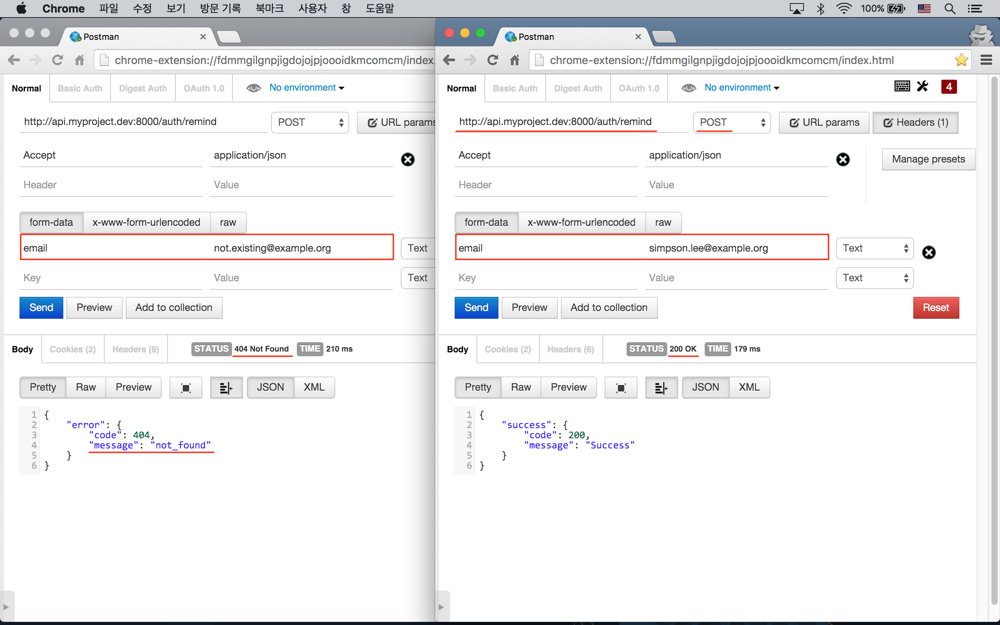
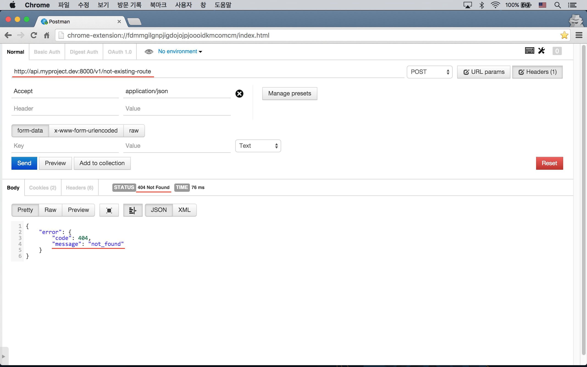

# 실전 프로젝트 3 - RESTful API

## 47강 - 중복 제거 리팩토링

앞 강에서 기존 컨트롤러의 HTTP 응답 메소드 부분을 API 관련 컨트롤러에서 오버라이드하는 과정에서, 상당히 많은 중복을 보았을 것이다. 이 중복을 제거하는 작업을 이번 강좌에서 해 볼 것이다.  

### API Response 패키지

API Response 에서 중복을 피하고 Response Payload 를 좀 더 편리하게 만들 수 있는, 이 실전 프로젝트 규모에 적절한 패키지를 찾아 봤지만.. 못 찾았다. `App\Http\Controllers\Controller` 나 별도 Trait 로 API Response 를 위한 공용 메소드를 정의하는 방법이 있기도 하지만, 필자가 [Packagist](https://packagist.org/) 에 올려 놓은 [`appkr/api`](https://github.com/appkr/api) 패키지를 이용하도록 하자. 

**`참고`** Laravel/Lumen 월드에서 API 관련 패키지 중에서는 [`dingo/api`](https://github.com/dingo/api) 가 갑 (甲) 인데, 라라벨의 네이티브 클래스들을 꽤 많이 오버라이드하고 있어서 사용법을 다시 익혀야 하는 단점이 있다. [45강 - 기본 구조 잡기](45-api-big-picture.md) 서두에서 같이 고민했던 "단일 서버 vs. 복수 서버" 섹션을 기억할 것이다. `dingo/api` 는 API 전용 독립 서버, 즉 복수 서버 구조에 더 적합하다고 생각된다. 거의 라라벨 프레임웍 수준의 큰 프로젝트로 API 관련 a-Z 를 모두 담고 있고, 베스트 프랙티스를 실천하고 있으므로 꼭 한번 설치해서 사용해 보기 바란다.

#### 설치

```bash
$ composer require "appkr/api:0.1.*"
```

ServiceProvider 를 설정하고 config 파일을 우리 프로젝트 안으로 끌고 오자. 

```php
// config/app.php

'providers' => [
    // ...
    Appkr\Api\ApiServiceProvider::class,
],
```

```bash
$ php artisan vendor:publish --provider="Appkr\Api\ApiServiceProvider"
```

#### 설정

설정 파일을 확인해 보자.

```php
// config/fractal.php

return [
    'pattern' => 'v1/*',
    'domain'  => 'api.myproject.dev',
    
    // ...
    
    'successFormat' => [
        'success' => [
            'code'    => ':code',
            'message' => ':message',
        ]
    ],
    
    'errorFormat' =>  [
        'error' => [
            'code'    => ':code',
            'message' => ':message',
        ]
    ],
];
```

`pattern`, `domain`
:   이 패키지에서도 `is_api_request()` 란 Helper 를 포함하고 있는데, 이 Helper 에서 사용하는 설정 값들이다. 주의할 점은 이 패키지가 먼저 로드되고 난후, 우리가 정의한 Helper 가 로드되는데, 이 때 `function_exists()` 에 걸려서 우리 Helper 가 로드되지 않고,이 패키지의 `is_api_request()` 가 동작하게 된다는 점이다. PHP 네임스페이스가 필요한 이유를 방금 봤다.
    
`successFormat`
:   200 번 대의 성공 응답을 할 때, 이 포맷이 사용된다. `:code`, `:message` 는 `Appkr\Api\Response` 클래스의 HTTP 응답 메소드에서 HTTP Status Code 와 메소드에 넘긴 메시지로 치환된다.
    
`errorFormat`
:   400 번 이상의 에러 응답을 할 때, 이 포맷이 사용된다.

### 리팩토링

방금 끌어온 `appkr/api` 패키지에서는 `json(array $payload)` Helper 를 제공한다. 또, `json()` Helper 는 인자 없이 호출할 때는 `Appkr\Api\Response` 인스턴스를 리턴하기 때문에, 해당 클래스에 정의된 

- `success(string $message)`
- `error(string|array|\Exception $message)`
- `respond***(string $message)`
- `setStatusCode(int $statusCode)`
- `setMeta(array $meta)` 
- `...`

등 다양한 메소드를 `json()->success()` 처럼 체인해서 사용할 수 있다. `set*()` 메소드는 다른 응답 메소드보다 먼저 체인되어야 한다는 점을 주의하자. 

#### 컨트롤러

하나씩 적용해 보자. `json(array $payload)` Helper 는 `response()->json(array $payload)` 와 같은 역할을 한다.

```php
// app/Http/Controllers/Api/WelcomeController.php

class WelcomeController extends Controller
{
    /**
     * Get the index page
     *
     * @return \Illuminate\Http\JsonResponse
     */
    public function index()
    {
        return json([
            'name'    => 'myProject Api',
            'message' => 'Welcome to myProject Api. This is a base endpoint.',
            'version' => 'n/a',
            'links'   => [/* ... */],
        ]);
    }
}
```

`unprocessableError(mixed $message)` 메소드는 HTTP 응답 코드를 422 로 설정하고, 인자로 넘겨 받은 `$message` 를, `config('fractal.errorFormat')` 으로 정의한 형태로 치환해서 HTTP 응답을 내 보내는 역할을 한다.

`setMeta(array $meta)` 는 HTTP 응답을 위한 Payload 에 `['meta' => $meta]` 를 추가해 준다. 

`created(string|array|Illuminate\Database\Eloquent\Model $primitive)` 는 HTTP 응답 코드를 201 로 설정하고, 인자로 넘겨 받은 `$primitive` 의 형태에 따라 적절하게 포맷팅하여 HTTP 응답을 내보내는 일을 한다.

```php
// app/Http/Controllers/Api/UsersController.php

class UsersController extends ParentController
{
    // ...

    protected function respondValidationError(Validator $validator)
    {
        return json()->unprocessableError($validator->errors()->all());
    }

    protected function respondCreated(User $user)
    {
        return json()->setMeta(['token' => \JWTAuth::fromUser($user)])->created();
    }
}
```


`SessionsController` 에서 위와 중복된 메소드는 설명을 생략했다.

`unauthorizedError(mixed $message)` 는 HTTP 응답 코드를 401로 설정하고, 넘겨 받은 `$message` 를 포맷팅해서 HTTP 응답을 반환한다.

```php
// app/Http/Controllers/Api/SessionsController.php

class SessionsController extends ParentController
{
    // ...
    
    protected function respondLoginFailed()
    {
        return json()->unauthorizedError('invalid_credentials');
    }
}
```


`PasswordsController::respondError()` 는 어떤 에러가 넘어올 지 모르기 때문에, `notFoundError(mixed $message)` 를 쓰지 않고, 좀 더 일반적인 `error()` 메소드를 사용하였다. 

`setStatusCode(int $statusCode)` 는 HTTP 응답 코드를 셋팅하는 역할을 한다. `error()` 메소드에는 'not_found' 란 스트링을 인자로 넘겨 주었다. 

```php
// app/Http/Controllers/Api/PasswordsController.php

class PasswordsController extends ParentController
{
    // ...
    
    protected function respondError($message, $statusCode = 400)
    {
        return json()->setStatusCode($statusCode)->error('not_found');
    }
}
```



`App\Http\Controllers\Api\V1\ArticlesController` 는 좀 더 다른 형태의 메소드를 사용해야 하기에, 다음 강좌에서 살펴 보기로 하자.

#### Handler

이번에는 라라벨의 글로벌 Exception Handling 을 하는 'App\Exceptions\Handler' 클래스에 끌어온 Response 의 메소드들을 적용하자.

```php
class Handler extends ExceptionHandler
{
    public function render($request, Exception $e)
    {
        // ...
        
        if (is_api_request()) {
            // ...
            
            return json()->setStatusCode($code ?: 400)->error($message);
        }
    }
}
```



<!--@start-->
---

- [목록으로 돌아가기](../readme.md)
- [46강 - JWT 를 이용한 인증](46-jwt.md)
- [48강 - all() is bad](48-all-is-bad.md)
<!--@end-->