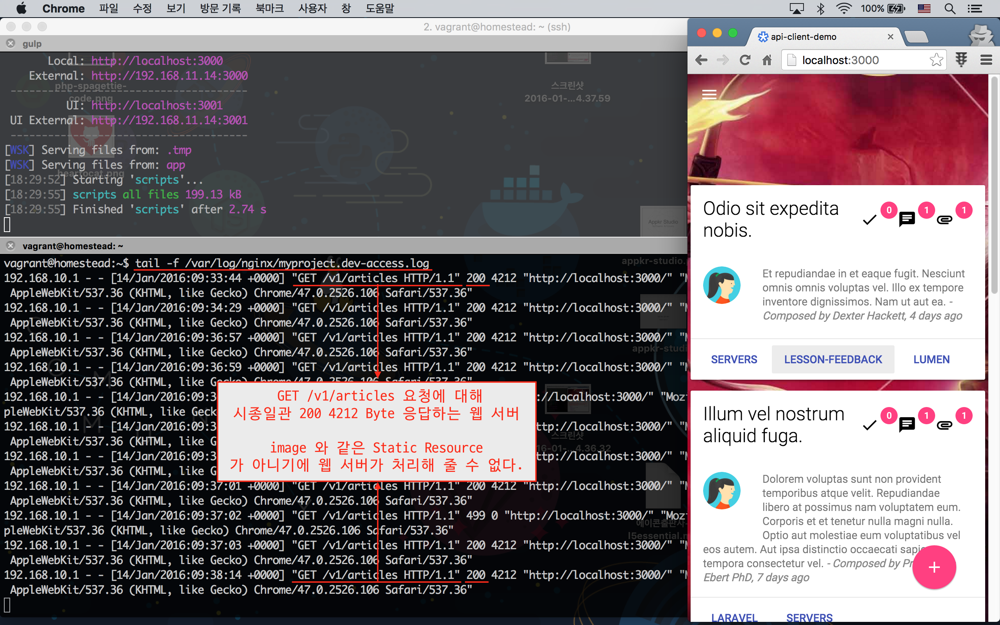
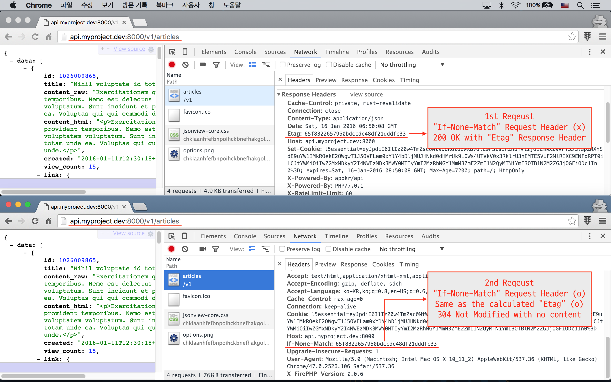

# 실전 프로젝트 3 - RESTful API

## 52강 - Caching

강좌를 시작하기 전에 "적정 기술" 이란 개념에 대해 먼저 잡담을 좀 하자. 

원래 의미와 약간 다를 수 있지만, 필자는 자신이 속한 환경, 즉 비즈니스/서비스의 성숙도나 규모에 따라 적합한 기술을 선택하는 행위로 해석한다. 스타트업이 MVP (==Minimum Viable Product) 를 개발하는 데, Caching 까지 고려해서 할 필요는 없다는 얘기다. 일 Page View 가 몇 천, 피크 타임에 동시 사용자가 수십 명 정도인 서비스에 Caching 까지 고려해서 API 서버와 API 클라이언트를 개발할 필요는 없다는 얘기다. 

바꾸어 얘기하면, 트래픽이 많은 서비스는 서버 사이드 및 클라이언트 사이드 모두에서 캐시를 구현해야 한다는 얘기다. 좀 더 나아가서 서버 팜에는 L4, Web, DB, Cache 등 서버가 모두 분리되어 있고 오토스케일링 할 수 있도록 설정되어 있어야 하며, Session 이나 Cache 등 공용 저장소는 클러스터링이 되어 있어야 한다. 규모가 되었는데 이렇게 안하면, 사용자는 떠나고 사업은 망한다.

지금 내가 처한 상황에서 Caching 이 적정기술이 아니더라도, 이 강좌는 일단 학습 목적으로 배워 두자. 그리고, "아, 그거 거기에 있었지~" 정도로 기억해 두자, 필요할 때 꺼내 쓸 수 있도록. "페이스북 하니까..", "구글이 하니까.." 라고 하는 오류를 범하지 말자. 

### Why?

Pagination, Transformer, Cache, Partial Response (원하는 필드만 골라 요청하고 응답하는 것) 등의 장치들은 모두 다음을 위한 것들이다.
 
1.  **네트워크 사용량을 줄인다.**

    가령, 전체 목록 요청에 응답되는 데이터량이 1 MByte 라고 가정해 보자. 모든 오버헤드를 무시하고, 1 초 내에 응답을 받으려면 적어도 네트워크 속도가 8 Mbps 가 되어야 한다. 다행히 대부분의 환경에서 그 이상 나온다. 그런데, 그렇지 않을 환경도 있다는 것을 염두해 두어야 한다. 만원 지하철 Wi-Fi , Lte 엣지, 강남역 처럼 사용자가 붐비는 곳의 Lte 등의 환경에 있는 API Client 도 있을 수 있기 때문이다. 가령, 200 Kbps 속도로 가정하면, 총 16 초가 소요되며, 그 사용자는 다시 방문하지 않을 것이다.
     
    뿐만 아니다. API 클라이언트와 서버가 Lte 와 같은 유료 네트워크를 이용한다면 그 비용은 누가 내는가? 훌륭한 서비스라면 사용자의 비용을 아껴주어야 한다. 
    
    정리하자면, API 호출로 인한 데이터 사용량은 **서비스 품질** 뿐 이나라 **비용** 두 가치 모두에 영향을 미친다. 이 강좌에서는 **Etag/If-None-Match** HTTP Header 를 이용해 네트워크 사용량을 최소화하는 구현을 할 것이다. 
    
2.  **컴퓨팅 파워를 절약한다.**

    PHP 7 이 나왔다. 외국 블로그들 보면, 동일 조건으로 PHP 5.6 과 비교하여, 몇 ms 가 더 빨라졌다고 비교 실험들을 하고 있다. Facebook 의 HHVM 과 실행 속도 면에 큰 차이가 없다는 기사도 보았다. 그런데, 서비스하는 입장에서 PHP Executable 에서 발생하는 몇 ms 는 큰 의미가 없다. 왜냐하면, 사실상의 병목은 파일, DB, 네트워크 등의 IO 에서 발생하기 때문이다. 경험이 있는 개발자라면 DB 에서 병목이 심하다는 것을 알고 있을 것이다.
     
    서버 사이드 캐시는 DB 쿼리를 결과를, 상대적으로 병목이 덜한 파일이나 메모리에 일정 시간 동안 담아 놓아, DB 쿼리로 인한 컴퓨팅 파워 절약과 반응속도를 향상시키는 역할을 한다. 이 강좌에서는 **서버 사이드 캐싱** 을 구현할 것이다.
    
"폭탄 떠넘기기" 라고 필자는 자주 얘기하는데, 서버 개발자와 클라이언트 개발자가 어렵고 귀찮은 캐싱 기능 구현을 상대편으로 떠넘기는 것을 묘사한 것이다. 이 강좌에서는 서버 사이드에서 HTTP 표준을 이용해 캐싱 기능을 구현하고, HTTP 표준을 이용하는 클라이언트가 거부감 없이 캐싱 기능을 사용하도록 할 것이다.
  
### 서버 사이드 캐싱

#### 구현

[42강 - 서버 사이드 개선](42-be-makeup.md) 에서 모델 쿼리에다 `remember()` 메소드를 바로 체인하기 위해서 [watson/rememberable](https://github.com/dwightwatson/rememberable) 를 끌어 온 적이 있다. 이번에는 이 패키지를 걷어 내고 [라라벨 표준 방식](https://laravel.com/docs/cache#cache-usage)으로 구현할 것이다.

```bash
$ composer remove watson/rememberable
```

```php
// app/Model.php

// use Watson\Rememberable\Rememberable;

abstract class Model extends Eloquent
{
    // use Rememberable;
}
```

`ArticlesController::index()`, `ArticlesController::show()` 에서 모델 쿼리 하는 부분에 캐싱 기능을 부여하자.

```php
// app/Http/Controllers/ArticlesController.php

class ArticlesController extends Controller
{
    protected $cache;

    public function __construct()
    {
        // taggable() Helper 를 이용하여 기본 쿼리를 만든다.
        // .env 에 CACHE_DRIVER= 값이 file 이나 database 이면 Cache Tag 를 쓸 수 없다.
        $this->cache = taggable() ? app('cache')->tags('articles') : app('cache');

        // ...
    }
    
    public function index(FilterArticlesRequest $request, $slug = null)
    {
        // ...

        // cache_key() Helper 를 이용해 캐시에 사용할 고유한 key 를 만든다.
        $cacheKey = cache_key('articles.index');

        $articles = $this->cache->remember($cacheKey, 5, function() use($query, $request) {
            return $this->filter($query)->paginate($request->input('pp', 5));
        });
        
        // ...
    }
 
    public function show($id)
    {
        $cacheKey = cache_key("articles.show.{$id}");
        $secondKey = cache_key("articles.show.{$id}.comments");

        $article = $this->cache->remember($cacheKey, 5, function() use($id) {
            return Article::with('comments', 'tags', 'attachments', 'solution')->findOrFail($id);
        });

        $commentsCollection = $this->cache->remember($secondKey, 5, function() use($article){
            return $article->comments()->with('replies')->withTrashed()->whereNull('parent_id')->latest()->get();
        });

        // ...
    }
}
```

`cache_key()` 란 Helper 를 사용하고 있다. 쿼리스트링을 포함한 요청 URL 과 함수 인자를 연결하여 고유한 스트링을 만드는 간단한 함수이다. 캐시 키를 만드는 데 정해진 규칙은 없다. `Article::find(2)` 와 `Article::find(3)` 쿼리는 서로 다른 쿼리이고, 그 결과가 다르기에 다른 키로 저장되어야 하며, 그 구분자 역할을 이 캐시 키가 하는 것이다.

```php
function cache_key($base) {
    $key = ($uri = request()->fullUrl()) ? $base . '.' . urlencode($uri) : $base;
    
    return md5($key);
}
```

#### 이벤트

앞 절에서 캐싱 기간을 5분으로 지정했다. 즉 5 분 내에 새로운 요청이 오면, DB 쿼리를 하지 않고 캐시 저장소에서 꺼내서 사용한다.
 
그렇다면, 5 분 내에 모델에 새로운 레코드가 생성되거나, 수정되거나, 삭제되면 어떻게 해야 하나? 이 부분은 이미 [42강 - 서버 사이드 개선](42-be-makeup.md) 에서 이미 배운 바 있다. 

한번 더 상기해 보면, `ArticlesController::store()`, `ArticlesController::update()`, `ArticlesController::destroy()` 메소드에는 해당 작업이 성공했을 때 `App\Events\ModelChanged` 이벤트를 던지도록 되어 있다. 이 이벤트를 받은 `App\Listeners\CacheHandler` 가 넘겨 받은 캐시를 찾아서 삭제하도록 되어 있다. 

이제 캐시 저장소는 비워졌고, 첫 사용자에게는 `ArticlesController` 에서 DB 쿼리를 통해 서비스를 제공하고 캐시 저장소에 다시 5 분간 캐싱할 수 있게 된다. 

#### 테스트

쿼리를 찍어 보는 방법 외에 딱히 좋은 테스트 방법은 없다.

Route 정의 파일에 아래 내용을 넣고, 로컬 서버를 기동한 후, '/v1/articles' 를 방문해 보자. 다시 한 번 더 방문해서 쿼리 개수가 줄어든 것을 확인하자.

```php
// app/Http/routes.php

DB::listen(function($event){
    var_dump($event->sql);
});
```

### Etag 와 304 Not Modified

#### 웹 서버

아래 그림을 보자.

우선, 우리가 사용하는 Apache 또는 Nginx 서버는 Html, Javascript, CSS, Image 등 Static Resource 에 대해서는 Etag 와 304 Not Modified 를 이용한 응답을 처리해 주고 있다. Static Resource 란 Content-Length 가 매 요청시 마다 변하지 않는 파일들을 말한다. 


반면, 확장자가 php 이거나 쿼리 스트링이 달린 경우에 웹 서버는 해당 요청에 대한 응답 형식을 Dynamic Resource 라 생각한다. Dynamic Resource 란 매 요청시마다 Content-Length 가 변할 수 있는 파일이다. 가령, /abc.php 요청했을 경우, abc.php 내에서 응답할 컨텐츠를 만들기 때문에, 설령 그 응답값이 지난 번과 동일하다 할 지라도, 웹 서버 입장에서는 응답의 크기를 미리 알 수 없다. 그래서, 304 응답을 자동으로 처리해 줄 수 없는 것이다.



**참고** 우리는 .php 로 요청하지 않고, '/v1/articles' 로 요청했는데 웹 서버가 어떻게 알지? 라고 궁금증이 생길 수 있다. 이 내용은 [2강 - 라라벨 5 설치하기](02-hello-laravel.md) 에서 라라벨의 동작 시퀀스라는 그림으로 설명한 바 있다. 웹 서버의 설정에 의해 '/v1/articles' 라 해도 무조건 'public/index.php' 로 들어가게 되고, 'index.php' 가 URL 을 Router 에 넘겨 적절한 컨트롤러로 작업을 위임하기 때문이다. 즉, 웹 서버는 확장자가 php 인 요청인지 안다는 얘기다.

#### Etag 생성

일단, 모델과 베이스 컨트롤러에 필요한 메소드를 추가하는 구조로 구현해 보자. Repository 패턴을 구현했다면 그 쪽에 위치하는 것이 더 좋을 것 같긴 하다만, 우리 강좌에서는 오버인 듯 하다.

`Article::etag()` Helper 메소드를 보면, `$cacheKey` 를 인자로 받아, 테이블 이름, 모델 id, 모델의 수정 시각 등을 모두 스트링으로 연결한 뒤 `md5()` 내장 함수로 Hashing 하는 것을 볼 수 있다.
 
```php
// app/Articles.php

class Article extends Model
{
    public function etag($cacheKey = null)
    {
        $etag = $this->getTable() . $this->getKey();

        if ($this->usesTimestamps()) {
            $etag .= $this->updated_at->timestamp;
        }

        return md5($etag.$cacheKey);
    }
}
```

위는 `ArticlesController::show()` 메소드에서 사용할 수 있는, 단일 모델에 대한 Etag 생성 로직이다. `ArticlesController::index()` 는 Collection 을 다루게 되는데 이때는 Etag 를 어떻게 하면 좋을까? Collection 에 속한 각 Item (==Article 모델) 을 순회하면서, 위에서 만든 `Article::etag()` 메소드로 얻은 개별 Article Etag 들을 전부 조합한후 `md5()` Hashing 을 하면 될 것 같다.

```php
// app/Http/Controllers/Controller.php

class Controller extends BaseController
{
    // ...
    
    public function etags($collection, $cacheKey = null)
    {
        $etag = '';

        foreach($collection as $instance) {
            $etag .= $instance->etag();
        }

        return md5($etag.$cacheKey);
    }
}
```

**참고** 3rd Party 에서 제공하는 Repository 패턴 구현체를 사용하려면, [`prettus/l5-repository`](https://github.com/prettus/l5-repository) 를 적극 권장한다. 위에서 살펴본 서버 사이드 캐싱 기능도 Ouf of Box 로 포함되어 있다. 

#### Controller 수정

`ArticlesController::index()` 에서는 수정할 것이 없다. `ArticlesController::show()` 에서는 Etag 가 모델의 updated_at 필드 값에 의존하기 때문에, 조회수를 증가시키기 위한 이벤트를 API 요청일 경우에는 제외시키도록 하자.

```php
// app/Http/Controllers/ArticlesController.php

class ArticlesController extends Controller
{
    public function show($id)
    {
        // ...

        if (! is_api_request()) {
            event(new ArticleConsumed($article));
        }

        return $this->respondItem($article, $commentsCollection, $cacheKey.$secondKey);
    }
}
```

Etag 및 304 응답은 API 요청/응답 에만 적용할 것이다. 즉, 앞선 강좌에서 만든 응답 관련 메소드만 수정하면 된다. 설명은 코드 내 주석을 보자.

```php
// app/Http/Controllers/Api/V1/ArticlesController.php

class ArticlesController extends ParentController
{
    protected function respondCollection(LengthAwarePaginator $articles, $cacheKey = null)
    {
        // Request 붙어 온 If-None-Match Header 가져오기 
        $reqEtag = request()->getETags();
        // 베이스 클래스에 만든 Collection 에 대한 Etag 만들기
        $genEtag = $this->etags($articles, $cacheKey);

        if (isset($reqEtag[0]) and $reqEtag[0] === $genEtag) {
            // $reqEtag = ["65f8322657950bdccdc48df21dddfc33"] 이기 때문에 Array Access 해야 함.
            return $this->respondNotModified();
        }

        // 클라이언트가 If-None-Match Header 를 보내 오지 않았거나,
        // 클라이언트가 보내온 Header 가 $genEtag 와 다를 경우. 
        // 즉, 모델이 수정되었을 경우.
        return json()->setHeaders(['Etag' => $genEtag])->withPagination($articles, new ArticleTransformer);
    }
    
    protected function respondItem(Article $article, Collection $commentsCollection = null, $cacheKey = null)
    {
        $reqEtag = request()->getETags();
        // 단일 Instance 에 대한 Etag 만들기
        $genEtag = $article->etag($cacheKey);

        if (isset($reqEtag[0]) and $reqEtag[0] === $genEtag) {
            return $this->respondNotModified();
        }

        return json()->setHeaders(['Etag' => $genEtag])->withItem($article, new ArticleTransformer);
    }
    
    protected function respondNotModified()
    {
        return json()->notModified();
    }
}
```

#### 테스트

브라우저로 쉽게 테스트해 볼 수 있다. 



개발자 도구의 'Disable Cache' 를 이용하면 차이점을 보기 쉬우니 참고하자. 

'Disable Cache' 를 켰다는 얘기는 Etag Header 를 클라이언트 측의 캐시 Key 로 해서 받은 컨텐츠를 브라우저 캐시 스토리지에 저장하지 않고, 다음 요청 때 If-Non-Match Header 를 보내지 않는다는 의미이다. 즉, 'Disable Cache' 를 켰다는 얘기는 API 클라이언트가 캐시 기능을 구현하지 않았다는 얘기이다. 

그런데, API 클라이언트 개발자가 HTTP 스펙을 다 이해하고 HTTP 스택을 직접 구현하지 않을 테고, 클라이언트의 플랫폼/프레임웍에 포함된 라이브라리를 가져다 쓸 것이다. 이 경우, 대부분이 Etag 기능을 지원하고, 위 브라우저 예에서 보듯이 클라이언트 사이드에서도 캐싱을 자동으로 하게 된다. API 클라이언트 개발자가 거부감이 들리 없다고 생각된다.   

<!--@start-->
---

- [목록으로 돌아가기](../readme.md)
- [51강 - CORS](51-cors.md)
- [53강 - Partial Response](53-partial-response.md)
<!--@end-->