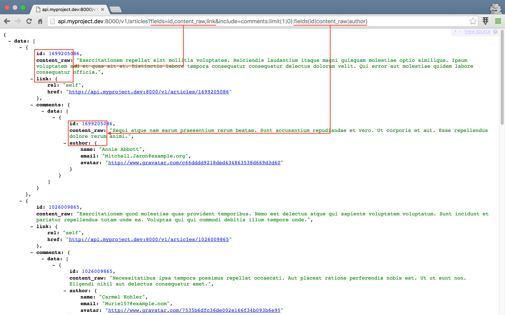

# 실전 프로젝트 3 - RESTful API

## 53강 - Partial Response

[52강 - Caching](lessons/52-caching.md) 에서 네트워크 대역폭을 줄이는 일이, 대형 서비스로 발전할 때 얼마나 중요한 일인지 배워 보았다. Partial Response 는 API 클라이언트가 필요한 필드만 골라서 받을 수 있도록 하는 장치로서 역시 동일한 이유로 API 서버에서 제공되면 좋은 기능이다.

지난 강의에서 캐싱을 구현했는데, Production 환경에서 꼭 필요한 기능이지만, Development 환경에서는 수정한 결과가 캐싱때문에 바로 표시되지 않는 문제가 있다. 이번 강좌에서도 응답을 수정하고, 그 결과를 봐야 할 때 매번 `$ php artisan cache:clear` 명령으로 캐시를 버리는 개발 프로세스는 아주 비 효율적이다. 개발 환경에서 캐시를 끌 수 있도록 하는 Refactoring 을 먼저 하고, Partial Response 를 살펴 보도록 하자.

### 리팩토링 I - 캐싱 기능 토글

#### Config (설정)

캐싱을 On/Off 할 수 있는 설정이 필요할 것 같다. 라라벨의 좋은 점 중에 하나가, config 폴더 아래에 만든 파일은 `config('파일명.키')` 로 값을 읽을 수 있다는 점이다. 'config/project.php' 를 만들자.
 
```php
// config/project.php

return [
    'cache' => ! env('APP_DEBUG', false),
];
```

부정 연산자 (`!`) 를 이용해서, '.env' 파일에 정의된 `APP_DEBUG=true` 이면 캐싱을 끄고, 반대이면 켜도록 하였다. 이제 프로젝트의 코드 어디서든 `config('project.cache')` 로 설정 값을 읽을 수 있다.
 
#### Controller

지난 강의에서 캐싱 기능 구현을 위해 수정한 컨트롤러 부분을 모두 수정해야 한다. 캐싱은 아주 일반적이고 자주 사용하는 기능인데, 모든 컨트롤러의 캐싱이 필요한 메소드에서 조건문으로 설정 값을 확인하는 일은 DRY (==Don't Repeat Yourself) 원칙에 어긋난다. 추출하여 부모 클래스로 옮기자.

새로운 기능을 추가할 때, 사용자 입장에서 어떻게 사용할지를 먼저 생각해 보고, 그에 맞게 기능을 개발하는 것은 좋은 습관이다. `ArticlesController` 에서 부모 클래스의 캐시 기능을 어떻게 사용할 지 먼저 작성해 보자. 참고로, 전 강좌에서도 지적한 바 있듯이 부모 클래스보다는 사실상 Repository 가 더 적절한 위치이다.

`cache(string $key, int $minites, mixed $query, string $method, mixed ...$param)` 으로 사용하면 좋을 것 같다. 

-   `$key`
    : 캐시키
    
-   `$minutes`
    : 캐싱 유지 기간 (분)
    
-   `$query`
    : 모델 (==데이터베이스) 쿼리

-   `$args`
    : 여기서는 `paginate`. 메소드를 떼낸 이유는 `$query` 에 `paginate()` 를 붙여 버리면 DB 쿼리를 해 버리기 때문이다. 이러면 캐싱을 할 수 없기 때문이다.

-   `...$param`
    : PHP 의 [Splat Operator](http://php.net/manual/kr/migration56.new-features.php#migration56.new-features.splat) (`...`) 를 사용한 `$method` 의 인자이다. `cache()` 메소드의 5번째 인자를 포함한 그 뒤에 추가되는 인자들은 모두 이 Splat Operator 로 처리된다. Splat Operator 를 받는 쪽에서 `$args` 는 배열로 인식된다. 

```php
// app/Http/Controllers/ArticlesController.php

class ArticlesController extends Controller
{
    // ...
    
    public function index(FilterArticlesRequest $request, $slug = null)
    {
        $query = $slug ? Tag::whereSlug($slug)->firstOrFail()->articles() : new Article;
        $cacheKey = cache_key('articles.index');
        $query = $this->filter($query->orderBy('pin', 'desc'));
        $param = $request->input(config('project.params.limit'), 5);
        
        // 기존 코드
        // $articles = $this->cache->remember($cacheKey, 5, function() use($query, $request) {
        //     return $this->filter($query->orderBy('pin', 'desc'))->paginate($request->input(config('project.params.limit'), 5));
        // });
        $articles = $this->cache($cacheKey, 5, $query, $method, $param);

        return $this->respondCollection($articles, $cacheKey);
    }
    
    // show() 메소드는 코드를 생략한다.
}
```

`cache()` 메소드를 구현하자.

Splat Operator 로 넘어온 값을 `implode(string $glue, array $pieces)` PHP 내장 함수로 조합했다. 캐싱 설정을 확인한 후, 꺼져 있으면 Early Return 을 하고 있다. `$this->cache->...` 로 시작하는 부분은 지난 강의에서 자식 클래스인 `ArticlesController` 에서 썼던 코드와 동일하다.

```php
// app/Http/Controllers/Controller.php

class Controller extends BaseController
{
    // ...

    protected function cache($key, $minutes, $query, $method, ...$args)
    {
        $args = (! empty($args)) ? implode(',', $args) : null;

        if (config('project.cache') === false) {
            return $query->{$method}($args);
        }

        return $this->cache->remember($key, $minutes, function() use($query, $method, $args){
            return $query->{$method}($args);
        });
    }
```

**`참고`** 코드 내에서 `else` 를 사용하고 있다면, 다시 한번 살펴 보자. 기술 용어로 [Code Smell](https://en.wikipedia.org/wiki/Code_smell) 이라 하는데, `else` 가 들어가면 나쁜 코드일 가능성이 크다. 위의 경우도 Early Return 을 통해서 `if(...) {...} else {...}` 를 쓸 것을 `if` 로만 사용하고 있다. Early Return 을 사용하는 방법은 에러나, 예외를 던져야 할 조건을 먼저 검사해서 빨리 반환값을 던져 버리는 것이다.

**`참고`** `use` 키워드는 전역에 정의된 변수를 [`Closure`](http://php.net/manual/kr/class.closure.php) 컨텍스트로 넘길때 사용한다.
 
**`참고`** `{$method}($args);` 에서 중괄호를 사용하고 있다. 우리 프로젝트의 이 코드 부분에서 중괄호 (==Curly Brace) 가 없어도 동작하지만, 중괄호를 쓰는 것이 좋은 습관이다. `$foo='bar; ${$foo}='baz';` 처럼 변수의 값을 변수의 이름으로 사용할 때, 변수의 값을 메소드 이름으로 사용할 때 등에 중괄호를 사용한다.  

자식 컨트롤러인 `ArticlesController::__construct()` 에 있던 `$this->cache` 속성 선언은 더 이상 필요 없다. 대신 부모 클래스인 `Controller::__construct()` 에 필요하므로 옮기자. 그런데 문제가 있다.

#### Interface

`Controller::__construct()` 에 `$this->cache` 를 선언하려고 보니, 캐시 태그가 필요하다. 이는 각 컨트롤러마다 달라져야 하는 값이다. 다른 구조도 있겠지만, 여기서는 다음과 같이 해 보자.
 
-  `Interface Cacheable` 을 만들고, `cacheTags` 메소드를 정의하자.
-  캐싱이 필요한 컨트롤러는 `Cacheable` 인터페이스를 구현하도록 하자. 이렇게 함으로써, `Cacheable` 인터페이스를 구현한 컨트롤러는 `cacheTags` 메소드를 반드시 포함해야 한다.
-  부모 컨트롤러의 생성자에서 이 클래스 인스턴스 (==오브젝트, `$this`) 가 `Cacheable` 인터페이스를 구현한 객체인지 검사하고, 검사에 통과할 경우 `cacheTags` 메소드를 호출하여 캐시 태그를 얻어 오자.

인터페이스를 정의하자. 

참고로 라라벨 프레임웍 코드를 보면, `Illuminate\Contracts` 라는 네임스페이스를 많이 접하게 된다. 여기에 라라벨 인터페이스들이 모두 정의되어 있다. 이름에서 보듯이 인터페이스는 계약 (==Contract) 이다. "인터페이스: 클래스야, 나를 구현하려면 내가 정한 원칙/계약을 따라야 해", "클래스: 니가 정한 원칙을 지킬께" 라고 서로 말하는 것이다. 

인터페이스에서 정의한 메소드를 클래스에서 구현하지 않거나, 메소드 인자의 타입이 다르면 PHP 는 실행 오류를 낸다.
 
```php
// app/Http/Controllers/Cacheable.php 

<?php

namespace App\Http\Controllers;

interface Cacheable
{
    public function cacheKeys();
}
```

방금 만든 인터페이스를 `implements` 키워드를 사용 하여 `ArticlesController` 에 적용하자. 

```php
// app/Http/Controllers/ArticlesController.php

class ArticlesController extends Controller implements Cacheable
{
    // ...
    
    public function cacheKeys()
    {
        return 'articles';
    }
}
```

자, 이제 `Cacheable` 인터페이스를 구현한 자식 컨트롤러에 `cacheTags()` 메소드가 무조건 있다는 것을 알고 있으니, 안전하게 부모 컨트롤러에서 `$this->cacheTags()` 를 실행할 수 있다.

```php
// app/Http/Controllers/Controller.php

class Controller extends BaseController
{
    use AuthorizesRequests, DispatchesJobs, ValidatesRequests;

    protected $cache;

    public function __construct() {
        // ...
        
        $this->cache = taggable() ? app('cache')->tags($this->cacheKeys()) : app('cache');
    }
    
    // ...
}
```

그런데, 여기서 또 문제가 있다.

#### Reflection

그럼, 모든 자식 컨트롤러가 `Cacheable` 인터페이스를 구현해야 하는가? 

이런 방법이 있긴 하다.

```php
// NotExistingChildController.php

public function cacheTags()
{
    throw new \Exception('This class does\'t require cache feature !!!');
}
```

사용하지도 않을 메소드를 구현하게 하는 것은 잘못된 디자인일 뿐더러, 생성자에서 `cacheTags()` 를 호출하기 때문에 저렇게 하면 컨트롤러 전체를 쓸 수 없게 된다. 

캐싱 기능이 필요 없는 `CommentsController` 등은 인터페이스를 구현하지 않아도 되도록 하자. 다시 말하면, `CommentsController` 가 생성될 때 부모 클래스에서 `cacheTags` 가 호출되지 않도록 한다는 얘기다.

이를 위해 [`class_implements(mixed $class)`](http://php.net/manual/en/function.class-implements.php) PHP 내장함수를 응용할 수도 있지만, 우리는 여기서 OOP 의 꽃이라 불리우는 [`ReflectionClass`](http://php.net/manual/en/book.reflection.php) 기능을 이용해 볼 것이다. 무엇인지에 대해서는 [What is Reflection in PHP?](http://culttt.com/2014/07/02/reflection-php/) 포스트를 참고하도록 하자.

```php
// app/Http/Controllers/Controller.php

class Controller extends BaseController
{
    use AuthorizesRequests, DispatchesJobs, ValidatesRequests;

    protected $cache;

    public function __construct() {
        // ...
        
        $this->cache = app('cache');

        if ((new \ReflectionClass($this))->implementsInterface(\App\Http\Controllers\Cacheable::class) and taggable()) {
            $this->cache = app('cache')->tags($this->cacheTags());
        }
    }
    
    // ...
}
```

잠깐 객체 지향 프로그랭의 기본 몇가지만 짚고 넘어가자.

reflection 은 투영, 반사를 의미하는 영어단어이다. `ReflectionClass` 는 인자로 받은 인스턴스의 모습을 투영해 준다. 대부분의 OOP 언어들이 가지고 있는 기능이며, 일종의 Hack 이라 할 수 있다. 꽃이라 한 이유는, 이 기능을 잘 사용하면 `private` 로 정의된 메소드도 끌어내서 사용할 수 있을 만큼 강력하기 때문이다.  

`$this` 키워드는 Instantiate 된 Object 를 의미한다. 아래 코드를 가정해 보자. 

```php
1 $foo = new Bear; 
2 $this->color = 'white';
3
4 $bar = new Bear; 
5 $this->color = 'black';
```

`$foo` 라는 흰색 곰과 `$bar` 라는 검정색 곰을 만들었다. 이 둘은 모두 `Bear` 란 클래스의 인스턴스이다. 여기서 `$this` 는 `Bear` 클래스를 의미하는 것이 아니다. 2 라인의 `$this` 는 `$foo` 라는 `Bear` 클래스의 인스턴스, 5 라인은 `$bar` 라는 `Bear` 클래스의 인스턴스를 의미한다. 

우리 코드의 `ReflectionClass($this)` 에서 `$this` 는 이 부모 클래스를 상속 받은 자식 클래스인 `ArticlesController` 의 인스턴스를 의미한다.   

이제 코드가 깔끔해 졌다. 앞 강에서 DB 쿼리 부분에 대한 서버사이드 캐싱 뿐 아니라, 클라이언트를 위한 Etag/304 기능도 구현했다. 요것도 개발 중에는 상당히 불편하다.

#### Etag & 304

요 부분은 특별히 추출할 것이 없어 쉽다.

```php
// app/Http/Controllers/Api/V1/ArticlesController.php

class ArticlesController extends ParentController
{
    protected function respondCollection(LengthAwarePaginator $articles, $cacheKey = null)
    {
        $reqEtag = request()->getETags();
        $genEtag = $this->etags($articles, $cacheKey);

        if (config('project.cache') === true and isset($reqEtag[0]) and $reqEtag[0] === $genEtag) {
            return $this->respondNotModified();
        }

        // return json()->...
    }
    
    // respondItem() 메소드는 코드를 생략한다.
}
```

#### 테스트

브라우저 개발자 도구를 켜 놓은 상태에서 'project.php' 의 `cache` 설정 값을 `true`, `false` 로 바꾸어 가며, 같은 엔드포인트로 여러번 반복 요청을 했을 때, 응답 코드가 어떻게 바뀌는지 눈으로 확인해 보자. 또, 쿼리 개수에는 어떤 영향을 미치는 지도 실험해 보자.

### 리팩토링 II - 캐싱 기능

아주 오래전 앞 강의에서 쿼리를 위한 필드를 만들 때, `f`, `s`, `d`, `...` 등 짧은 필드명을 이용한 것은 Github 의 필드명을 참조한 것이다. 그런데, API 클라이언트, 즉 컴퓨터가 보기엔 `l` 이나 `limit` 나 같은 녀석이겠지만, 클라이언트를 개발하는 사람이 보기에는 가독성과 이해도가 너무 떨어 지는 것 같아, 필드명을 바꾸기로 결심했다.

또, 필드명이 나중에 바뀔 수도 있고 해서, API 를 사용하는 클라이언트 측과, 서버의 코드 사이에 완충 레이어를 하나 더 두기로 했다. 설령, 클라이언트가 사용해야 하는 필드명이 바뀌 더라도, 서버의 코드는 수정할 일이 없도록 말이다.
 
앞 절에서 만든 'project.php' 는 우리 서비스 전체를 위한 설정들을 저장하기에 가장 좋은 장소이다. 이용하자.

```php
// config/project.php

return [
    // ...
    
    'params'      => [
        'page'   => 'page',
        'filter' => 'filter',
        'limit'  => 'limit',
        'sort'   => 'sort',
        'order'  => 'order',
        'search' => 'q',
        'select' => 'fields',
    ],
    
    'filters' => [
        'article' => [
            'no_comment' => 'No Comment',
            'not_solved' => 'Not Solved'
        ]
    ],
];
```

> **`주의`** API 버전을 정의하는 부분에서 한번 설명했지만, 한번 더 강조한다. <br/><br/>
> API 를 탑재한 클라이언트 앱이 사용자에게 뿌려지는 순간, 앞서 말한 필드명이 바뀌는 등, API 스펙을 바꾸는 행위는 자제해야 한다. 바뀐 API 스펙을 탑재하여 클라이언트 앱을 업데이트하였다 해도, 이를 사용하는 사용자가 즉시 업데이트를 할지는 전혀 알 수 없는 일이다. 갑작스런 API 스펙 변경에, 예전 스펙대로 동작하는 클라이언트 앱들은 전혀 동작하지 않게 될 것이고, 여러번 말했지만 서비스는 망한다.<br/><br/> 
> 클라이언트 코드를 서버 개발자가 언제든 배포할 수 있는 웹 (물론 웹도 클라이언트 측의 캐싱이 만료될 때 까지는 문제가 있을 수 있다.) 과는 차원이 다르다는 점을 기억하자. 그뿐인가, API 서버에 어떤 녀석 (User Agent) 이 요청을 할지.. CURL CLI 일 수도, `fsockopen(string $hostname, int $port)` PHP 내장 함수를 이용한 앱일 수도 있다는 점을 염두해 두자. <br/><br/>
> 코드 에디터를 열기 전에, API 스펙을 설계하는 일이 먼저다. 바로 다음 강좌에서 다루려고 한다. 

적용되는 부분이 여러군데 있는데 그 중 한군데만 살펴보자.

```php
// app/Http/Requests/FilterArticlesRequest.php

class FilterArticlesRequest extends Request
{
    // ...
    
    public function rules()
    {
        $params = config('project.params');
        $filters = implode(',', array_keys(config('project.filters.article')));

        return [
            $params['filter'] => "in:{$filters}",
            $params['limit']  => 'size:1,10',
            $params['sort']   => 'in:created_at,view_count,created',
            $params['order']  => 'in:asc,desc',
            $params['search'] => 'alpha_dash',
            $params['page']   => '',
        ];
    }
}
```

주제에 조금 벗어난 얘기지만, 없는 필드에 대해서 DB 쿼리를 하면 `Illuminate\Database\QueryException` 이 발생하기 때문에, API 클라이언트에게 허용할 필드들을 미리 지정해 주고, DB 쿼리 까지 도달하기 전에 미리 걸러내는 것이 좋은 디자인이라 할 수 있다. 

그 외 `App\Http\Controllers\ArticlesController::filter()` 메소드를 추상화해서 `App\Http\Controllers\Controller::filter()` 로 옮겼고, 'config/project.php' 의 설정을 이용해서 HTML 뷰의 내용을 수정하는 작업을 좀 더 했으나, 설명과 코드는 생략한다. [Github Commit 로그](https://github.com/appkr/l5essential/commits/master) 에서 확인해 보자.

### Partial Response

#### 패키지 업데이트

Partial Response 를 위해 특별히 더 구현할 것은 없다. 왜냐하면, 우리 프로젝트에서 사용하는 [`appkr/api`](https://github.com/appkr/api) 패키지에 이미 포함되어 있기 때문이다. 사용법만 살펴 볼 것이다. 

해당 기능은 필자가 최근에 추가했으므로, 최신 버전이 아니라면 아래와 같이 업그레이드 하자.
 
```sh
$ composer update

# 수정한 설정이 있다면 수동으로 머지하자. 
$ rm config/api.php
$ php artisan vendor:publish --provider="Appkr\Api\ApiServiceProvider"
```

기존에 artisan CLI 의 `make:transformer` 를 이용해 Transformer 를 만들었다면, 이번 강좌의 코드를 참조해서 수정하도록 하자.

```php
// app/Transformers/ArticleTransformer.php

class ArticleTransformer extends TransformerAbstract
{
    public function transform(Article $article)
    {
        $payload = [/* ... */];
        
        if ($fields = $this->getPartialFields()) {
            $payload = array_only($payload, $fields);
        }

        return $payload;
    }
    
    public function includeComments(Article $article, ParamBag $params = null)
    {
        $transformer = new \App\Transformers\CommentTransformer($params);

        $parsed = $this->getParsedParams();

        // ...
    }
    
    public function includeAuthor(Article $article, ParamBag $params = null)
    {
        return $this->item($article->author, new \App\Transformers\UserTransformer($params));
    }
    
    // ...
}
```

#### 테스트

Partial Response 를 구현하는 방법은 여러 가지가 있을 텐데, 왜 Transformer (~=Presentation Layer) 에 구현했는가 라는 의문이 들 수 있다. 가령, fields 라는 쿼리스트링 필드명을 쓴다면, 모델 쿼리할 때 `Article::select($request->input('fields'))->...` 처럼 구현할 수도 있다. 그런데 이렇게 쿼리 레이어에서 수정해 버리면, 쿼리 결과에 의존하는 나머지 코드들이 모두 망가질 가능성이 크다.

우리가 HTML 뷰를 응답할 때, 모델에서 모든 속성값들을 쿼리해서 가져온 후, 뷰에서 필요한 속성들만 바인딩해서 썼다. 그거랑 동일한 개념이라고 보면 된다.

우선 테스트를 위해 앞 절에서 구현한 기능을 설정하자.
 
```php
// config/project.php

return [
    'cache' => false, // ! env('APP_DEBUG', false),
    
    // ...
];
```

서버를 부트업하고, 브라우저나 PostMan 에서 아래 주소를 방문해 보자.

```http
GET /v1/articles?fields=id,content_raw,link&include=comments:limit(1|0):fields(id|content_raw|author)
```



부모 리소스를 선택할 때는 `fields` 값의 구분자로 콤마 (`,`) 를 사용하고, 자식 리소스에 대해서는 파이프 (`|`) 문자를 사용한다는 점을 주의하자.

Presentation Layer 에서 응답할 내용을 제어해서 좋은 점 또 한가지는, API 클라이언트로 부터 넘겨 받은 필드들이 DB 쿼리에 사용되지 않으므로 `QueryException` 이 발생할 염려가 없다는 점이다. 없는 필드가 넘어오면 그냥 무시된다.

#### 설정

'config/api.php' 를 열어 어떤 설정을 수정할 수 있는 지 확인해 보자.

```php
// config/api.php

return [
    'include' => [
        // 자식 리소스를 포함할 때 사용할 쿼리스트링의 필드 이름을 바꿀 수 있다.
        // 기본 값은 'include' 이다.
        'key' => 'include',
        'params' => [
            // limit, sort 의 기본값을 정의할 수 있다.
            'limit' => [3, 0],
            'sort' => ['created_at', 'desc'],
        ],
    ],

    'partial' => [
        // Partial Response 에 사용할 쿼리스트링의 필드 이름을 바꿀 수 있다.
        // 기본 값은 'fields' 이다.
        'key' => 'fields',
    ],
    
    // ...
];
```

<!--@start-->
---

- [목록으로 돌아가기](../readme.md)
- [52강 - Caching](52-caching.md)
- [54강 - API Documents](54-api-docs.md)
<!--@end-->
