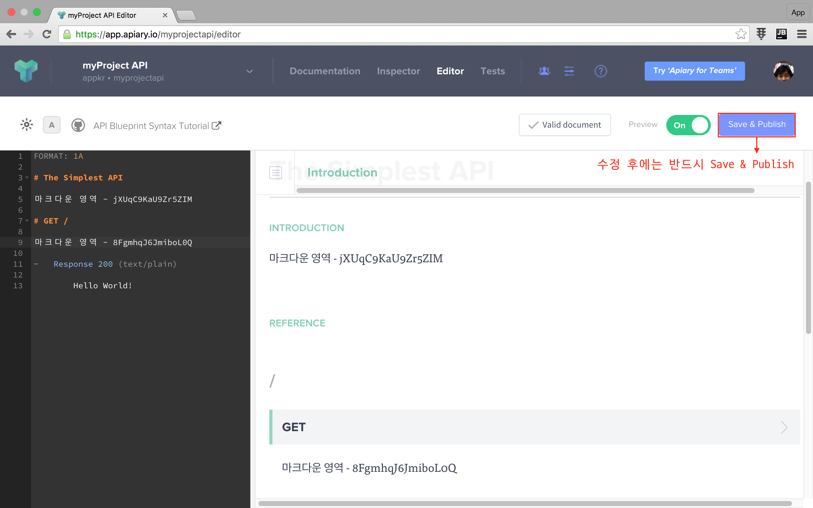

# 실전 프로젝트 3 - RESTful API

## 54강 - API Documents

### 잡담

필자의 경험에 비추어 보면 대기업이 좋은 점도 있었다.

-   실무에서 실수를 하더라도 결재 라인을 타는 과정에서 걸러질 가능성이 크다.
-   문제가 걸러지지 않아 세상에 제품이나 서비스 뿌려졌더라도 그로 인해 회사가 망할 지경에 이르지는 않는다.
-   업무 프로세스가 잘 갖추어져 있다.

바꾸어, 중소기업믜 문제점을 지적해 보자.

-   말단 신입 사원의 작은 실수 하나도 사업에 치명타를 입힌다. (e.g. 신입 사원에게 Production 서버의 root 권한을 줬는데, 실수로 `# rm -rf *`)  
-   이런 걸 걸러 줄 시스템적인 장치가 탄탄하지 않다. 
-   업무 프로세스가 잘 정리되지 않았다. (e.g. 개업날 식당에 가면, 허둥지둥 대기만 하고, 대접은 못받는 거랑 마찬가지~)

대신 대기업의 문제점은 업무 속도가 짜증날 정도로 늦다는 점이고, 중소기업은 반대다. [52강 - Caching](52-caching.md) 에서 "적정기술" 이란 잡담을 나누었는데, 어른이 되는 꿈을 품고 사업을 하는 것이고, 또 대기업으로 성장하기 위해서는 적정 수준에서 규모에 적합한 업무 프로세스를 개발하고 적용해야 한다.

그런데, 규모에 상관없이 아래 프로세스는 꼭 했으면 좋겠다. (기업마다 용어는 다를 수 있다)

-   PRD (==Product/Service Require Document)

    스펙이다. 가령 우리가 [31강 - 포럼 요구사항 기획](31-forum-features.md) 에서 봤던 내용을 좀 더 구체화해서, "사용자는 이메일과 비밀번호를 이용해 로그인한다" 처럼 상위 설계를 하는 것이다.
    
    이 문서를 기반으로 개발팀이 Functional 스펙 과 개발 계획을 수립합니다. 이 문서를 보고 경영진이나 투자자는 회사가 기획한 제품/서비스가 무엇이고 어떤 기대효과가 있을 지를 이해할 수 있고, 그에 따라 필요한 의사결정을 할 수 있다. 영업이나 재무하시는 분들은 이 문서를 보고 장기 영업/자금 예측을 할 수 있고, 인사는 성과 평가의 기초 자료로 활용할 수 있다. PRD 는 한번에 완성되는 것이 아니라, 프로젝트를 진행하면서 여러 이해관계자가 지속적으로 논의하고 다듬어야 한다.
    
-   Story board

    PRD 를 기초로 제품/서비스를 좀 더 구체화한 화면 설계와 동작 시나리오이다. 스토리 보드는 업무량을 가늠하는 척도가 된다. UI 개발자들은 스토리보드를 참고해서 마크업을 작성하고, 서버 개발자는 백엔드 코드를 작성하게 된다.
      
-   API Documentation

    이번 강좌의 주제이다. 우리 강좌에서는 코드를 먼저 구현하고 문서를 작성하는 순으로 순서가 뒤집어 졌지만... 실무에서는 항상 문서를 먼저 만들 것을 권장한다. API 문서만 가지고 클라이언트 개발자는 작업을 시작할 수 있고, API 문서를 가지고 서버 개발자는 구현을 하게된다. 이런 이유로 API 문서가 반드시 먼저 개발되어야 한다.

-   Testing

    제품/서비스의 특징이 달라 집집마다 천차만별인게 테스팅이다. 유닛이나 통합테스트가 불가한 시나리오도 있어, 사람이 직접 필드를 돌거나 해야 하는 제품 이나 기능들도 있다. 상황이 어떻든 테스팅 프로세스가 있어야, 개발자는 발 뻗고 편히 잠자리에 누울 수 있다. 특히 테스트 코드가 있다면 코드 리팩토링이나 신규 기능 추가시 테스트에 소요되는 시간을 상당히 단축할 수 있다.  

위 프로세스의 소유자는 누구냐? 라고 질문할 수 있다. 필자는 이 부분도 "폭탄 떠넘기기"라 생각한다. 작은 회사에 기획자, 개발자 구분이 어디 있으랴? 심지어 구글이나 페이스북에는 기획팀이 없고 개발팀이 a-Z, 다시 말하면 기획~개발~마케팅 까지 다 한다는 점을 타산지석으로 삼아야 한다. 시쳇말로 월급 받으면 다 할 수 있는 일이다. 디자인은 예술 영역이라 조금 다르다는 생각이 든다. 

### 플랫폼 선택

잡담이 길었다. 본론으로 들어가서... API 문서 만드는 데 왜 플랫폼 선택이 필요하냐고 반문할 수 있다.

API 문서는 그냥 워드프로세서나 코드에디터 열고 쓰면 된다. API 를 만든다는 것은 API 문서를 만든다는 내용을 포함하고 있다. API 강좌 시작하면서 얘기했지만, API 를 잘 만드는 방법은 인터넷 공룡들을 따라하는 것이다. API 문서도 마찬가지이다.

-   [Github API v3](https://developer.github.com/v3/)
-   [YouTube Data API (v3)](https://developers.google.com/youtube/v3/docs/)
-   [Twitter API](https://dev.twitter.com/rest/public)

이들의 공통적인 특징은 아래와 같다. 

-   REST 원칙을 따른다.
-   API 베스트 프랙티스를 실천한다.
-   (클라이언트 개발자가 바로 실험해 볼 수 있도록) Tester/Playground 를 제공한다.
-   (클라이언트 개발자가 복붙해서 사용할 수 있도록) cURL 포함 다양한 플랫폼을 위한 샘플 코드를 제공한다.

워드프로세서로 만드는 것은 누구든 할 수 있으니 생략하고, 인터넷 공룡들의 API 의 장점을 모두 흡수하기 위해, 이 강좌에서는 API 문서를 만드는 플랫폼을 이용할 것이다.

선택 가능한 옵션은 아래와 같다.

-   API Blueprint ([Project site](https://apiblueprint.org/), [Github](https://github.com/apiaryio/api-blueprint))
-   [Apiary](https://apiary.io/) (==API Blueprint 의 SaaS 버전)
-   RAML ([Project site](http://raml.org/), [Github](https://github.com/raml-org/raml-spec))
-   Swagger ([Project site](http://swagger.io/), [Github](https://github.com/swagger-api))

### Apiary 가입 및 프로젝트 생성

Swagger 는 Java 라 패스, RAML 은 YAML 문법으로 스펙을 써야 해서 패스. 개발자라면 누구나 친숙한 마크다운 (아닌가요? 익숙해 지시길.) 문법으로 스펙을 쉽게 쓸 수 있고, 호스팅까지 제공되는 Apiary 로 선택하자. 필자는 에이피아이어리 라고 읽는데, 매일 쓰라고 다이어리라는 단어를 합성한 것 같아, 이름도 잘 지었다고 생각한다. 

참고로 가입 후 30 일 동안 무료로 모든 기능을 사용해 볼 수 있지만, 이후 부터는 요금이 꽤 나온다. 신용카드 없이 가입할 수 있고, 계속 쓰지 않을 것이라면 신용카드 정보를 입력하지 않으면 되기에 걱정없이 사용하자.   

[Apiary](https://apiary.io/) 에 가입하고, 첫 프로젝트를 만들자.


프로젝트 이름을 입력한다. 처음 가입했다면 무조건 하나를 만들라는 창이 뜨는데, 거기서 이름을 입력하면 된다.


에디터 창이 떴을 것이다. 이 에디터는 문법 오류를 잡아주고 미리 보기도 보여 주므로, 첫 프로젝트는 여기서 API 문서를 쓰자. 익숙해지면 로컬 프로젝트 디렉토리에서 `apiary.apib` 파일을 만들어 스펙을 쓰고, Github 에 배포하면 자동으로 API 문서가 업데이트되도록 하자.


### API Blueprint 문법

Apiary 는 API Bluepint 문법을 구현한 호스팅 서비스의 이름이다. 

[API Blueprint 문법](https://github.com/apiaryio/api-blueprint/blob/master/API%20Blueprint%20Specification.md) 은 기본적으로 그냥 마크다운이다. [예약어](https://github.com/apiaryio/api-blueprint/blob/master/API%20Blueprint%20Specification.md#def-keywords) 는 문서의 타이틀 (`# title`, `## title`, `### title`) 영역이나, 목록 (`- list item`) 영역에 사용하지 말아야 한다. 이 약속만 지키면, 타이틀이나 목록을 자유롭게 쓸 수 있고, 최종 API 문서의 본문에 잘 렌더링되어 표출된다.

아래는 꼭 알아야 할 기본적인 API Blueprint 문법이다.

**`알림`** 이해도를 높이기 위해 블레이드의 `{{}}` 문법을 차용해서 String Interpolation 을 표기하였다. `{{}}` 를 제외한 나머지 기호 (e.g. `` ` ``, `{}`, `[]`, `()`, `-`, `#`) 들은 그대로 써야 하는 것들이다.
**`알림`** 리스트 표현을 위해 Dash (`-`) 를 썼는데, Asterisk (`*`), Plus (`+`) 기호도 쓸 수 있다. 

-   문서의 가장 첫 줄은 `FORMAT: 1A` 로 시작한다.
-   두번째 줄은 `HOST: http://your-host` 를 쓴다.
-   세번째 줄은 사용자에게 표출될 API 이름, `# Welcome to Blah Blah API` 와 같은 타이틀과 그 아래에 설명을 자유롭게 담는다.
-   그 이후 내용들은 모두 본문으로 간주된다.
    -   본문은 `# group {{Group Name}}`, `## {{Resource Name}} [{{Endpoint}}]`, `### {{Action Name}} [HEAD|GET|POST|PUT\PATCH|DELETE {{Endpoint override, if any...}}]` 순으로 진행된다.
    -   `### {{Action Name}}` 은 다시 `- request {{Optional Request Name}}`, `- response {{HTTP Status Code}} ({{Content Type}})` 와 같은 하위 요소를 포함할 수 있다.
    -   `- request` 는 `- headers`, `- body` 하위 요소를 가질 수 있다.
    -   `- response` 도 `- headers`, `- body` 하위 요소를 가질 수 있다.
    -   `- headers`, `- body` 의 내용은 `            Accept: application/json` 처럼, 12 space 들여쓰기 해야 한다.
    -   `- headers`, `- body` 키워드 없이 `- request`, `- response` 아래에 바로 Request 또는 Response Payload 를 쓰면 `- body` 의 내용으로 해석된다.
-   Url Endpoint
    -   `/v1/articles/{id}` 처럼 Route Parameter 가 있을 때는,  `### {{Action Name}}` 또는 `- request` 하위에 `- parameters` 를 정의할 수 있다.
    -   `- parameters` 는 `` - id: `{{example id}}` `` 처럼 Route Parameter 값을 정의할 수 있다.
    -   쿼리스트링은 `/v1/articles{?field,another}` 식으로 쓸 수 있다.

이 정도만 알아도 훌륭한 Apiary 서비스에서 훌륭한 API 를 작성할 수 있다. 같이 해 보자.
 
### Hello Apiary

Apiary 를 방문하여 프로젝트를 생성한 후, 열린 에디터 창에서 아래와 같이 입력한 후 <kbd>Save & Publish</kbd> 버튼을 누르자. Resource 가 없는 정말 간단한 예제이다.

```apib
FORMAT: 1A

# The Simplest API

마크다운 영역 - jXUqC9KaU9Zr5ZIM

# GET /

마크다운 영역 - 8FgmhqJ6JmiboL0Q

-   Response 200 (text/plain)

        Hello World!
```



### Apiary with Resource

아래 예제를 꼼꼼이 읽어 보자. 에디터에 붙여 넣고 어떻게 표현되지는 확인하자. <kbd>Save & Publish</kbd> 버튼을 누른 후 시험해 보자.

```apib
FORMAT: 1A
HOST: http://api.appkr.kr

# myProject API

myProject API 에 오신 것을 환영합니다.

# group Authentication

마크다운 영역 - 0QUzt3lZmM6SNg13

## User Registration [/auth/register]

마크다운 영역 - unRx5VBYJloH8ZVi

### 예약어가 포함되지 않은 타이틀은 그냥 HTML <H3> Element 로 렌더링 된다.

마크다운 영역 - K7C7ZjOTwxB5OlFi

-   list - N1DGocGMwgHdy2c3
-   list - yXuAdYAurN74hH4W

\```php
// fenced code block 도 안될리 없다.

echo 'Hello Apiary';
\```

### User Registration [POST]

-   request

    -   headers
        
            Accept: application/json
            Content-type: application/json
        
    -   body
    
            {
                "name": "John Doe",
                "email": "john@example.com",
                "password": "password",
                "password_confirmation": "password"
            }
        
-   response 201 (application/json)

    -   body
    
            {
                "success": {
                    "code": 201,
                    "message": "Created"
                },
                "meta": {
                    "token": "header.payload.signature"
                }
            }
```

위 예제에서 사용한 서버는 이 강좌의 [라이브 데모 API 서버](http://api.appkr.kr) 이다. 즉, Production 으로 실험을 해 볼 수 있다는 의미이다.

**`참고`** API 설계 과정, 즉 API 가 구현되기 전에는, Apiary 에서 제공하는 Mock Server 를 이용해서 설계와 시험을 할 수 있다. **클라이언트 개발자가 이것만 가지고 개발을 시작할 수 있다는 의미이다.** 


이 강좌의 라이브 데모 서버에 john@example 사용자는 이미 있으므로 아래와 같은 422 응답을 받았을 것이다.

### Payload Content Type

라라벨은 정말 스마트하다. API 요청의 Payload 를 Form data 로 보내든 JSON 으로 보내든 라라벨은 다 잡아 낸다. 가령, 요청 Payload 를 `{"name": "John Doe"}` 로 보내면, 라라벨에서는 `Request::input('name') // 'John Doe'` 로 Form Data 와 동일하게 사용자 요청 값을 읽을 수 있다. PostMan 에서는 `raw` 버튼을 선택하고 JSON 을 직접 입력해서 실험해 볼 수 있다.
 

 
클라이언트에서 Form data 로 보내야 한다면, 아래 처럼 보내야 한다. Javascript Ajax 클라이언트는 Form data 를 아래와 같이 자동으로 포맷팅하는 기능을 가지고 있다. 요점은 API 클라이언트에게 요청 Content-type 에 대한 선택 자유도를 주었다는 점이다. 

참고로 `Content-type: application/x-www-form-urlencoded` 으로 지정하고 Ampersand (`&`) 로 Payload 를 이어붙여 인코딩한 후 보낼 수도 있다. 자세한 내용은 [rfc1341](https://www.w3.org/Protocols/rfc1341/4_Content-Type.html) 을 참고.

```http
POST /auth/register HTTP/1.1
Host: api.appkr.kr
Content-Type: multipart/form-data; boundary=MultipartBoundryYQUn4B08rTQtuN4O

------MultipartBoundryYQUn4B08rTQtuN4O
Content-Disposition: form-data; name="name"

john
------MultipartBoundryYQUn4B08rTQtuN4O
Content-Disposition: form-data; name="email"

john@example.com

# ...
```

### Final Product

문법을 익혔으니 됐다. Apiary 의 모든 기능을 다룬 것이 아니므로, 문서도 읽어 보고 에디터에서 이것 저것 가지고 놀아 보길 권장한다. 그리고 스펙 작성시 중복을 줄여 주는 [MSON](https://github.com/apiaryio/mson) 도 공부해 보시기 바란다. 

필자가 작성한 스펙의 소스와 최종 결과물은 여기에 있다. (JWT 가 꼭 있어야 하는 일부는 Apiary Console 이 동작하지 않는다)

-   https://github.com/appkr/l5essential/blob/master/apiary.apib (우상단에 Raw 버튼을 눌러서 보자.)
-   http://docs.forumv1.apiary.io

## 변경 사항 알림

JWT 리프레시 하는 부분이 빠져서 추가했다.

```php
// app/Http/routes.php

Route::group(['domain' => env('API_DOMAIN'), 'as' => 'api.', 'namespace' => 'Api', 'middleware' => 'cors'], function() {
    Route::post('auth/refresh', [
        'as'   => 'sessions.refresh',
        'uses' => 'SessionsController@refresh'
    ]);
    
    // ...
});
```

```php
//app/Http/Controllers/Api/V1/SessionsController.php

class SessionsController extends ParentController
{
    public function __construct()
    {
        $this->middleware('jwt.refresh', ['only' => 'refresh']);
        
        // ...
    }

    public function refresh()
    {
        // 미들웨어에서 응답을 던지므로 이 메소드는 빈 메소드이다.
        return true;
    }
}
```

<!--@start-->
---

- [목록으로 돌아가기](../readme.md)
- [53강 - Partial Response](53-partial-response.md)
<!--@end-->
